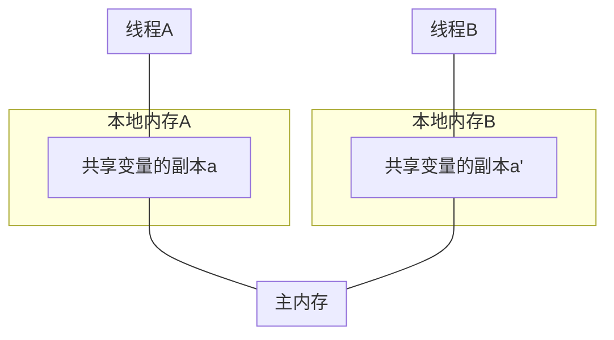
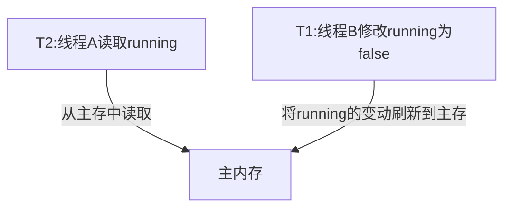

<center>volatile</center>
###可见性
>（注意：运行时请加上jvm参数：-server，while循环内不要有标准输出）：

```
public class Task implements Runnable {
  boolean running = true;
  int i=0;
  @Override
  public void run(){
    while(running){
      i++;
    }
  }

  public static void main(String[] args) throws InterruptedException{
    Task task = new Task();
    Tread th = new Tread(task);
    th.start();
    Thread.sleep(10);
    task.running = false;
    Thread.sleep(100);
    System.out.println(task.i);
    System.out.println("程序停止");
  }
}
```
java的内存模型

###java内存分为工作内存和主存
工作内存：即java线程的本地内存，是单独给某个线程分配的，存储局部变量等，同时也会复制主存的共享变量作为本地的副本，目的是为了减少和主存通信的频率，提高效率。
主存：存储类成员变量等
##可见性是指的是线程访问变量是否是最新值。
局部变量不存在可见性问题，而**共享内存就会有可见性问题**，因为本地线程在创建的时候，会从主存中读取一个共享变量的副本，且修改也是修改副本，且并不是立即刷新到主存中去，那么其他线程并不会马上共享变量的修改。
因此，线程B修改共享变量后，线程A并不会马上知晓，就会出现上述死循环的问题。
>解决共享变量可见性问题，需要用volatile关键字修饰。

```
public class Task implements Runnable {
  volatile boolean running = true;
  int i=0;
  @Override
  public void run(){
    while(running){
      i++;
    }
  }

  public static void main(String[] args) throws InterruptedException{
    Task task = new Task();
    Tread th = new Tread(task);
    th.start();
    Thread.sleep(1);
    task.running = false;
    Thread.sleep(10000);
    System.out.println(task.i);
    System.out.println("程序停止");
  }
}
```
**可见性的特性总结为以下2点：**
+ 对volatile变量的写会立即刷新到主存
+ 对volatile变量的读会读主存中的新值

可以用如下图更清晰的描述：

为了能更深刻的理解volatile的语义，我们来看下面的时序图，回答这2个问题：
时刻          |    线程A         |   线程B
-|:-:|-:
T1            |                  |开始写running=false
T2            |读取：读取到false还是等待线程B                 |
T3            |                  |running=false写完成
T4            |此时读取running，一定能得到running==false吗？  |
**问题1：t2时刻，如果线程A读取running变量，会读取到false，还是等待线程B执行完呢？**
答案是否定的，volatile并没有锁的特性。
**问题2：t4时刻，线程A是否一定能读取到线程B修改后的最新值**
答案是肯定的，线程A会从重新从主存中读取running的最新值。
还有一种办法也可以解决死循环的问题：
```
public class Task implements Runnable {
  boolean running = true;
  int i=0;
  @Override
  public void run(){
    while(this.isRunning()){
      i++;
    }
  }

  public static void main(String[] args) throws InterruptedException{
    Task task = new Task();
    Tread th = new Tread(task);
    th.start();
    Thread.sleep(10);
    task.setRunning(false);
    Thread.sleep(1000);
    System.out.println(task.i);
    System.out.println("程序停止");
  }
  public synchronized boolean isRunning(){
    return running;
  }
  public synchronized void setRunning(boolean running){
    this.running = running;
  }
}
```
虽然running变量上没有volatile关键字修饰，但是读和写running都是同步方法。
**同步块存在如下语义：**
+ 进入同步块，访问共享变量会去读取主存
+ 退出同步块，本地内存对共享变量的修改会立即刷新到主存
###volatile变量的原子性
这里要讲的原子性指的是写操作，原子性的特别总结为2点：
+ 对一个volatile变量的写操作，只有所有步骤完成，才能被其它线程读取到。
+ 多个线程对volatile变量的写操作本质上是有先后顺序的。也就是说并发写没有问题。

举例说明volatile变量和非volatile变量的区别
```
//线程1初始化User
User user;
user = new User();
//线程2读取user
if(user!=null){
user.getName();
}
```
在多线程并发环境下，线程2读取到的user可能未初始化完成，具体来看User user = new User的语义：
+ 分配对象的内存空间
+ 初始化对线
+ 设置user指向刚分配的内存地址

步骤2和步骤3可能会被重排序，流程变为
>1->3->2

这些线程1在执行完第3步而还没来得及执行完第2步的时候，如果内存刷新到了主存，那么线程2将得到一个未初始化完成的对象。因此如果将user声明为volatile的，那么步骤2,3将不会被重排序。

来看一个具体案例，一个基于双重检查的懒加载的单例模式实现：
```
public class Singleton {
  private static Singleton instance;
  private Singleton(){}

  public static Singleton getInstance(){
    if(instance == null){// 步骤1
      synchronized (Singleton.class){// 步骤2
        if(instance == null){// 步骤3
          instance == new Singleton();// 步骤4
        }
      }
    }

    return instance;
  }
}
```
这个单例模式看起来很完美，如果instance为空，则加锁，只有一个线程进入同步块完成对象的初始化，然后instance不为空，那么后续的所有线程获取instance都不用加锁，从而提升了性能。
但是我们刚才讲了对象赋值操作步骤可能会存在重排序，即当前线程的步骤4执行到一半，其它线程如果进来执行到步骤1，instance已经不为null，因此将会读取到一个没有初始化完成的对象。
但如果将instance用volatile来修饰，就完全不一样了，对instance的写入操作将会变成一个原子操作，没有初始化完，就不会被刷新到主存中。
修改后的单例模式代码如下：
```
public class Singleton {
  private static volatile Singleton instance;
  private Singleton(){}

  public static Singleton getInstance(){
    if(instance == null){// 步骤1
      synchronized (Singleton.class){// 步骤2
        if(instance == null){// 步骤3
          instance == new Singleton();// 步骤4
        }
      }
    }

    return instance;
  }
}
```
**对volatile理解的误区**
很多人会认为对volatile变量的所有操作都是原子性的，比如自增i++。
><font color=red>这其实是不对的。</font>

看如下代码：
```
public class VolatileDemo implements Runnable{
  volatile int i=0;

  @Override
  public void run(){
    for(int j=0; j<10000; j++){
      i++;
    }
  }

  public static void main(String[] args) throws InterruptedException{
    VolatileDemo task = new VolatileDemo();
    Thread t1 = new Thread(task);
    Thread t2 = new Thread(task);
    t1.start();
    t2.start();
    t1.join();
    t2.join();
    System.out.println(task.i);
  }
}
```
如果i++的操作是线程安全的，那么预期结果应该是i=20000
>然而运行的结果是：11349

说明i++存在并发问题，i++语义是i=i+1
分为2个步骤
+ 读取i=0
+ 计算i+1=1，并重新赋值给i

那么可能存在2个线程同时读取到i=0，并计算出结果i=1然后赋值给i，那么就得不到预期结果i=2。
这个问题说明了2个问题：
+ i++这种操作不是原子操作
+ volatile 并不会有锁的特性
