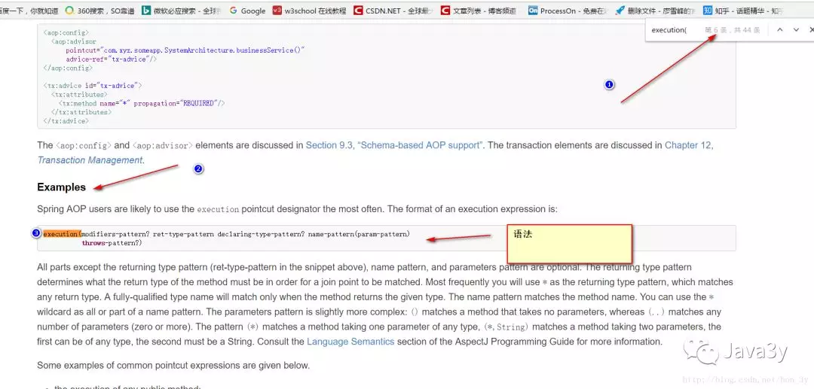

<center>AOP入门基础知识(简单配置，使用)</center>
##一、cglib代理
在讲解cglib之前，首先我们来回顾一下[静态代理和动态代理](./../../../设计模式/代理模式/代理.md)
<strong style="font-size: inherit;line-height: inherit;color: rgb(233, 105, 0);">由于静态代理需要实现目标对象的相同接口，那么可能会导致代理类会非常非常多….不好维护</strong>---->因此出现了动态代理
动态代理也有个约束：<strong style="font-size: inherit;line-height: inherit;color: rgb(233, 105, 0);">目标对象一定是要有接口的，没有接口就不能实现动态代理</strong>…..----->因此出现了cglib代理
cglib代理也叫子类代理，<strong style="font-size: inherit;line-height: inherit;color: rgb(233, 105, 0);">从内存中构建出一个子类来扩展目标对象的功能！</strong>
+ <strong style="font-size: inherit;line-height: inherit;color: rgb(233, 105, 0);">CGLIB是一个强大的高性能的代码生成包，它可以在运行期扩展Java类与实现Java接口。它广泛的被许多AOP的框架使用，例如Spring AOP和dynaop，为他们提供方法的interception（拦截）。</strong>
##二、编写cglib代理
cglib代理编写步骤：
+ <strong style="font-size: inherit;line-height: inherit;color: rgb(233, 105, 0);">需要引入cglib – jar文件， 但是spring的核心包中已经包括了cglib功能，所以直接引入spring-core-3.2.5.jar即可。</strong>
+ <strong style="font-size: inherit;line-height: inherit;color: rgb(233, 105, 0);">引入功能包后，就可以在内存中动态构建子类</strong>
+ <strong style="font-size: inherit;line-height: inherit;color: rgb(233, 105, 0);">代理的类不能为final</strong>，否则报错【在内存中构建子类来做扩展，当然不能为final，有final就不能继承了】
+ <strong style="font-size: inherit;line-height: inherit;color: rgb(233, 105, 0);">目标对象的方法如果为final/static, 那么就不会被拦截</strong>，即不会执行目标对象额外的业务方法。
```java
//需要实现MethodInterceptor接口
public class ProxyFactory implements MethodInterceptor{

    // 维护目标对象
    private Object target;
    public ProxyFactory(Object target){
        this.target = target;
    }

    // 给目标对象创建代理对象
    public Object getProxyInstance(){
        //1. 工具类
        Enhancer en = new Enhancer();
        //2. 设置父类
        en.setSuperclass(target.getClass());
        //3. 设置回调函数
        en.setCallback(this);
        //4. 创建子类(代理对象)
        return en.create();
    }


    @Override
    public Object intercept(Object obj, Method method, Object[] args, MethodProxy proxy) throws Throwable {

        System.out.println("开始事务.....");

        // 执行目标对象的方法
        Object returnValue = method.invoke(target, args);

        System.out.println("提交事务.....");

        return returnValue;
    }
}
```
**测试：**
```java
public class App {

    public static void main(String[] args) {

        UserDao userDao = new UserDao();

        UserDao factory = (UserDao) new ProxyFactory(userDao).getProxyInstance();

        factory.save();
    }
}
```
<strong style="font-size: inherit;line-height: inherit;color: rgb(233, 105, 0);">使用cglib就是为了弥补动态代理的不足【动态代理的目标对象一定要实现接口】</strong>
##三、手动实现AOP编程
AOP 面向切面的编程：
+ <strong style="font-size: inherit;line-height: inherit;color: rgb(233, 105, 0);">AOP可以实现“业务代码”与“关注点代码”分离</strong>
```java
// 保存一个用户
public void add(User user) {
  Session session = null;
  Transaction trans = null;
  try {
  	session = HibernateSessionFactoryUtils.getSession(); // 【关注点代码】
  	trans = session.beginTransaction(); // 【关注点代码】

  	session.save(user); // 核心业务代码

  	trans.commit(); // …【关注点代码】

  } catch (Exception e) {
  	e.printStackTrace();
  	if (trans != null) {
  		trans.rollback(); // ..【关注点代码】

  	}
  } finally {
  	HibernateSessionFactoryUtils.closeSession(session); // //..【关注点代码】

  }
}
```
+ 关注点代码，就是指重复执行的代码。
+ 业务代码与关注点代码分离，好处？
  + 关注点代码写一次即可；
  + 开发者只需要关注核心业务；
  + 运行时期，执行核心业务代码时候动态植入关注点代码； 【代理】
####案例分析
IUser接口
```java
public interface IUser {
    void save();
}
```
<strong style="font-size: inherit;line-height: inherit;color: rgb(233, 105, 0);">首先我们的UserDao有一个save()方法，每次都要开启事务和关闭事务</strong>
```java
//@Component  -->任何地方都能用这个
@Repository  //-->这个在Dao层中使用
public class UserDao {
  public void save() {
      System.out.println("开始事务");
      System.out.println("DB:保存用户");
      System.out.println("关闭事务");
  }
}
```
在刚学习java基础的时候，我们知道：<strong style="font-size: inherit;line-height: inherit;color: rgb(233, 105, 0);">如果某些功能经常需要用到就封装成方法</strong>。
```java
//@Component  -->任何地方都能用这个
@Repository  //-->这个在Dao层中使用
public class UserDao {

    public void save() {
        begin();
        System.out.println("DB:保存用户");
        close();
    }

    public void begin() {
        System.out.println("开始事务");
    }
    public void close() {
        System.out.println("关闭事务");
    }
}
```
现在呢，<strong style="font-size: inherit;line-height: inherit;color: rgb(233, 105, 0);">我们可能有多个Dao，都需要有开启事务和关闭事务的功能，现在只有UserDao中有这两个方法，重用性还是不够高。因此我们抽取出一个类出来</strong>
```java
public class AOP {
    public void begin() {
        System.out.println("开始事务");
    }
    public void close() {
        System.out.println("关闭事务");
    }
}
```
<strong style="font-size: inherit;line-height: inherit;color: rgb(233, 105, 0);">在UserDao维护这个变量，要用的时候，调用方法就行了。</strong>
```java
@Repository  //-->这个在Dao层中使用
public class UserDao {
    AOP aop;

    public void save() {
        aop.begin();
        System.out.println("DB:保存用户");
        aop.close();
    }
}
```
现在的开启事务、关闭事务还是需要我在userDao中手动调用。还是不够优雅。。我想要的效果：当我在调用userDao的save()方法时，<strong style="font-size: inherit;line-height: inherit;color: rgb(233, 105, 0);">动态地开启事务、关闭事务</strong>。因此，我们就<strong style="font-size: inherit;line-height: inherit;color: rgb(233, 105, 0);">用到了代理</strong>。当然了，<strong style="font-size: inherit;line-height: inherit;color: rgb(233, 105, 0);">真正执行方法的都是userDao、要干事的是AOP，因此在代理中需要维护他们的引用</strong>。
```java
public class ProxyFactory {
    //维护目标对象
    private static Object target;

    //维护关键点代码的类
    private static AOP aop;
    public static Object getProxyInstance(Object target_, AOP aop_) {

        //目标对象和关键点代码的类都是通过外界传递进来
        target = target_;
        aop = aop_;

        return Proxy.newProxyInstance(
                target.getClass().getClassLoader(),
                target.getClass().getInterfaces(),
                new InvocationHandler() {
                    @Override
                    public Object invoke(Object proxy, Method method, Object[] args) throws Throwable {

                        aop.begin();
                        Object returnValue = method.invoke(target, args);
                        aop.close();

                        return returnValue;
                    }
                }
        );
    }
}
```
####工厂静态方法
**把AOP加入IOC容器中**
```java
//把该对象加入到容器中
@Component
public class AOP {
    public void begin() {
        System.out.println("开始事务");
    }
    public void close() {
        System.out.println("关闭事务");
    }
}
```
把UserDao放入容器中
```java
@Component
public class UserDao {
    public void save() {
        System.out.println("DB:保存用户");
    }
}
```
**在配置文件中开启注解扫描,使用工厂静态方法创建代理对象**
```xml
<?xml version="1.0" encoding="UTF-8"?>
<beans xmlns="http://www.springframework.org/schema/beans"
       xmlns:xsi="http://www.w3.org/2001/XMLSchema-instance"
       xmlns:p="http://www.springframework.org/schema/p"
       xmlns:context="http://www.springframework.org/schema/context"
       xsi:schemaLocation="
        http://www.springframework.org/schema/beans
        http://www.springframework.org/schema/beans/spring-beans.xsd
        http://www.springframework.org/schema/context
        http://www.springframework.org/schema/context/spring-context.xsd">


    <bean id="proxy" class="aa.ProxyFactory" factory-method="getProxyInstance">
        <constructor-arg index="0" ref="userDao"/>
        <constructor-arg index="1" ref="AOP"/>
    </bean>

    <context:component-scan base-package="aa"/>


</beans>
```
测试，得到UserDao对象，调用方法
```java
public class App {

    public static void main(String[] args) {
        ApplicationContext ac =
                new ClassPathXmlApplicationContext("aa/applicationContext.xml");
        IUser iUser = (IUser) ac.getBean("proxy");
        iUser.save();
    }
}
```
####工厂非静态方法
上面使用的是工厂静态方法来创建代理类对象。下面<strong style="font-size: inherit;line-height: inherit;color: rgb(233, 105, 0);">使用一下非静态的工厂方法创建对象</strong>。
```java
package aa;

import java.lang.reflect.InvocationHandler;
import java.lang.reflect.Method;
import java.lang.reflect.Proxy;

/**
 * Created by ozc on 2017/5/11.
 */
public class ProxyFactory {

    public Object getProxyInstance(final Object target_, final AOP aop_) {
        //目标对象和关键点代码的类都是通过外界传递进来
        return Proxy.newProxyInstance(
                target_.getClass().getClassLoader(),
                target_.getClass().getInterfaces(),
                new InvocationHandler() {
                    @Override
                    public Object invoke(Object proxy, Method method, Object[] args) throws Throwable {

                        aop_.begin();
                        Object returnValue = method.invoke(target_, args);
                        aop_.close();

                        return returnValue;
                    }
                }
        );
    }
}
```
配置文件:<strong style="font-size: inherit;line-height: inherit;color: rgb(233, 105, 0);">先创建工厂，再创建代理类对象</strong>
```xml
<?xml version="1.0" encoding="UTF-8"?>
<beans xmlns="http://www.springframework.org/schema/beans"
       xmlns:xsi="http://www.w3.org/2001/XMLSchema-instance"
       xmlns:p="http://www.springframework.org/schema/p"
       xmlns:context="http://www.springframework.org/schema/context"
       xsi:schemaLocation="
        http://www.springframework.org/schema/beans
        http://www.springframework.org/schema/beans/spring-beans.xsd
        http://www.springframework.org/schema/context
        http://www.springframework.org/schema/context/spring-context.xsd">


    <!--创建工厂-->
    <bean id="factory" class="aa.ProxyFactory"/>


    <!--通过工厂创建代理-->
    <bean id="IUser" class="aa.IUser" factory-bean="factory" factory-method="getProxyInstance">
        <constructor-arg index="0" ref="userDao"/>
        <constructor-arg index="1" ref="AOP"/>
    </bean>


    <context:component-scan base-package="aa"/>


</beans>
```
##四、AOP的概述
<strong style="font-size: inherit;line-height: inherit;color: rgb(233, 105, 0);">Aop： aspect object programming  面向切面编程</strong>
+ <strong style="font-size: inherit;line-height: inherit;color: rgb(233, 105, 0);">功能： 让关注点代码与业务代码分离！</strong>
+ 面向切面编程就是指： <strong style="font-size: inherit;line-height: inherit;color: rgb(233, 105, 0);">对很多功能都有的重复的代码抽取，再在运行的时候往业务方法上动态植入“切面类代码”。</strong>

关注点：
+ <strong style="font-size: inherit;line-height: inherit;color: rgb(233, 105, 0);">重复代码就叫做关注点。</strong>
```java
// 保存一个用户
public void add(User user) {
      Session session = null;
      Transaction trans = null;
      try {
          session = HibernateSessionFactoryUtils.getSession();   // 【关注点代码】
          trans = session.beginTransaction();    // 【关注点代码】

          session.save(user);     // 核心业务代码

          trans.commit();     //…【关注点代码】

      } catch (Exception e) {     
          e.printStackTrace();
          if(trans != null){
              trans.rollback();   //..【关注点代码】

          }
      } finally{
          HibernateSessionFactoryUtils.closeSession(session);   ////..【关注点代码】

      }
 }
```
切面：
+ <strong style="font-size: inherit;line-height: inherit;color: rgb(233, 105, 0);">关注点形成的类，就叫切面(类)！</strong>
```java
public class AOP {
    public void begin() {
        System.out.println("开始事务");
    }
    public void close() {
        System.out.println("关闭事务");
    }
}
```
切入点：
+ 执行目标对象方法，动态植入切面代码。
+ 可以通过<strong style="font-size: inherit;line-height: inherit;color: rgb(233, 105, 0);">切入点表达式，指定拦截哪些类的哪些方法； 给指定的类在运行的时候植入切面类代码。</strong>
切入点表达式：
+ <strong style="font-size: inherit;line-height: inherit;color: rgb(233, 105, 0);">指定哪些类的哪些方法被拦截</strong>
##五、使用Spring AOP开发步骤
1）<strong style="font-size: inherit;line-height: inherit;color: rgb(233, 105, 0);">先引入aop相关jar文件</strong>        （aspectj  aop优秀组件）
+ spring-aop-3.2.5.RELEASE.jar   【spring3.2源码】
+ aopalliance.jar                【spring2.5源码/lib/aopalliance】
+ aspectjweaver.jar              【spring2.5源码/lib/aspectj】或【aspectj-1.8.2\lib】
+ aspectjrt.jar                  【spring2.5源码/lib/aspectj】或【aspectj-1.8.2\lib】

注意： <strong style="font-size: inherit;line-height: inherit;color: rgb(233, 105, 0);">用到spring2.5版本的jar文件，如果用jdk1.7可能会有问题。</strong>
+ 需要升级aspectj组件，即使用aspectj-1.8.2版本中提供jar文件提供。

2）<strong style="font-size: inherit;line-height: inherit;color: rgb(233, 105, 0);">bean.xml中引入aop名称空间</strong>
+ xmlns:context="http://www.springframework.org/schema/context"
+ http://www.springframework.org/schema/context
+ http://www.springframework.org/schema/context/spring-context.xsd

####引入jar包
引入4个jar包：

####引入名称空间
```xml
<?xml version="1.0" encoding="UTF-8"?>
<beans xmlns="http://www.springframework.org/schema/beans"
       xmlns:xsi="http://www.w3.org/2001/XMLSchema-instance"
       xmlns:p="http://www.springframework.org/schema/p"
       xmlns:context="http://www.springframework.org/schema/context"
       xsi:schemaLocation="
        http://www.springframework.org/schema/beans
        http://www.springframework.org/schema/beans/spring-beans.xsd
        http://www.springframework.org/schema/context
        http://www.springframework.org/schema/context/spring-context.xsd">

</beans>
```
##六、注解方式实现AOP编程
  之前手动的实现AOP编程是需要自己来编写代理工厂的，<strong style="font-size: inherit;line-height: inherit;color: rgb(233, 105, 0);">现在有了Spring，就不需要我们自己写代理工厂了。Spring内部会帮我们创建代理工厂</strong>。
因此，我们<strong style="font-size: inherit;line-height: inherit;color: rgb(233, 105, 0);">只要关心切面类、切入点、编写切入表达式指定拦截什么方法就可以了！</strong>
还是以上一个例子为案例，使用Spring的注解方式来实现AOP编程。
####在配置文件中开启AOP注解方式
```xml
<?xml version="1.0" encoding="UTF-8"?>
<beans xmlns="http://www.springframework.org/schema/beans"
       xmlns:xsi="http://www.w3.org/2001/XMLSchema-instance"
       xmlns:p="http://www.springframework.org/schema/p"
       xmlns:context="http://www.springframework.org/schema/context"
       xmlns:aop="http://www.springframework.org/schema/aop"
       xsi:schemaLocation="http://www.springframework.org/schema/beans
        http://www.springframework.org/schema/beans/spring-beans.xsd
        http://www.springframework.org/schema/context
        http://www.springframework.org/schema/context/spring-context.xsd http://www.springframework.org/schema/aop http://www.springframework.org/schema/aop/spring-aop.xsd">


    <context:component-scan base-package="aa"/>

    <!-- 开启aop注解方式 -->
    <aop:aspectj-autoproxy></aop:aspectj-autoproxy>

</beans>
```
####代码
切面类
```java
@Component
@Aspect//指定为切面类
public class AOP {
    //里面的值为切入点表达式
    @Before("execution(* aa.*.*(..))")
    public void begin() {
        System.out.println("开始事务");
    }

    @After("execution(* aa.*.*(..))")
    public void close() {
        System.out.println("关闭事务");
    }
}
```
<strong style="font-size: inherit;line-height: inherit;color: rgb(233, 105, 0);">UserDao实现了IUser接口</strong>
```java
@Component
public class UserDao implements IUser {
    @Override
    public void save() {
        System.out.println("DB:保存用户");
    }
}
```
IUser接口
```java
public interface IUser {
    void save();
}
```
测试代码
```java
public class App {
    public static void main(String[] args) {
        ApplicationContext ac =
                new ClassPathXmlApplicationContext("aa/applicationContext.xml");

        //这里得到的是代理对象....
        IUser iUser = (IUser) ac.getBean("userDao");

        System.out.println(iUser.getClass());

        iUser.save();

    }
}
```
结果

####目标对象没有接口
上面我们测试的是UserDao有IUser接口，内部使用的是动态代理…那么我们这次测试的是目标对象没有接口
OrderDao没有实现接口
```java
@Component
public class OrderDao {
    public void save() {
        System.out.println("我已经进货了！！！");
    }
}
```
测试代码
```java
public class App {
    public static void main(String[] args) {
        ApplicationContext ac =
                new ClassPathXmlApplicationContext("aa/applicationContext.xml");

        OrderDao orderDao = (OrderDao) ac.getBean("orderDao");

        System.out.println(orderDao.getClass());

        orderDao.save();

    }
}
```
结果

##七、优化和AOP注解API
####API
+ @Aspect                            指定一个类为切面类
+ @Pointcut("execution(* cn.itcast.e_aop_anno..(..))")  指定切入点表达式
+ @Before("pointCut_()")             前置通知: 目标方法之前执行
+ @After("pointCut_()")              后置通知：目标方法之后执行（始终执行）
+ @AfterReturning("pointCut_()")     返回后通知： 执行方法结束前执行(异常不执行)
+ @AfterThrowing("pointCut_()")      异常通知:  出现异常时候执行
+ @Around("pointCut_()")             环绕通知： 环绕目标方法执行

测试：
```java
// 前置通知 : 在执行目标方法之前执行
@Before("pointCut_()")
public void begin(){
    System.out.println("开始事务/异常");
}

// 后置/最终通知：在执行目标方法之后执行  【无论是否出现异常最终都会执行】
@After("pointCut_()")
public void after(){
    System.out.println("提交事务/关闭");
}

// 返回后通知： 在调用目标方法结束后执行 【出现异常不执行】
@AfterReturning("pointCut_()")
public void afterReturning() {
    System.out.println("afterReturning()");
}

// 异常通知： 当目标方法执行异常时候执行此关注点代码
@AfterThrowing("pointCut_()")
public void afterThrowing(){
    System.out.println("afterThrowing()");
}

// 环绕通知：环绕目标方式执行
@Around("pointCut_()")
public void around(ProceedingJoinPoint pjp) throws Throwable{
    System.out.println("环绕前....");
    pjp.proceed();  // 执行目标方法
    System.out.println("环绕后....");
}
```
####优化
我们的代码是这样的：<strong style="font-size: inherit;line-height: inherit;color: rgb(233, 105, 0);">每次写Before、After等，都要重写一次切入点表达式，这样就不优雅了</strong>。
```java
@Before("execution(* aa.*.*(..))")
public void begin() {
    System.out.println("开始事务");
}

@After("execution(* aa.*.*(..))")
public void close() {
    System.out.println("关闭事务");
}
```
于是乎，我们要<strong style="font-size: inherit;line-height: inherit;color: rgb(233, 105, 0);">使用@Pointcut这个注解，来指定切入点表达式，在用到的地方中，直接引用就行了！</strong>
代码就可以改造成这样了
```java
@Component
@Aspect//指定为切面类
public class AOP {
    // 指定切入点表达式，拦截哪个类的哪些方法
    @Pointcut("execution(* aa.*.*(..))")
    public void pt() {

    }

    @Before("pt()")
    public void begin() {
        System.out.println("开始事务");
    }

    @After("pt()")
    public void close() {
        System.out.println("关闭事务");
    }
}
```
##八、XML方式实现AOP编程
**XML文件配置**
```xml
<?xml version="1.0" encoding="UTF-8"?>
<beans xmlns="http://www.springframework.org/schema/beans"
       xmlns:xsi="http://www.w3.org/2001/XMLSchema-instance"
       xmlns:p="http://www.springframework.org/schema/p"
       xmlns:context="http://www.springframework.org/schema/context"
       xmlns:aop="http://www.springframework.org/schema/aop"
       xsi:schemaLocation="http://www.springframework.org/schema/beans
        http://www.springframework.org/schema/beans/spring-beans.xsd
        http://www.springframework.org/schema/context
        http://www.springframework.org/schema/context/spring-context.xsd http://www.springframework.org/schema/aop http://www.springframework.org/schema/aop/spring-aop.xsd">


    <!--对象实例-->
    <bean id="userDao" class="aa.UserDao"/>
    <bean id="orderDao" class="aa.OrderDao"/>

    <!--切面类-->
    <bean id="aop" class="aa.AOP"/>

    <!--AOP配置-->
    <aop:config >

        <!--定义切入表达式，拦截哪些方法-->
        <aop:pointcut id="pointCut" expression="execution(* aa.*.*(..))"/>

        <!--指定切面类是哪个-->
        <aop:aspect ref="aop">

            <!--指定来拦截的时候执行切面类的哪些方法-->
            <aop:before method="begin" pointcut-ref="pointCut"/>
            <aop:after method="close" pointcut-ref="pointCut"/>

        </aop:aspect>
    </aop:config>


</beans>
```
测试
```java
public class App {
    @Test
    public  void test1() {
        ApplicationContext ac =
                new ClassPathXmlApplicationContext("aa/applicationContext.xml");

        OrderDao orderDao = (OrderDao) ac.getBean("orderDao");

        System.out.println(orderDao.getClass());

        orderDao.save();

    }

    @Test
    public  void test2() {
        ApplicationContext ac =
                new ClassPathXmlApplicationContext("aa/applicationContext.xml");

        IUser userDao = (IUser) ac.getBean("userDao");

        System.out.println(userDao.getClass());

        userDao.save();

    }
}
```
##九、切入点表达式
切入点表达式主要就是来<strong style="font-size: inherit;line-height: inherit;color: rgb(233, 105, 0);">配置拦截哪些类的哪些方法</strong>
####查官方文档
**在文档中搜索:execution(**

####语法解析
```
execution(modifiers-pattern? ret-type-pattern declaring-type-pattern? name-pattern(param-pattern) throws-pattern?)
```
符号讲解：
+ ?号代表0或1，可以不写
+ “\*”号代表任意类型，0或多
+ 方法参数为..表示为可变参数

参数讲解：
+ modifiers-pattern?【修饰的类型，可以不写】
+ ret-type-pattern【方法返回值类型，必写】
+ declaring-type-pattern?【方法声明的类型，可以不写】
+ name-pattern(param-pattern)【要匹配的名称，括号里面是方法的参数】
+ throws-pattern?【方法抛出的异常类型，可以不写】

官方也有给出一些例子给我们理解：

####测试代码
```xml
<!-- 【拦截所有public方法】 -->
<!--<aop:pointcut expression="execution(public * *(..))" id="pt"/>-->

<!-- 【拦截所有save开头的方法 】 -->
<!--<aop:pointcut expression="execution(* save*(..))" id="pt"/>-->

<!-- 【拦截指定类的指定方法, 拦截时候一定要定位到方法】 -->
<!--<aop:pointcut expression="execution(public * cn.itcast.g_pointcut.OrderDao.save(..))" id="pt"/>-->

<!-- 【拦截指定类的所有方法】 -->
<!--<aop:pointcut expression="execution(* cn.itcast.g_pointcut.UserDao.*(..))" id="pt"/>-->

<!-- 【拦截指定包，以及其自包下所有类的所有方法】 -->
<!--<aop:pointcut expression="execution(* cn..*.*(..))" id="pt"/>-->

<!-- 【多个表达式】 -->
<!--<aop:pointcut expression="execution(* cn.itcast.g_pointcut.UserDao.save()) || execution(* cn.itcast.g_pointcut.OrderDao.save())" id="pt"/>-->
<!--<aop:pointcut expression="execution(* cn.itcast.g_pointcut.UserDao.save()) or execution(* cn.itcast.g_pointcut.OrderDao.save())" id="pt"/>-->
<!-- 下面2个且关系的，没有意义 -->
<!--<aop:pointcut expression="execution(* cn.itcast.g_pointcut.UserDao.save()) &amp;&amp; execution(* cn.itcast.g_pointcut.OrderDao.save())" id="pt"/>-->
<!--<aop:pointcut expression="execution(* cn.itcast.g_pointcut.UserDao.save()) and execution(* cn.itcast.g_pointcut.OrderDao.save())" id="pt"/>-->

<!-- 【取非值】 -->
<!--<aop:pointcut expression="!execution(* cn.itcast.g_pointcut.OrderDao.save())" id="pt"/>-->
```
