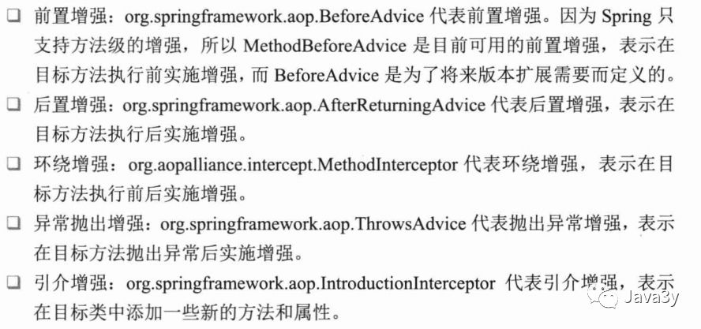
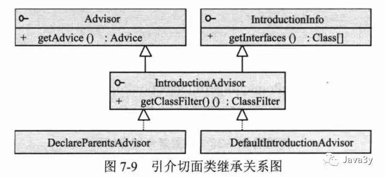
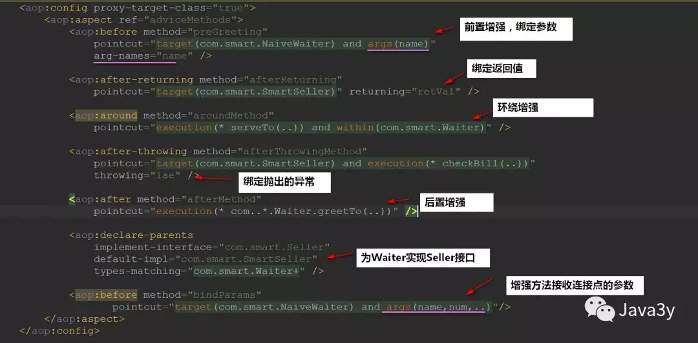

<center>AOP重要知识点(术语介绍、全面使用)</center>
##一、Spring AOP全面认知
结合《Spring 实战 (第4版)》和《精通Spring4.x 企业应用开发实战》两本书的AOP章节将其知识点整理起来。
####1.1AOP概述
AOP称为面向切面编程,可以先看看下面这段代码：

Java面向对象的时候，如果代码重复了
+ 1：抽取成方法
+ 2：抽取类

抽取成类的方式我们称之为：<strong style="color: #E96900;">纵向抽取</strong>
**通过继承的方式实现纵向抽取**
但是，我们现在的办法不行：即使抽取成类还是会出现重复的代码，因为这些逻辑(开始、结束、提交事务)<strong style="color: #E96900;">依附在我们业务类的方法逻辑中</strong>！

现在纵向抽取的方式不行了，AOP的理念：就是将<strong style="color: #E96900;">分散在各个业务逻辑代码中相同的代码通过横向切割的方式</strong>抽取到一个独立的模块中！

上面的图也很清晰了，将重复性的逻辑代码横切出来其实很容易(我们简单可认为就是封装成一个类就好了)，但我们要将这些<strong style="color: #E96900;">被我们横切出来的逻辑代码融合到业务逻辑中</strong>，来完成和之前(没抽取前)一样的功能！这就是AOP首要解决的问题了！
####1.2Spring AOP原理
>被我们横切出来的逻辑代码融合到业务逻辑中，来完成和之前(没抽取前)一样的功能

没有学Spring AOP之前，我们就可以使用代理来完成
代理可以帮我们<strong style="color: #E96900;">增强对象的行为</strong>！使用动态代理实质上就是<strong style="color: #E96900;">调用时拦截对象方法，对方法进行改造、增强</strong>！
其实Spring AOP的底层原理就是<strong style="color: #E96900;">动态代理</strong>！

来源《精通Spring4.x 企业应用开发实战》一段话：
>Spring AOP使用纯Java实现，它不需要专门的编译过程，也不需要特殊的类装载器，它在<strong style="color: #E96900;">运行期通过代理方式向目标类织入增强代码</strong>。在Spring中可以无缝地将Spring AOP、IoC和AspectJ整合在一起。

来源《Spring 实战 (第4版)》一句话：
>Spring AOP构建在动态代理基础之上，因此，<strong style="color: #E96900;">Spring对AOP的支持局限于方法拦截</strong>。

在Java中动态代理有两种方式：
+ JDK动态代理
+ CGLib动态代理


JDK动态代理是需要实现某个接口了，而我们类未必全部会有接口，于是CGLib代理就有了
+ CGLib代理其生成的动态代理对象是目标类的子类
+ Spring AOP<strong style="color: #E96900;">默认是使用JDK动态代理</strong>，如果代理的类<strong style="color: #E96900;">没有接口则会使用CGLib代理</strong>。

JDK代理和CGLib代理我们该用哪个呢？？在《精通Spring4.x 企业应用开发实战》给出了建议：
+ 如果是<strong style="color: #E96900;">单例的我们最好使用CGLib代理</strong>，如果是多例的我们最好使用JDK代理

原因：
+ JDK在创建代理对象时的性能要高于CGLib代理，而生成代理对象的运行性能却比CGLib的低。
+ 如果是单例的代理，推荐使用CGLib

看到这里我们就应该知道什么是Spring AOP(面向切面编程)了：<strong style="color: #E96900;">将相同逻辑的重复代码横向抽取出来，使用动态代理技术将这些重复代码织入到目标对象方法中，实现和原来一样的功能</strong>。
+ 这样一来，我们就在<strong style="color: #E96900;">写业务时只关心业务代码</strong>，而不用关心与业务无关的代码

####1.3AOP的实现者
AOP除了有Spring AOP实现外，还有著名的AOP实现者：AspectJ，也有可能大家没听说过的实现者：JBoss AOP~~
我们下面来说说AspectJ扩展一下知识面：
>AspectJ是<strong style="color: #E96900;">语言级别</strong>的AOP实现，扩展了Java语言，定义了AOP语法，能够在<strong style="color: #E96900;">编译期</strong>提供横切代码的织入，所以它有<strong style="color: #E96900;">专门的编译器</strong>用来生成遵守Java字节码规范的Class文件。

而Spring借鉴了AspectJ很多非常有用的做法，<strong style="color: #E96900;">融合了AspectJ实现AOP的功能</strong>。但Spring AOP本质上底层还是<strong style="color: #E96900;">动态代理</strong>，所以Spring AOP是不需要有专门的编辑器的。
####1.4AOP的术语
<strong style="color: #E96900;">连接点</strong>(Join point)：
+ <strong style="color: #E96900;">能够被拦截的地方</strong>：Spring AOP是基于动态代理的，所以是方法拦截的。每个成员方法都可以称之为连接点~

<strong style="color: #E96900;">切点</strong>(Poincut)：
+ <strong style="color: #E96900;">具体定位的连接点</strong>：上面也说了，每个方法都可以称之为连接点，我们<strong style="color: #E96900;">具体定位到某一个方法就成为切点</strong>。

<strong style="color: #E96900;">增强/通知</strong>(Advice)：
+ 表示添加到切点的一段<strong style="color: #E96900;">逻辑代码</strong>，并定位连接点的<strong style="color: #E96900;">方位信息</strong>。
  + 简单来说就定义了是干什么的，具体是在哪干
  + Spring AOP提供了5种Advice类型给我们：前置、后置、返回、异常、环绕给我们使用！

<strong style="color: #E96900;">织入</strong>(Weaving)：
+ 将<code style="font-size: inherit;line-height: inherit;word-wrap: break-word;padding: 2px 4px;border-radius: 4px;margin-right: 2px;margin-left: 2px;color: rgb(248, 35, 117);background: rgb(248, 248, 248);">增强/通知</code>添加到目标类的具体连接点上的过程。

<strong style="color: #E96900;">引入/引介</strong>(Introduction)：
+ <code style="font-size: inherit;line-height: inherit;word-wrap: break-word;padding: 2px 4px;border-radius: 4px;margin-right: 2px;margin-left: 2px;color: rgb(248, 35, 117);background: rgb(248, 248, 248);">引入/引介</code>允许我们<strong style="color: #E96900;">向现有的类添加新方法或属性</strong>。是一种<strong style="color: #E96900;">特殊</strong>的增强！

<strong style="color: #E96900;">切面</strong>(Aspect)：
+ 切面由切点和<code style="font-size: inherit;line-height: inherit;word-wrap: break-word;padding: 2px 4px;border-radius: 4px;margin-right: 2px;margin-left: 2px;color: rgb(248, 35, 117);background: rgb(248, 248, 248);">增强/通知</code>组成，它既包括了横切逻辑的定义、也包括了连接点的定义。

在《Spring 实战 (第4版)》给出的总结是这样子的：
>通知/增强包含了需要用于多个应用对象的横切行为；连接点是程序执行过程中能够应用通知的所有点；切点定义了通知/增强被应用的具体位置。其中关键的是切点定义了哪些连接点会得到通知/增强。

总的来说：
+ 这些术语可能翻译过来不太好理解，但对我们正常使用AOP的话<strong style="color: #E96900;">影响并没有那么大</strong>~~看多了就知道它是什么意思了。

####1.5Spring对AOP的支持
Spring提供了3种类型的AOP支持：
+ 基于代理的经典SpringAOP
  + 需要实现接口，手动创建代理
+ 纯POJO切面
  + 使用XML配置，aop命名空间
+ @AspectJ注解驱动的切面
  + 使用注解的方式，这是最简洁和最方便的！

##二、基于代理的经典SpringAOP
首先，我们来看一下增强接口的继承关系图：

可以分成五类增强的方式：

Spring提供了六种的切点类型：

<strong style="color: #E96900;">切面类型主要分成了三种：</strong>
+ 一般切面
+ 切点切面
+ 引介/引入切面


一般切面，切点切面，引介/引入切面介绍：

对于切点切面我们一般都是直接用就好了，我们来看看引介/引入切面是怎么一回事：
+ 引介/引入切面是引介/引入增强的封装器，通过引介/引入切面，<strong style="color: #E96900;">可以更容易地为现有对象添加任何接口的实现！</strong>

继承关系图：

引介/引入切面有两个实现类：
+ DefaultIntroductionAdvisor：常用的实现类
+ DeclareParentsAdvisor：用于实现AspectJ语言的DeclareParent注解表示的引介/引入切面

实际上，我们使用AOP往往是<strong style="color: #E96900;">Spring内部使用BeanPostProcessor帮我们创建代理。</strong>
这些代理的创建器可以分成三类：
+ 基于Bean配置名规则的自动代理创建器：BeanNameAutoProxyCreator
+ 基于Advisor匹配机制的自动代理创建器：它会对容器所有的Advisor进行扫描，实现类为DefaultAdvisorAutoProxyCreator
+ 基于Bean中的AspectJ注解标签的自动代理创建器：AnnotationAwareAspectJAutoProxyCreator

对应的类继承图：


##三、拥抱基于注解和命名空的AOP编程
Spring在新版本中对AOP功能进行了增强，体现在这么几个方面：
+ 在XML配置文件中为AOP提供了aop命名空间
+ 增加了AspectJ切点表达式语言的支持
+ 可以无缝地集成AspectJ

具体的切点表达式使用还是前往：[Spring AOP入门基础知识(简单配置，使用)](./基础知识.md)看吧
对应的增强注解：


####3.1使用引介/引入功能实现为Bean引入新方法
其实前置啊、后置啊这些很容易就理解了，整篇文章看下来就只有这个引介/引入切面有点搞头。

我们来看一下具体的用法吧，现在我有个服务员的接口：
```java
public interface Waiter {

    // 向客人打招呼
    void greetTo(String clientName);

    // 服务
    void serveTo(String clientName);
}
```
一位年轻服务员实现类：
```java
public class NaiveWaiter implements Waiter {
    public void greetTo(String clientName) {
        System.out.println("NaiveWaiter:greet to " + clientName + "...");
    }

    @NeedTest
    public void serveTo(String clientName) {
        System.out.println("NaiveWaiter:serving " + clientName + "...");
    }
}
```
现在我想做的就是：<strong style="color: #E96900;">想这个服务员可以充当售货员的角色，可以卖东西</strong>！当然了，我肯定不会加一个卖东西的方法到Waiter接口上啦，因为这个是暂时的~
所以，我搞了一个售货员接口：
```java
public interface Seller {

  // 卖东西
  int sell(String goods, String clientName);
}
```
一个售货员实现类：
```java
public class SmartSeller implements Seller {

    // 卖东西
    public int sell(String goods,String clientName) {
        System.out.println("SmartSeller: sell "+goods +" to "+clientName+"...");
        return 100;
    }
}
```
此时，我们的类图是这样子的：

现在我想干的就是：<strong style="color: #E96900;">借助AOP的引入/引介切面，来让我们的服务员也可以卖东西</strong>！
我们的引入/引介切面具体是这样干的：
```java
@Aspect
public class EnableSellerAspect {

    @DeclareParents(value = "com.smart.NaiveWaiter",  // 指定服务员具体的实现
            defaultImpl = SmartSeller.class) // 售货员具体的实现
    public Seller seller; // 要实现的目标接口
}
```
写了这个切面类会发生什么？？
+ 切面技术将SmartSeller融合到NaiveWaiter中，这样NaiveWaiter就实现了Seller接口！！！！

我们的bean.xml文件很简单：
```xml
<?xml version="1.0" encoding="UTF-8" ?>
<beans xmlns="http://www.springframework.org/schema/beans"
    xmlns:xsi="http://www.w3.org/2001/XMLSchema-instance"
    xmlns:aop="http://www.springframework.org/schema/aop"
    xsi:schemaLocation="http://www.springframework.org/schema/beans http://www.springframework.org/schema/beans/spring-beans-4.0.xsd
           http://www.springframework.org/schema/aop http://www.springframework.org/schema/aop/spring-aop-4.0.xsd">
    <aop:aspectj-autoproxy/>
    <bean id="waiter" class="com.smart.NaiveWaiter"/>
    <bean class="com.smart.aspectj.basic.EnableSellerAspect"/>
</beans>
```
测试一下：
```java
public class Test {
    public static void main(String[] args) {


        ClassPathXmlApplicationContext ctx = new ClassPathXmlApplicationContext("com/smart/aspectj/basic/beans.xml");
        Waiter waiter = (Waiter) ctx.getBean("waiter");

        // 调用服务员原有的方法
        waiter.greetTo("Java3y");
        waiter.serveTo("Java3y");

        // 通过引介/引入切面已经将waiter服务员实现了Seller接口，所以可以强制转换
        Seller seller = (Seller) waiter;
        seller.sell("水军", "Java3y");

    }
}
```
结果


具体的调用过程是这样子的：
>当引入接口方法被调用时，代理对象会把此调用委托给实现了新接口的某个其他对象。实际上，一个Bean的实现被拆分到多个类中


####3.2在XML中声明切面

测试一下与传统的SpringAOP结合的advisor
实现类：

xml配置文件：

......
一次性用图的方式来讲啦：

最后还有一个切面类型总结图:


##四、总结
简要总结AOP：
+ AOP的底层实际上是动态代理，动态代理分成了JDK动态代理和CGLib动态代理。如果被代理对象没有接口，那么就使用的是CGLIB代理(也可以直接配置使用CBLib代理)
+ 如果是单例的话，那我们最好使用CGLib代理，因为CGLib代理对象运行速度要比JDK的代理对象要快
+ AOP既然是基于动态代理的，那么它只能对方法进行拦截，它的层面上是方法级别的
+ 无论经典的方式、注解方式还是XML配置方式使用Spring AOP的原理都是一样的，只不过形式变了而已。一般我们使用注解的方式使用AOP就好了。
+ 注解的方式使用Spring AOP就了解几个切点表达式，几个增强/通知的注解就完事了，是不是贼简单…使用XML的方式和注解其实没有很大的区别，很快就可以上手啦。
+ 引介/引入切面也算是一个比较亮的地方，可以用代理的方式为某个对象实现接口，从而能够使用借口下的方法。这种方式是非侵入式的~
+ 要增强的方法还可以接收与被代理方法一样的参数、绑定被代理方法的返回值这些功能…
