
事务

##一、介绍
事务（Transaction），一般是指要做的或所做的事情。在计算机术语中是指访问并可能更新数据库中各种数据项的一个程序执行单元(unit)。
以取钱的例子来讲解：比如你去ATM机取1000块钱，大体有两个步骤：第一步输入密码金额，银行卡扣掉1000元钱；第二步从ATM出1000元钱。这两个步骤必须是要么都执行要么都不执行。如果银行卡扣除了1000块但是ATM出钱失败的话，你将会损失1000元；如果银行卡扣钱失败但是ATM却出了1000块，那么银行将损失1000元。
如何保证这两个步骤不会出现一个出现异常了，而另一个执行成功呢？事务就是用来解决这样的问题。**事务是一系列的动作，它们综合在一起才是一个完整的工作单元，这些动作必须全部完成，如果有一个失败的话，那么事务就会回滚到最开始的状态，仿佛什么都没发生过一样**。 在企业级应用程序开发中，事务管理是必不可少的技术，用来确保数据的完整性和一致性。

##二、事务的四个特性（ACID）
①、原子性（Atomicity）：事务是一个原子操作，由一系列动作组成。事务的原子性确保动作要么全部完成，要么完全不起作用。
②、一致性（Consistency）：一旦事务完成（不管成功还是失败），系统必须确保它所建模的业务处于一致的状态，而不会是部分完成部分失败。在现实中的数据不应该被破坏。
③、隔离性（Isolation）：可能有许多事务会同时处理相同的数据，因此每个事务都应该与其他事务隔离开来，防止数据损坏。
④、持久性（Durability）：一旦事务完成，无论发生什么系统错误，它的结果都不应该受到影响，这样就能从任何系统崩溃中恢复过来。通常情况下，事务的结果被写到持久化存储器中。

##三、Spring 事务管理的核心接口
首先我们创建一个Java工程，然后导入 Spring 核心事务包
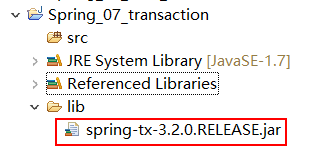
我们打开Spring的核心事务包，查看如下类：org.springframework.transaction
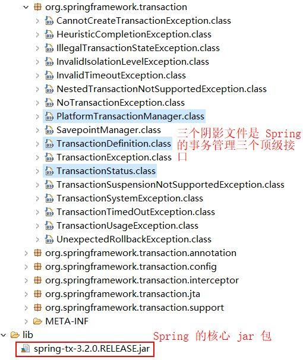
上面所示的三个类文件便是Spring的事务管理接口。如下图所示：下面我们分别对这三个接口进行简单的介绍
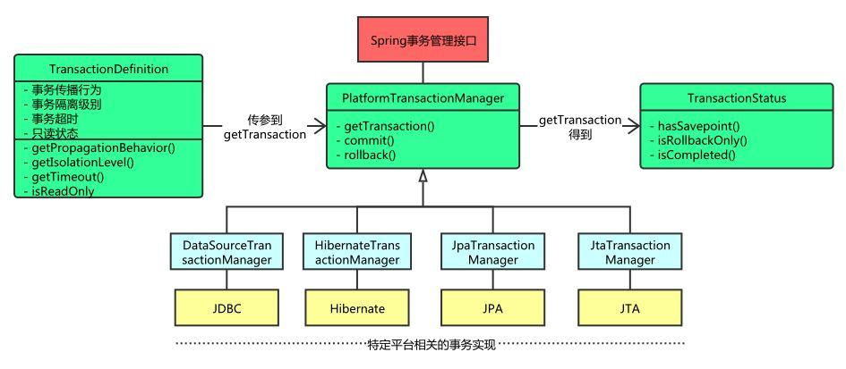

####1、 PlatformTransactionManager  事务管理器
Spring事务管理器的接口是org.springframework.transaction.PlatformTransactionManager，如上图所示，Spring并不直接管理事务，通过这个接口，Spring为各个平台如JDBC、Hibernate等都提供了对应的事务管理器，也就是将事务管理的职责委托给Hibernate或者JTA等持久化机制所提供的相关平台框架的事务来实现。

我们进入到 PlatformTransactionManager 接口，查看源码：
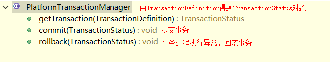
　　①、TransactionStatus getTransaction(TransactionDefinition definition) ，事务管理器 通过TransactionDefinition，获得“事务状态”，从而管理事务。
　　②、void commit(TransactionStatus status)  根据状态提交
　　③、void rollback(TransactionStatus status) 根据状态回滚

Spring事务管理的为不同的事务API提供一致的编程模型，具体的事务管理机制由对应各个平台去实现。
比如下面我们导入实现事务管理的两种平台：JDBC和Hibernate
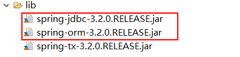
然后我们再次查看PlatformTransactionManager接口，会发现它多了几个实现类，如下：
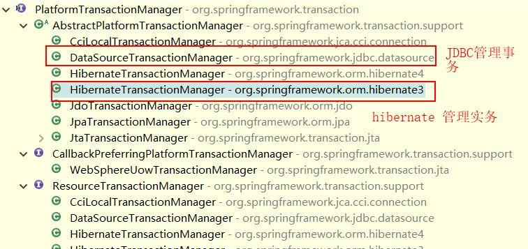

####2、TransactionStatus　事务状态
在上面 PlatformTransactionManager 接口中，有如下方法：
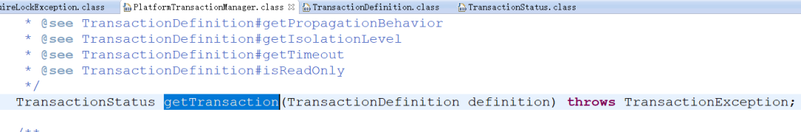

这个方法返回的是 TransactionStatus对象，然后程序根据返回的对象来获取事务状态，然后进行相应的操作。
而 TransactionStatus 这个接口的内容如下：
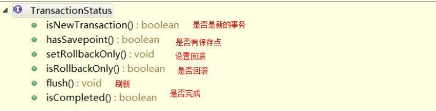
这个接口描述的是一些处理事务提供简单的控制事务执行和查询事务状态的方法，在回滚或提交的时候需要应用对应的事务状态。

####3、TransactionDefinition　基本事务属性的定义
上面讲到的事务管理器接口PlatformTransactionManager通过getTransaction(TransactionDefinition definition)方法来得到事务，这个方法里面的参数是TransactionDefinition类，这个类就定义了一些基本的事务属性。
事务属性可以理解成事务的一些基本配置，描述了事务策略如何应用到方法上。事务属性包含了5个方面，如图所示：
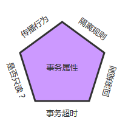

TransactionDefinition 接口方法如下：
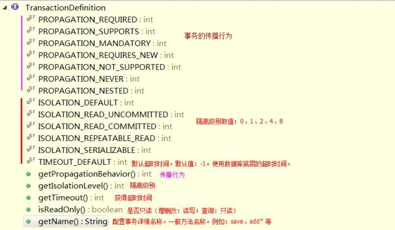

######A、传播行为：当事务方法被另一个事务方法调用时，必须指定事务应该如何传播。
Spring 定义了如下七中传播行为，这里以A业务和B业务之间如何传播事务为例说明：
　　①、<strong>PROPAGATION_REQUIRED</strong>：required , 必须。默认值，A如果有事务，B将使用该事务；如果A没有事务，B将创建一个新的事务。
　　②、<strong>PROPAGATION_SUPPORTS</strong>：supports ，支持。A如果有事务，B将使用该事务；如果A没有事务，B将以非事务执行。
　　③、<strong>PROPAGATION_MANDATORY</strong>：mandatory ，强制。A如果有事务，B将使用该事务；如果A没有事务，B将抛异常。
　　④、<strong>PROPAGATION_REQUIRES_NEW</strong>：requires_new，必须新的。如果A有事务，将A的事务挂起，B创建一个新的事务；如果A没有事务，B创建一个新的事务。
　　⑤、<strong>PROPAGATION_NOT_SUPPORTED</strong>：not_supported ,不支持。如果A有事务，将A的事务挂起，B将以非事务执行；如果A没有事务，B将以非事务执行。
　　⑥、<strong>PROPAGATION_NEVER</strong>：never，从不。如果A有事务，B将抛异常；如果A没有事务，B将以非事务执行。
　　⑦、<strong>PROPAGATION_NESTED</strong>：nested ，嵌套。A和B底层采用保存点机制，形成嵌套事务。

######B、隔离级别：定义了一个事务可能受其他并发事务影响的程度。
<strong style="color: #E96900;">并发事务引起的问题：</strong>
在典型的应用程序中，多个事务并发运行，经常会操作相同的数据来完成各自的任务。并发虽然是必须的，但可能会导致以下的问题。
　　①、<strong style="color: DarkOrchid;">脏读（Dirty reads）</strong>——脏读发生在一个事务读取了另一个事务改写但尚未提交的数据时。如果改写在稍后被回滚了，那么第一个事务获取的数据就是无效的。
　　②、<strong style="color: DarkOrchid;">不可重复读（Nonrepeatable read）</strong>——不可重复读发生在一个事务执行相同的查询两次或两次以上，但是每次都得到不同的数据时。这通常是因为另一个并发事务在两次查询期间进行了更新。
　　③、<strong style="color: DarkOrchid;">幻读（Phantom read）</strong>——幻读与不可重复读类似。它发生在一个事务（T1）读取了几行数据，接着另一个并发事务（T2）插入了一些数据时。在随后的查询中，第一个事务（T1）就会发现多了一些原本不存在的记录。

<strong style="color: #E96900;">注意：不可重复读重点是修改，而幻读重点是新增或删除。</strong>

在 Spring 事务管理中，为我们定义了如下的隔离级别：
　　①、ISOLATION_DEFAULT：使用后端数据库默认的隔离级别
　　②、ISOLATION_READ_UNCOMMITTED：最低的隔离级别，允许读取尚未提交的数据变更，可能会导致脏读、幻读或不可重复读
　　③、ISOLATION_READ_COMMITTED：允许读取并发事务已经提交的数据，可以阻止脏读，但是幻读或不可重复读仍有可能发生
　　④、ISOLATION_REPEATABLE_READ：对同一字段的多次读取结果都是一致的，除非数据是被本身事务自己所修改，可以阻止脏读和不可重复读，但幻读仍有可能发生
　　⑤、ISOLATION_SERIALIZABLE：最高的隔离级别，完全服从ACID的隔离级别，确保阻止脏读、不可重复读以及幻读，也是最慢的事务隔离级别，因为它通常是通过完全锁定事务相关的数据库表来实现的

上面定义的隔离级别，在 Spring 的 TransactionDefinition.class 中也分别用常量 -1,0,1,2,4,8表示。比如 ISOLATION_DEFAULT 的定义：
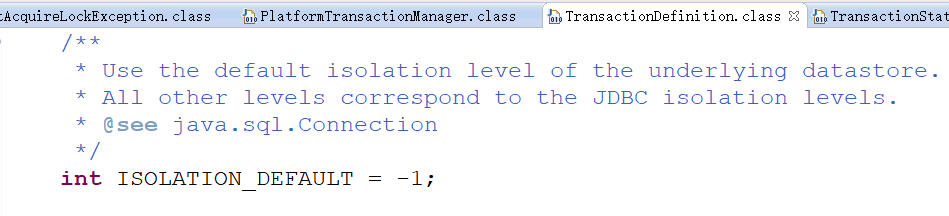

######C、只读
这是事务的第三个特性，是否为只读事务。如果事务只对后端的数据库进行该操作，数据库可以利用事务的只读特性来进行一些特定的优化。通过将事务设置为只读，你就可以给数据库一个机会，让它应用它认为合适的优化措施。

######D、事务超时
为了使应用程序很好地运行，事务不能运行太长的时间。因为事务可能涉及对后端数据库的锁定，所以长时间的事务会不必要的占用数据库资源。事务超时就是事务的一个定时器，在特定时间内事务如果没有执行完毕，那么就会自动回滚，而不是一直等待其结束。

######E、回滚规则
事务五边形的最后一个方面是一组规则，这些规则定义了哪些异常会导致事务回滚而哪些不会。**默认情况下，事务只有遇到运行期异常时才会回滚**，而在遇到检查型异常时不会回滚（这一行为与EJB的回滚行为是一致的） 。但是你**可以声明事务在遇到特定的检查型异常时像遇到运行期异常那样回滚**。同样，你**还可以声明事务遇到特定的异常不回滚，即使这些异常是运行期异常**。

##四、Spring 编程式事务和声明式事务的区别
<strong>编程式事务处理</strong>：所谓编程式事务指的是通过编码方式实现事务，允许用户在代码中精确定义事务的边界。即类似于JDBC编程实现事务管理。管理使用TransactionTemplate或者直接使用底层的PlatformTransactionManager。对于编程式事务管理，spring推荐使用TransactionTemplate。
<strong>声明式事务处理</strong>：管理建立在AOP之上的。其本质是对方法前后进行拦截，然后在目标方法开始之前创建或者加入一个事务，在执行完目标方法之后根据执行情况提交或者回滚事务。声明式事务最大的优点就是不需要通过编程的方式管理事务，这样就不需要在业务逻辑代码中掺杂事务管理的代码，只需在配置文件中做相关的事务规则声明(或通过基于@Transactional注解的方式)，便可以将事务规则应用到业务逻辑中。

简单地说，编程式事务侵入到了业务代码里面，但是提供了更加详细的事务管理；而声明式事务由于基于AOP，所以既能起到事务管理的作用，又可以不影响业务代码的具体实现。
