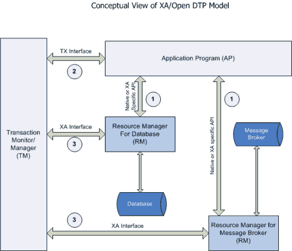

<center>分布式事务</center>
##一、前言
分布式事务就是指事务的参与者、支持事务的服务器、资源服务器以及事务管理器分别位于不同的分布式系统的不同节点之上。
简单的说，就是一次大的操作由不同的小操作组成，这些小的操作分布在不同的服务器上，且属于不同的应用，分布式事务需要保证这些小操作要么全部成功，要么全部失败。本质上来说，**分布式事务就是为了保证不同数据库的数据一致性。**

##二、产生原因
####1、数据库分库分表：
当数据库单表一年产生的数据超过1000W，那么就要考虑分库分表，简单的说，就是原来的一个数据库变成了多个数据库。这时候，如果一个操作既访问01库，又访问02库，而且要保证数据的一致性，那么就要用到分布式事务。

####2、应用SOA化：
​所谓的SOA化，就是业务的服务化。比如原来单机支撑了整个电商网站，现在对整个网站进行拆解，分离出了订单中心、用户中心、库存中心。对于订单中心，有专门的数据库存储订单信息，用户中心也有专门的数据库存储用户信息，库存中心也会有专门的数据库存储库存信息。这时候如果要同时对订单和库存进行操作，那么就会涉及到订单数据库和库存数据库，为了保证数据一致性，就需要用到分布式事务。

##三、应用场景
####1、支付、转账：
最经典的场景就是支付了，一笔支付，是对买家账户进行扣款，同时对卖家账户进行加钱，这些操作必须在一个事务里执行，要么全部成功，要么全部失败。而对于买家账户属于买家中心，对应的是买家数据库，而卖家账户属于卖家中心，对应的是卖家数据库，对不同数据库的操作必然需要引入分布式事务。

####2、在线下单：
买家在电商平台下单，往往会涉及到两个动作，一个是扣库存，第二个是更新订单状态，库存和订单一般属于不同的数据库，需要使用分布式事务保证数据一致性。

####3、电商场景：流量充值业务
​中国移动-流量充值能力中心，核心业务流程为：
1、用户进入流量充值商品购买页面，选择流量商品；
2、购买流量充值商品，有库存限制则判断库存，生成流量购买订单；
3、选择对应的支付方式（和包、银联、支付宝、微信）进行支付操作；
4、支付成功后，近实时流量到账即可使用流量商品；

##四、术语
+ <strong style='color: Darkorange'>事务</strong>：事务是由一组操作构成的可靠的独立的工作单元，事务具备ACID的特性，即原子性、一致性、隔离性和持久性。
+ <strong style='color: Darkorange'>分布式事务</strong>：涉及两个或多个数据库源的事务，即跨越多台同类或异类数据库的事务（由每台数据库的本地事务组成的），分布式事务旨在保证这些本地事务的所有操作的ACID，使事务可以跨越多台数据库。
+ <strong style='color: Darkorange'>本地事务</strong>：当事务由资源管理器本地管理时被称作本地事务。本地事务的优点就是支持严格的ACID特性，高效，可靠，状态可以只在资源管理器中维护，而且应用编程模型简单。但是本地事务不具备分布式事务的处理能力，隔离的最小单位受限于资源管理器。
+ <strong style='color: Darkorange'>全局事务</strong>：当事务由全局事务管理器进行全局管理时成为全局事务，事务管理器负责管理全局的事务状态和参与的资源，协同资源的一致提交回滚。
+ <strong style='color: Darkorange'>TX协议</strong>：应用或者应用服务器与事务管理器的接口。
+ <strong style='color: Darkorange'>XA协议</strong>：全局事务管理器与资源管理器的接口。XA是由X/Open组织提出的分布式事务规范。该规范主要定义了全局事务管理器和局部资源管理器之间的接口。主流的数据库产品都实现了XA接口。XA接口是一个双向的系统接口，在事务管理器以及多个资源管理器之间作为通信桥梁。之所以需要XA是因为在分布式系统中从理论上讲两台机器是无法达到一致性状态的，因此引入一个单点进行协调。由全局事务管理器管理和协调的事务可以跨越多个资源和进程。全局事务管理器一般使用XA二阶段协议与数据库进行交互。
+ <strong style='color: Darkorange'>AP</strong>：应用程序，可以理解为使用DTP（Data Tools Platform）的程序。
+ <strong style='color: Darkorange'>RM</strong>：资源管理器，这里可以是一个DBMS或者消息服务器管理系统，应用程序通过资源管理器对资源进行控制，资源必须实现XA定义的接口。资源管理器负责控制和管理实际的资源。
+ <strong style='color: Darkorange'>TM</strong>：事务管理器，负责协调和管理事务，提供给AP编程接口以及管理资源管理器。事务管理器控制着全局事务，管理事务的生命周期，并且协调资源。
+ <strong style='color: Darkorange'>两阶段提交协议</strong>：XA用于在全局事务中协调多个资源的机制。TM和RM之间采取两阶段提交的方案来解决一致性问题。两节点提交需要一个协调者（TM）来掌控所有参与者（RM）节点的操作结果并且指引这些节点是否需要最终提交。两阶段提交的局限在于协议成本，准备阶段的持久成本，全局事务状态的持久成本，潜在故障点多带来的脆弱性，准备后，提交前的故障引发一系列隔离与恢复难题。
+ <strong style='color: Darkorange'>BASE理论</strong>：BA指的是基本业务可用性，支持分区失败，S表示柔性状态，也就是允许短时间内不同步，E表示最终一致性，数据最终是一致的，但是实时是不一致的。原子性和持久性必须从根本上保障，为了可用性、性能和服务降级的需要，只有降低一致性和隔离性的要求。
+ <strong style='color: Darkorange'>CAP定理</strong>：对于共享数据系统，最多只能同时拥有CAP其中的两个，任意两个都有其适应的场景，真实的业务系统中通常是ACID与CAP的混合体。分布式系统中最重要的是满足业务需求，而不是追求高度抽象，绝对的系统特性。C表示一致性，也就是所有用户看到的数据是一样的。A表示可用性，是指总能找到一个可用的数据副本。P表示分区容错性，能够容忍网络中断等故障。
+ <strong style='color: Darkorange'>柔性事务中的服务模式</strong>：
  + <strong style='color: Coral'>可查询操作</strong>：服务操作具有全局唯一的标识，操作唯一的确定的时间。
  + <strong style='color: Coral'>幂等操作</strong>：重复调用多次产生的业务结果与调用一次产生的结果相同。一是通过业务操作实现幂等性，二是系统缓存所有请求与处理的结果，最后是检测到重复请求之后，自动返回之前的处理结果。
  + <strong style='color: Coral'>TCC操作</strong>：Try阶段，尝试执行业务，完成所有业务的检查，实现一致性；预留必须的业务资源，实现准隔离性。Confirm阶段：真正的去执行业务，不做任何检查，仅适用Try阶段预留的业务资源，Confirm操作还要满足幂等性。Cancel阶段：取消执行业务，释放Try阶段预留的业务资源，Cancel操作要满足幂等性。TCC与2PC(两阶段提交)协议的区别：TCC位于业务服务层而不是资源层，TCC没有单独准备阶段，Try操作兼备资源操作与准备的能力，TCC中Try操作可以灵活的选择业务资源，锁定粒度。TCC的开发成本比2PC高。实际上TCC也属于两阶段操作，但是TCC不等同于2PC操作。
  + <strong style='color: Coral'>可补偿操作</strong>：Do阶段：真正的执行业务处理，业务处理结果外部可见。Compensate阶段：抵消或者部分撤销正向业务操作的业务结果，补偿操作满足幂等性。约束：补偿操作在业务上可行，由于业务执行结果未隔离或者补偿不完整带来的风险与成本可控。实际上，TCC的Confirm和Cancel操作可以看做是补偿操作。

##五、保证强一致性
####1、本地事务（mysql 之 InnoDB）：
InnoDB支持事务，同Oracle类似，事务提交需要写redo、undo。采用日志先行的策略，将数据的变更在内存中完成，并且将事务记录成redo，顺序的写入redo日志中，即表示该事务已经完成，就可以返回给客户已提交的信息。但是实际上被更改的数据还在内存中，并没有刷新到磁盘，即还没有落地，当达到一定的条件，会触发checkpoint，将内存中的数据（page）合并写入到磁盘，这样就减少了离散写、IOPS，提高性能。
在这个过程中，如果服务器宕机了，内存中的数据丢失，当重启后，会通过redo日志进行recovery重做。确保不会丢失数据。因此只要redo能够实时的写入到磁盘，InnoDB就不会丢数据。

####2、分布式事务：
多个数据库中的某个数据库在提交事务的时候突然断电，那么它是怎么样恢复的呢？ 这也是分布式系统复杂的地方，因为分布式的网络环境很复杂，这种“断电”故障要比单机多很多，所以我们在做分布式系统的时候，最先考虑的就是这种情况。这些异常可能有 机器宕机、网络异常、消息丢失、消息乱序、数据错误、不可靠的TCP、存储数据丢失、其他异常等等...
在分布式系统中，同时满足 "CAP定律" 中的 "一致性"、"可用性" 和 "分区容错性" 三者是不可能的， 根据不同的业务场景使用不同的方法实现最终一致性，可以根据业务的特性做部分取舍，在业务过程中可以容忍一定时间内的数据不一致。

##六、柔性事务解决方案架构
在电商领域等互联网场景下，传统的事务在数据库性能和处理能力上都暴露出了瓶颈。柔性事务有两个特性：基本可用和柔性状态。所谓基本可用是指分布式系统出现故障的时候允许损失一部分的可用性。柔性状态是指允许系统存在中间状态，这个中间状态不会影响系统整体的可用性，比如数据库读写分离的主从同步延迟等。柔性事务的一致性指的是最终一致性。

####（一）、基于可靠消息的最终一致性方案概述

+ 实现：业务处理服务在业务事务提交之前，向实时消息服务请求发送消息，实时消息服务只记录消息数据，而不是真正的发送。业务处理服务在业务事务提交之后，向实时消息服务确认发送。只有在得到确认发送指令后，实时消息服务才会真正发送。
+ 消息：业务处理服务在业务事务回滚后，向实时消息服务取消发送。消息发送状态确认系统定期找到未确认发送或者回滚发送的消息，向业务处理服务询问消息状态，业务处理服务根据消息ID或者消息内容确认该消息是否有效。被动方的处理结果不会影响主动方的处理结果，被动方的消息处理操作是幂等操作。
+ 成本：可靠的消息系统建设成本，一次消息发送需要两次请求，业务处理服务需要实现消息状态回查接口。
+ 优点：消息数据独立存储，独立伸缩，降低业务系统和消息系统之间的耦合。对最终一致性时间敏感度较高，降低业务被动方的实现成本。兼容所有实现JMS标准的MQ中间件，确保业务数据可靠的前提下，实现业务的最终一致性，理想状态下是准实时的一致性。

####（二）、TCC事务补偿型方案

+ 实现：一个完整的业务活动由一个主业务服务于若干的从业务服务组成。主业务服务负责发起并完成整个业务活动。从业务服务提供TCC型业务操作。业务活动管理器控制业务活动的一致性，它登记业务活动的操作，并在业务活动提交时确认所有的TCC型操作的Confirm操作，在业务活动取消时调用所有TCC型操作的Cancel操作。
+ 成本：实现TCC操作的成本较高，业务活动结束的时候Confirm和Cancel操作的执行成本。业务活动的日志成本。
+ 使用范围：强隔离性，严格一致性要求的业务活动。适用于执行时间较短的业务，比如处理账户或者收费等等。
+ 特点：不与具体的服务框架耦合，位于业务服务层，而不是资源层，可以灵活的选择业务资源的锁定粒度。TCC里对每个服务资源操作的是本地事务，数据被锁住的时间短，可扩展性好，可以说是为独立部署的SOA服务而设计的。

####（三）、最大努力通知型

+ 实现：业务活动的主动方在完成处理之后向业务活动的被动方发送消息，允许消息丢失。业务活动的被动方根据定时策略，向业务活动的主动方查询，恢复丢失的业务消息。
+ 约束：被动方的处理结果不影响主动方的处理结果。
+ 成本：业务查询与校对系统的建设成本。
+ 使用范围：对业务最终一致性的时间敏感度低。跨企业的业务活动。
+ 特点：业务活动的主动方在完成业务处理之后，向业务活动的被动方发送通知消息。主动方可以设置时间阶梯通知规则，在通知失败后按规则重复通知，直到通知N次后不再通知。主动方提供校对查询接口给被动方按需校对查询，用户恢复丢失的业务消息。
+ 适用范围：银行通知，商户通知。

##七、基于可靠消息的最终一致性方案详解
####（一）、消息发送一致性
消息中间件在分布式系统中的核心作用就是异步通讯、应用解耦和并发缓冲（也叫作流量削峰）。在分布式环境下，需要通过网络进行通讯，就引入了数据传输的不确定性，也就是CAP理论中的分区容错性。

消息发送一致性是指产生消息的业务动作与消息发送一致，也就是说如果业务操作成功，那么由这个业务操作所产生的消息一定要发送出去，否则就丢失。

######处理方式一
```java
public void completeOrderService() {
	// 处理订单
	order.process();

	// 发送会计原始凭证消息
	pipe.sendAccountingVouchetMessage();
}
```
在上面的情况中，如果业务操作成功，执行的消息发送之前应用发生故障，消息发送不出去，导致消息丢失，将会产生订单系统与会计系统的数据不一致。如果消息系统或者网络异常，也会导致消息发送不出去，也会造成数据不一致。

######处理方式二
```java
public void completeOrderService() {
	// 发送会计原始凭证消息
	pipe.sendAccountingVouchetMessage();

	// 处理订单
	order.process();
}
```
如果将上面的两个操作调换一下顺序，这种情况就会更加不可控了，消息发出去了业务订单可能会失败，会造成订单系统与业务系统的数据不一致。那么JMS标准中的XA协议是否可以保障发送的一致性？
+ JMS协议标准的API中，有很多以XA开头的接口，其实就是前面讲到的支持XA协议（基于两阶段提交协议）的全局事务型接口。
```
XAConnection.class
XAConnectionFactory.class
XAQueueConnection.class
XAQueueConnectionFactory.class
XASession.class
XATopicConnection.class
XATopicConnectionFactory.class
XATopicSession.class
```
+ JMS中的XA系列的接口可以提供分布式事务的支持。但是引用XA方式的分布式事务，就会带来很多局限性。
  + 要求业务操作的资源必须支持XA协议，但是并不是所有的资源都支持XA协议。
  + 两阶段提交协议的成本。
  + 持久化成本等DTP模型的局限性，例如：全局锁定、成本高、性能低。
  + 使用XA协议违背了柔性事务的初衷。

####（二）、保证消息一致的变通做法

1. 发送消息：主动方现将应用把消息发给消息中间件，消息状态标记为“待确认”状态。
2. 消息中间件收到消息后，把消息持久化到消息存储中，但是并不影响被动方投递消息。
3. 消息中间件返回消息持久化结果，主动方根据返回的结果进行判断如何进行业务操作处理：
    1. 失败：放弃执行业务操作处理，结束，必要时向上层返回处理结果。
    2. 成功：执行业务操作处理。
4. 业务操作完成后，把业务操作结果返回给消息中间件。
5. 消息中间件收到业务操作结构后，根据业务结果进行处理：
    1. 失败：删除消息存储中的消息，结束。
    2. 成功：更新消息存储中的消息状态为“待发送”，然后执行消息投递。
6. 前面的正向流程都成功之后，向被动方应用投递消息。
但是在上面的处理流程中，任何一个环节都有可能出现问题。

####（三）、常规MQ消息处理流程和特点

+ 常规的MQ队列处理流程无法实现消息的一致性。
+ 投递消息的本质就是消息消费，可以细化。

####（四）、消息重复发送问题和业务接口幂等性设计

对于未确认的消息，采用按规则重新投递的方式进行处理。对于以上流程，消息重复发送会导致业务处理接口出现重复调用的问题。消息消费过程中消息重复发送的主要原因就是消费者成功接收处理完消息后，消息中间件没有及时更新投递状态导致的。如果允许消息重复发送，那么消费方应该实现业务接口的幂等性设计。

####（五）、本地消息服务方案

+ 实现思路：
    + 主动方应用系统通过业务操作完成业务数据的操作，在准备发送消息的时候将消息存储在主动方应用系统一份，另一份发送到实时消息服务
    + 被动方应用系统监听实时消息系统中的消息，当被动方完成消息处理后通过调用主动方接口完成消息确认
    + 主动方接收到消息确认以后删除消息数据。
    + 通过消息查询服务查询到消息被接收之后再规定的时间内没有返回ACK确认 消息就通过消息恢复系统重新发送消息。
+ 优点：
    + 消息的时效性比较高
    + 从应用设计的角度实现了消息数据的可靠性，消息数据的可靠性不依赖于MQ中间件，弱化了对MQ中间件特性的依赖。
    + 方案轻量级，容易实现。
+ 缺点：
    + 与具体的业务场景绑定，耦合性强，不可以共用。
    + 消息数据与业务数据同步，占用业务系统资源。
    + 业务系统在使用关系型数据库的情况下消息服务性能会受到关系型数据库的并发性能限制。

####（六）、独立消息服务方案

+ 实现思路：
    + 预发送消息：主动方应用系统预发送消息，由消息服务子系统存储消息，如果存储失败，那么也就无法进行业务操作。如果返回存储成功，然后执行业务操作。
    + 执行业务操作：执行业务操作如果成功的时候，将业务操作执行成功的状态发送到消息服务子系统。消息服务子系统修改消息的标识为“可发送”状态。
    + 发送消息到实时消息服务：当消息的状态发生改变的时候，立刻将消息发送到实时消息服务中。接下来，消息将会被消息业务的消费端监听到，然后被消费。
    + 消息状态子系统：相当于定时任务系统，在消息服务子系统中定时查找确认超时的消息，在主动方应用系统中也去定时查找没有处理成功的任务，进行相应的处理。
    + 消息消费：当消息被消费的时候，向实时消息服务发送ACK，然后实时消息服务删除消息。同时调用消息服务子系统修改消息为“被消费”状态。
    + 消息恢复子系统：当消费方返回消息的时候，由于网络中断等其他原因导致消息没有及时确认，那么需要消息恢复子系统定时查找出在消息服务子系统中没有确认的消息。将没有被确认的消息放到实时消息服务中，进行重做，因为被动方应用系统的接口是幂等的。
+ 优点：
    + 消息服务独立部署，独立维护，独立伸缩。
    + 消息存储可以按需选择不同的数据库来集成实现。
    + 消息服务可以被相同的的使用场景使用，降低重复建设服务的成本。
    + 从分布式服务应用设计开发角度实现了消息数据的可靠性，消息数据的可靠性不依赖于MQ中间件，弱化了对MQ中间件特性的依赖。
    + 降低了业务系统与消息系统之间的耦合，有利于系统的扩展维护。
+ 缺点：
    + 一次消息发送需要两次请求。
    + 主动方应用系统需要实现业务操作状态的校验与查询接口。

####（七）、消息服务子系统的设计实现
示例消息数据表：
| 名称 | 数据类型 | 允许空 | 默认值 | 属性  | 释义 |
| :--  | :--     | :--   | :--    | :--  | :--  |
| uuid | varchar(50) | No | — | unique | UUID |
| version | int(11) | No | 0 | — | 版本号 |
| editer | varchar(100) | Yes | NULL | — | 修改者 |
| creater | varchar(100) | Yes | NULL | — | 创建者 |
| edit_time | datetime | Yes | 0000-00-00 00:00:00 | — | 最后修改时间 |
| create_time | datetime | No | 0000-00-00 00:00:00 | — | 创建时间 |
| msg_id | varchar(50) | No | — | — | 消息ID |
| msg_body | longtext | No | — | — | 消息内容 |
| msg_date_type | varchar(50) | Yes | — | — | 消息数据类型 |
| consumer_queue | varchar(100) | No | — | — | 消费队列 |
| send_times | int(6) | No | 0 | — | 消息重发次数 |
| is_dead | varchar(20) | No | — | — | 是否死亡 |
| status | varchar(20) | No | — | — | 状态 |
| remark | varchar(200) | Yes | — | — | 备注 |
| field0 | varchar(200) | Yes | — | — | 扩展字段0 |
| field1 | varchar(200) | Yes | — | — | 扩展字段1 |
| field2 | varchar(200) | Yes | — | — | 扩展字段2 |

##七、分布式事务解决方案

####1、基于XA协议的两阶段提交（2PC）
下图说明了事务管理器、资源管理器，与应用程序之间的关系：


######1、运行过程
在分布式事务的控制中采用了**两阶段提交协议（Two- Phase Commit Protocol）**。即事务的提交分为两个阶段：
　　**预提交阶段(Pre-Commit Phase)**　　**决策后阶段（Post-Decision Phase）**
为了支持两阶段提交，一个分布式更新事务中涉及到的服务器必须能够相互通信。一般来说一个服务器会被指定为"控制"或"提交"服务器并监控来自其它服务器的信息。

在一个分布式事务中，必须有一个场地的Server作为协调者(coordinator)，它能向 其它场地的Server发出请求，并对它们的回答作出响应，由它来控制一个分布式事务的提交或撤消。该分布式事务中涉及到的其它场地的Server称为参 与者（Participant）。


事务两阶段提交的过程如下：
+ 两阶段提交在应用程序向协调者发出一个提交命令时被启动。这时提交进入第一阶段，即预提交阶段。在这一阶段中：
    (1) 协调者准备局部（即在本地）提交并在日志中写入"预提交"日志项，并包含有该事务的所有参与者的名字。
    (2) 协调者询问参与者能否提交该事务。一个参与者可能由于多种原因不能提交。例如，该Server提供的约束条件（Constraints）的延迟检查不符合 限制条件时，不能提交；参与者本身的Server进程或硬件发生故障，不能提交；或者协调者访问不到某参与者（网络故障），这时协调者都认为是收到了一个 否定的回答。
    (3) 如果参与者能够提交，则在其本身的日志中写入"准备提交"日志项，该日志项立即写入硬盘，然后给协调者发回，已准备好提交"的回答。
    (4) 协调者等待所有参与者的回答，如果有参与者发回否定的回答，则协调者撤消该事务并给所有参与者发出一个"撤消该事务"的消息，结束该分布式事务，撤消该事务的所有影响。
+ 如果所有的参与者都送回"已准备好提交"的消息，则该事务的提交进入第二阶段，即决策后提交阶段。在这一阶段中：
    (1) 协调者在日志中写入"提交"日志项，并立即写入硬盘。　　
    (2) 协调者向参与者发出"提交该事务"的命令。各参与者接到该命令后，在各自的日志中写入"提交"日志项，并立即写入硬盘。然后送回"已提交"的消息，释放该事务占用的资源。
    (3) 当所有的参与者都送回"已提交"的消息后，协调者在日志中写入"事务提交完成"日志项，释放协调者占用的资源 。这样，完成了该分布式事务的提交。

######2、存在的问题
+ 同步阻塞 所有事务参与者在等待其它参与者响应的时候都处于同步阻塞状态，无法进行其它操作。
+ 单点问题 协调者在 2PC 中起到非常大的作用，发生故障将会造成很大影响。特别是在阶段二发生故障，所有参与者会一直等待状态，无法完成其它操作。
+ 数据不一致 在阶段二，如果协调者只发送了部分 Commit 消息，此时网络发生异常，那么只有部分参与者接收到 Commit 消息，也就是说只有部分参与者提交了事务，使得系统数据不一致。
+ 太过保守 任意一个节点失败就会导致整个事务失败，没有完善的容错机制。

######3、优缺点
<strong>优点</strong>： 尽量保证了数据的强一致，适合对数据强一致要求很高的关键领域。
<strong>缺点</strong>： 实现复杂，牺牲了可用性，对性能影响较大，涉及多次节点间的网络通信，通信时间太长，不适合高并发高性能场景。

####2、补偿事务（TCC）
######1、阶段
TCC 其实就是采用的补偿机制，其核心思想是：针对每个操作，都要注册一个与其对应的确认和补偿（撤销）操作。它分为三个阶段：
+ Try 阶段主要是对业务系统做检测及资源预留
+ Confirm 阶段主要是对业务系统做确认提交，Try阶段执行成功并开始执行 Confirm阶段时，默认 Confirm阶段是不会出错的。即：只要Try成功，Confirm一定成功。
+ Cancel 阶段主要是在业务执行错误，需要回滚的状态下执行的业务取消，预留资源释放。

######2、例子
举个例子，假入 Bob 要向 Smith 转账，思路大概是： 我们有一个本地方法，里面依次调用
1. 首先在 Try 阶段，要先调用远程接口把 Smith 和 Bob 的钱给冻结起来。
2. 在 Confirm 阶段，执行远程调用的转账的操作，转账成功进行解冻。
3. 如果第2步执行成功，那么转账成功，如果第二步执行失败，则调用远程冻结接口对应的解冻方法 (Cancel)。

######3、优缺点
<strong>优点</strong>： 跟2PC比起来，实现以及流程相对简单了一些，但数据的一致性比2PC也要差一些
<strong>缺点</strong>： 缺点还是比较明显的，在2,3步中都有可能失败。TCC属于应用层的一种补偿方式，所以需要程序员在实现的时候多写很多补偿的代码，在一些场景中，一些业务流程可能用TCC不太好定义及处理。

####3、本地消息表（MQ 异步确保）
这种实现方式的思路，其实是源于ebay，后来通过支付宝等公司的布道，在业内广泛使用。其基本的设计思想是将远程分布式事务拆分成一系列的本地事务。

######1、基本思路
*消息生产方*，需要额外建一个消息表，并记录消息发送状态。消息表和业务数据要在一个事务里提交，也就是说他们要在一个数据库里面。然后消息会经过 MQ 发送到消息的消费方。如果消息发送失败，会进行重试发送。
*消息消费方*，需要处理这个消息，并完成自己的业务逻辑。此时如果本地事务处理成功，表明已经处理成功了，如果处理失败，那么就会重试执行。如果是业务上面的失败，可以给生产方发送一个业务补偿消息，通知生产方进行回滚等操作。
*生产方和消费方定时扫描本地消息表*，把还没处理完成的消息或者失败的消息再发送一遍。如果有靠谱的自动对账补账逻辑（防止消息会被重复投递，增加消息应用状态表（message_apply），通俗来说就是个账本，用于记录消息的消费情况，每次来一个消息， 在真正执行之前，先去消息应用状态表中查询一遍，如果找到说明是重复消息，丢弃即可，如果没找到才执行，同时插入到消息应用状态表（同一事务）），这种方案还是非常实用的。

这种方案遵循 BASE 理论，采用的是最终一致性，比较适合实际业务场景的，即不会出现像 2PC 那样复杂的实现(当调用链很长的时候，2PC 的可用性是非常低的)，也不会像 TCC 那样可能出现确认或者回滚不了的情况。

######2、关系型数据库中的表实现
本地消息表与业务数据表处于同一个数据库中，这样就能利用本地事务来保证在对这两个表的操作满足事务特性，并且使用了消息队列来保证最终一致性。
1. 在分布式事务操作的一方完成写业务数据的操作之后向本地消息表发送一个消息，本地事务能保证这个消息一定会被写入本地消息表中。
2. 之后将本地消息表中的消息转发到 Kafka 等消息队列中，如果转发成功则将消息从本地消息表中删除，否则继续重新转发。
3. 在分布式事务操作的另一方从消息队列中读取一个消息，并执行消息中的操作。

######3、优缺点
<strong>优点</strong>： 一种非常经典的实现，避免了分布式事务，实现了最终一致性。
<strong>缺点</strong>： 消息表会耦合到业务系统中，如果没有封装好的解决方案，会有很多杂活需要处理，而且，关系型数据库的吞吐量和性能方面存在瓶颈，频繁的读写消息会给数据库造成压力。

####4、MQ 事务消息
有一些第三方的 MQ 是支持事务消息的，比如 RocketMQ，他们支持事务消息的方式也是类似于采用的二阶段提交，但是市面上一些主流的 MQ 都是不支持事务消息的，比如 RabbitMQ 和 Kafka 都不支持。

######1、思路
以阿里的 RocketMQ 中间件为例，其思路大致为：
+ 第一阶段Prepared消息，会拿到消息的地址。
+ 第二阶段执行本地事务，
+ 第三阶段通过第一阶段拿到的地址去访问消息，并修改状态。

也就是说在业务方法内要想消息队列提交两次请求，一次发送消息和一次确认消息。如果确认消息发送失败了RocketMQ会定期扫描消息集群中的事务消息，这时候发现了Prepared消息，它会向消息发送者确认，所以生产方需要实现一个check接口，RocketMQ会根据发送端设置的策略来决定是回滚还是继续发送确认消息。这样就保证了消息发送与本地事务同时成功或同时失败。

######2、具体原理

1、A系统向消息中间件发送一条预备消息
2、消息中间件保存预备消息并返回成功
3、A执行本地事务
4、A发送提交消息给消息中间件

通过以上4 步完成了一个消息事务。对于以上的4个步骤，每个步骤都可能产生错误，下面一一分析：
+ 步骤一出错，则整个事务失败，不会执行A的本地操作
+ 步骤二出错，则整个事务失败，不会执行A的本地操作
+ 步骤三出错，这时候需要回滚预备消息，怎么回滚？答案是A系统实现一个消息中间件的回调接口，消息中间件会去不断执行回调接口，检查A事务执行是否执行成功，如果失败则回滚预备消息
+ 步骤四出错，这时候A的本地事务是成功的，那么消息中间件要回滚A吗？答案是不需要，其实通过回调接口，消息中间件能够检查到A执行成功了，这时候其实不需要A发提交消息了，消息中间件可以自己对消息进行提交，从而完成整个消息事务

基于消息中间件的两阶段提交往往用在高并发场景下，将一个分布式事务拆成一个消息事务（A系统的本地操作+发消息）+B系统的本地操作，其中B系统的操作由消息驱动，只要消息事务成功，那么A操作一定成功，消息也一定发出来了，这时候B会收到消息去执行本地操作，如果本地操作失败，消息会重投，直到B操作成功，这样就变相地实现了A与B的分布式事务。

######3、例子效果


######4、优缺点
<strong>优点</strong>： 实现了最终一致性，不需要依赖本地数据库事务。
<strong>缺点</strong>： 实现难度大，主流MQ不支持，RocketMQ事务消息部分代码也未开源。

####5、Sagas 事务模型
Saga事务模型又叫做长时间运行的事务（Long-running-transaction）, 它是由普林斯顿大学的H.Garcia-Molina等人提出，它描述的是另外一种在没有两阶段提交的的情况下解决分布式系统中复杂的业务事务问题。
这里说的是一种基于 Sagas 机制的工作流事务模型，这个模型的相关理论目前来说还是比较新的。

######1、核心思想
该模型其核心思想就是拆分分布式系统中的长事务为多个短事务，或者叫多个本地事务，然后由 Sagas 工作流引擎负责协调，如果整个流程正常结束，那么就算是业务成功完成，如果在这过程中实现失败，那么Sagas工作流引擎就会以相反的顺序调用补偿操作，重新进行业务回滚。

######2、举例
比如我们一次关于购买旅游套餐业务操作涉及到三个操作，他们分别是预定车辆，预定宾馆，预定机票，他们分别属于三个不同的远程接口。可能从我们程序的角度来说他们不属于一个事务，但是从业务角度来说是属于同一个事务的。

他们的执行顺序如上图所示，所以当发生失败时，会依次进行取消的补偿操作。
因为长事务被拆分了很多个业务流，所以 Sagas 事务模型最重要的一个部件就是工作流或者你也可以叫流程管理器（Process Manager），工作流引擎和Process Manager虽然不是同一个东西，但是在这里，他们的职责是相同的。

####6、其他补偿方式
做过支付宝交易接口的同学都知道，我们一般会在支付宝的回调页面和接口里，解密参数，然后调用系统中更新交易状态相关的服务，将订单更新为付款成功。同时，只有当我们回调页面中输出了success字样或者标识业务处理成功相应状态码时，支付宝才会停止回调请求。否则，支付宝会每间隔一段时间后，再向客户方发起回调请求，直到输出成功标识为止。
其实这就是一个很典型的补偿例子，跟一些 MQ 重试补偿机制很类似。
一般成熟的系统中，对于级别较高的服务和接口，整体的可用性通常都会很高。如果有些业务由于瞬时的网络故障或调用超时等问题，那么这种重试机制其实是非常有效的。
当然，考虑个比较极端的场景，假如系统自身有bug或者程序逻辑有问题，那么重试1W次那也是无济于事的。那岂不是就发生了“明明已经付款，却显示未付款不发货”类似的悲剧？
其实为了交易系统更可靠，我们一般会在类似交易这种高级别的服务代码中，加入详细日志记录的，一旦系统内部引发类似致命异常，会有邮件通知。同时，后台会有定时任务扫描和分析此类日志，检查出这种特殊的情况，会尝试通过程序来补偿并邮件通知相关人员。
在某些特殊的情况下，还会有 "人工补偿" 的，这也是最后一道屏障。

##八、总结
分布式事务，本质上是对多个数据库的事务进行统一控制，按照控制力度可以分为：不控制、部分控制和完全控制。
