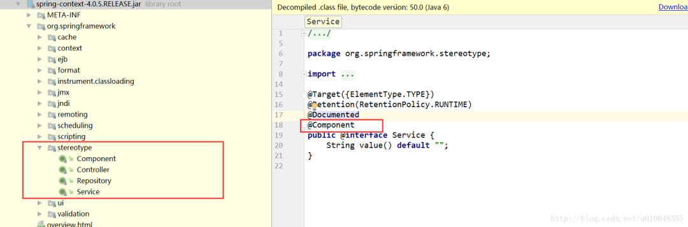

<center>组件类注解</center>
####介绍
<strong>@Component：</strong>标准一个普通的spring Bean类。
<strong>@Repository：</strong>标注一个DAO组件类。
<strong>@Service：</strong>标注一个业务逻辑组件类。
<strong>@Controller：</strong>标注一个控制器组件类。这些都是注解在平时的开发过程中出镜率极高。
@Component、@Repository、@Service、@Controller实质上属于同一类注解，用法相同，功能相同，区别在于标识组件的类型。
@Component可以代替@Repository、@Service、@Controller，因为这三个注解是被@Component标注的。
如下代码：
```java
@Target({ElementType.TYPE})
@Retention(RetentionPolicy.RUNTIME)
@Documented
@Component
public @interface Controller {
    String value() default "";
}
```

####举例详解
（1）当一个组件代表数据访问层（DAO）的时候，我们使用@Repository进行注解，如下
```java
@Repository
public class HappyDaoImpl implements HappyDao{
    private final static Logger LOGGER = LoggerFactory.getLogger(HappyDaoImpl .class);
    public void  club(){
        //do something ,like drinking and singing
    }
}
```
（2）当一个组件代表业务层时，我们使用@Service进行注解，如下
```java
@Service(value="goodClubService")
//使用@Service注解不加value ,默认名称是clubService
public class ClubServiceImpl implements ClubService {
    @Autowired
    private ClubDao clubDao;

    public void doHappy(){
        //do some Happy
    }
}
```
（3）当一个组件作为前端交互的控制层，使用@Controller进行注解，如下
```java
@Controller
public class HappyController {
  @Autowired //下面进行讲解
    private ClubService clubService;

  // Control the people entering the Club
  // do something
}
/*Controller相关的注解下面进行详细讲解，这里简单引入@Controller*/
```

####总结注意点
1、被注解的java类当做Bean实例，Bean实例的名称默认是Bean类的首字母小写，其他部分不变。
@Service也可以自定义Bean名称，但是必须是唯一的！
2、尽量使用对应组件注解的类替换@Component注解，在spring未来的版本中，@Controller，@Service，@Repository会携带更多语义。并且便于开发和维护！
3、指定了某些类可作为Spring Bean类使用后，最好还需要让spring搜索指定路径，在Spring配置文件加入如下配置：
```xml
<!-- 自动扫描指定包及其子包下的所有Bean类 -->
<context:component-scan base-package="org.springframework.*"/>
```
