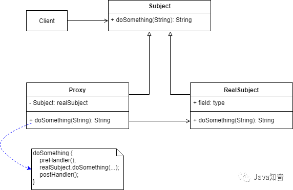
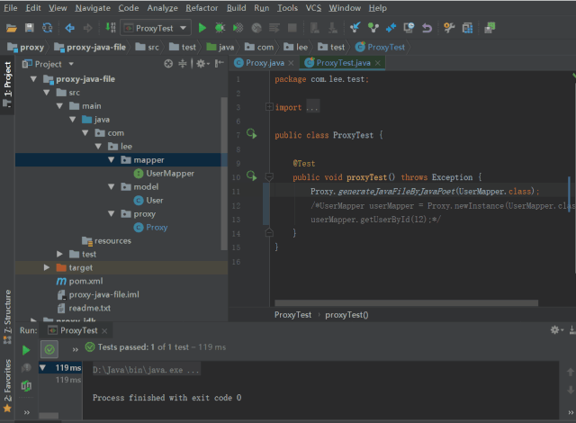
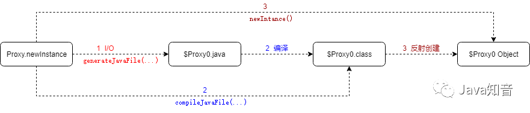
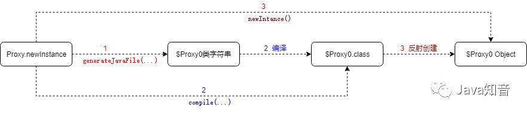
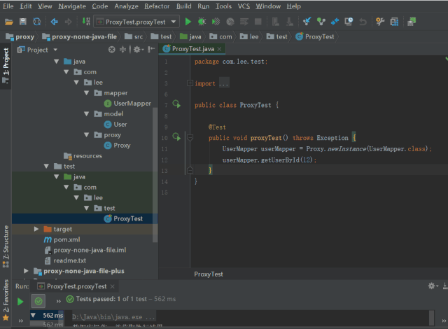
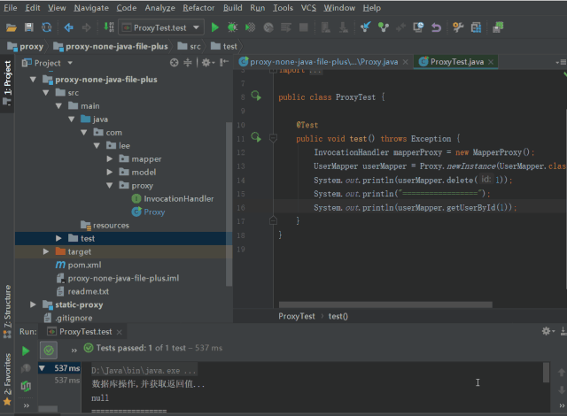
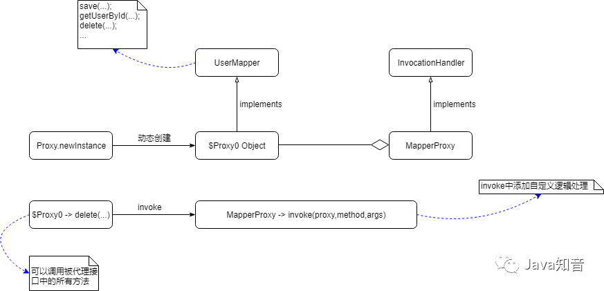
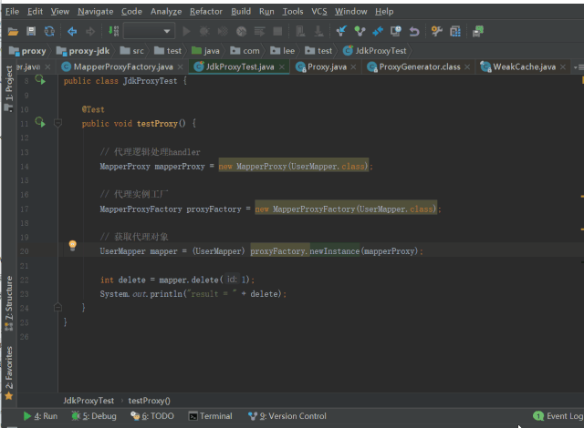

<center>代理模式</center>
##1、什么是代理模式
所谓代理，就是一个人或者一个机构代表另一个人或者另一个机构采取行动。在一些情况下，一个客户不想或者不能直接引用一个对象，而代理对象可以在客户端和目标对象之间起到中介的左右。
<strong>代理模式：</strong>给某一个对象提供一个代理或占位符，并由代理对象来控制对原对象的访问，通过代理对象访问目标对象，这样可以在不修改原目标对象的前提下，提供额外的功能操作，扩展目标对象的功能。
说简单点，代理模式就是设置一个中间代理来控制访问原目标对象，以达到增强原对象的功能和简化访问方式。一般而言会分三种：`静态代理`、`动态代理`和`CGLIB代理`。

##2、静态代理
静态代理需要代理对象和被代理对象实现一样的接口。
代理类：UserDaoProxy.java
```
/**
 * 代理逻辑在代理类中，而不是由用户自定义
 */
public class UserDaoProxy implements IUserDao {

    private IUserDao target;            // 被代理对象

    public UserDaoProxy(IUserDao target) {
        this.target = target;
    }

    /**
     *  前置/后置 处理一旦写完，就固定死了，后续想修改的话需要改此代理类
     * @param id
     * @return
     */
    public int delete(int id) {
        // 前置处理，例如开启事务
        System.out.println("前置处理...");

        // 调用目标对象方法
        int count = target.delete(id);

        // 后置处理，例如提交事务或事务回滚
        System.out.println("前置处理...");
        return count;
    }
}
```
UserDaoProxy代理IUserDao类型，此时也只能代理IUserDao类型的被代理对象。
<strong>优点：</strong>可以在不修改目标对象的前提下扩展目标对象的功能。
<strong>缺点：</strong>如果需要代理多个类，每个类都会有一个代理类，会导致代理类无限制扩展；如果类中有多个方法，同样的代理逻辑需要反复实现、应用到每个方法上，一旦接口增加方法，目标对象与代理对象都要进行修改
##3、动态代理
代理类在程序运行时创建的代理方式被成为动态代理。也就是说，这种情况下，代理类并不是在Java代码中定义的，而是在运行时根据我们在Java代码中的“指示”动态生成的。下面我们一步一步手动来实现动态代理。
下面的示例都是直接针对接口的，就不是针对接口的具体实现类了，<font color=red>静态代理示例中，UserDaoProxy代理的是IUserDao的实现类：UserDaoImpl</font>，那么动态代理示例就直接针对接口了，下面示例针对的都是UserMapper接口，模拟的mybatis，但不局限于UserMapper接口。
###1、代理类源代码持久化
1、**先利用反射动态生成代理类，并持久化代理类到磁盘（也就是生成代理类的java源文件），generateJavaFile方法如下：**
```
   /**
     * 生成接口实现类的源代码, 并持久化到java文件
     * @param interface_
     * @param proxyJavaFileDir
     * @throws Exception
     */
    private static void generateJavaFile(Class<?> interface_, String proxyJavaFileDir) throws Exception {
        StringBuilder proxyJava = new StringBuilder();
        proxyJava.append("package ").append(interface_.getPackage().getName()).append(";").append(ENTER).append(ENTER)
                .append("public class ").append(PROXY_CLASS_NAME).append(" implements ").append(interface_.getName()).append(" {");
        Method[] methods = interface_.getMethods();
        for(Method method : methods) {
            Type returnType = method.getGenericReturnType();
            Type[] paramTypes = method.getGenericParameterTypes();
            proxyJava.append(ENTER).append(ENTER).append(TAB_STR).append("@Override").append(ENTER)
                    .append(TAB_STR).append("public ").append(returnType.getTypeName()).append(" ").append(method.getName()).append("(");
            for(int i=0; i<paramTypes.length; i++) {
                if (i != 0) {
                    proxyJava.append(", ");
                }
                proxyJava.append(paramTypes[i].getTypeName()).append(" param").append(i);
            }
            proxyJava.append(") {").append(ENTER)
                    .append(TAB_STR).append(TAB_STR)
                    .append("System.out.println("数据库操作, 并获取执行结果...");").append(ENTER); // 真正数据库操作，会有返回值，下面的return返回应该是此返回值
            if (!"void".equals(returnType.getTypeName())) {
                proxyJava.append(TAB_STR).append(TAB_STR).append("return null;").append(ENTER);      // 这里的"null"应该是上述中操作数据库后的返回值，为了演示写成了null
            }
            proxyJava.append(TAB_STR).append("}").append(ENTER);
        }
        proxyJava .append("}");

        // 写入文件
        File f = new File(proxyJavaFileDir + PROXY_CLASS_NAME + ".java");
        FileWriter fw = new FileWriter(f);
        fw.write(proxyJava.toString());
        fw.flush();
        fw.close();
    }
```
生成的代理类：`$Proxy0.java` 如下：
```
package com.lee.mapper;

public class $Proxy0 implements com.lee.mapper.UserMapper {

    @Override
    public java.lang.Integer save(com.lee.model.User param0) {
        System.out.println("数据库操作, 并获取执行结果...");
        return null;
    }


    @Override
    public com.lee.model.User getUserById(java.lang.Integer param0) {
        System.out.println("数据库操作, 并获取执行结果...");
        return null;
    }
}
```
这个代理类的生成过程是我们自己实现的，实现不难，但排版太繁琐，我们可以用javapoet来生成代理类源代码，generateJavaFileByJavaPoet方法如下：
```
/**
 * 用JavaPoet生成接口实现类的源代码,并持久化到java文件
 * @param interface_ 目标接口类
 * @return
 */
public static void generateJavaFileByJavaPoet(Class<?> interface_) throws Exception {

    // 类名、实现的接口，以及类访问限定符
    TypeSpec.Builder typeSpecBuilder = TypeSpec.classBuilder("JavaPoet$Proxy0")
            .addSuperinterface(interface_)
            .addModifiers(Modifier.PUBLIC);

    Method[] methods = interface_.getDeclaredMethods();
    for (Method method : methods) {

        // 方法参数列表
        List<ParameterSpec> paramList = new ArrayList<>();
        Type[] paramTypes = method.getGenericParameterTypes();
        int count = 1 ;
        for (Type param : paramTypes) {
            ParameterSpec paramSpec = ParameterSpec.builder(Class.forName(param.getTypeName()), "param" + count)
                    .build();
            count ++;
            paramList.add(paramSpec);
        }

        // 方法名、方法访问限定符、参数列表、返回值、方法体等
        Class<?> returnType = method.getReturnType();
        MethodSpec.Builder builder = MethodSpec.methodBuilder(method.getName())
                .addModifiers(Modifier.PUBLIC)
                .addParameters(paramList)
                .addAnnotation(Override.class)
                .returns(returnType)
                .addCode("n")
                .addStatement("$T.out.println("数据库操作, 并获取执行结果...")", System.class)    // 真正数据库操作，会有返回值，下面的return返回应该是此返回值
                .addCode("n");
        if (!"void".equals(returnType.getName())) {
            builder.addStatement("return null");       // 这里的"null"应该是上述中操作数据库后的返回值，为了演示写成了null
        }

        MethodSpec methodSpec = builder.build();
        typeSpecBuilder.addMethod(methodSpec);

    }

    JavaFile javaFile = JavaFile.builder(interface_.getPackage().getName(), typeSpecBuilder.build()).build();
    javaFile.writeTo(new File(SRC_JAVA_PATH));
}
```
生成的代理类：`JavaPoet$Proxy0.java` 如下
```
package com.lee.mapper;

import com.lee.model.User;
import java.lang.Integer;
import java.lang.Override;
import java.lang.System;

public class JavaPoet$Proxy0 implements UserMapper {
  @Override
  public Integer save(User param1) {

    System.out.println("数据库操作, 并获取执行结果...");

    return null;
  }

  @Override
  public User getUserById(Integer param1) {

    System.out.println("数据库操作, 并获取执行结果...");

    return null;
  }
}
```
利用javapoet生成的代理类更接近我们平时手动实现的类，排版更符合我们的编码习惯，看上去更自然一些；两者的实现过程是一样的，只是javapoet排版更好。
2、**既然代理类的源代码已经有了，那么需要对其编译了，compileJavaFile方法如下：**
```
/**
 * 编译代理类源代码生成代理类class
 * @param proxyJavaFileDir
 */
private static void compileJavaFile(String proxyJavaFileDir) throws Exception {
    JavaCompiler compiler = ToolProvider.getSystemJavaCompiler();
    //获得文件管理者
    StandardJavaFileManager manager = compiler.getStandardFileManager(null, null, null);
    Iterable<? extends JavaFileObject> fileObjects = manager.getJavaFileObjects(proxyJavaFileDir + PROXY_CLASS_NAME + ".java");
    //编译任务
    JavaCompiler.CompilationTask task = compiler.getTask(null, manager, null, null, null, fileObjects);
    //开始编译，执行完可在指定目录下看到.class文件
    task.call();
    //关闭文件管理者
    manager.close();
}
```
会在指定目录下看到：`$Proxy0.class`
3、**加载`$Proxy0.class`，并创建其实例对象（代理实例对象）**
```
public static <T> T newInstance(Class<T> interface_) throws Exception{
    String proxyJavaFileDir = SRC_JAVA_PATH + interface_.getPackage().getName().replace(".", File.separator) + File.separator;

    // 1、生成interface_接口的实现类，并持久化到磁盘：$Proxy0.java
    generateJavaFile(interface_, proxyJavaFileDir);

    // 2、编译$Proxy0.java，生成$Proxy0.class到磁盘
    compileJavaFile(proxyJavaFileDir);

    // 3、加载$Proxy0.class，并创建其实例对象（代理实例对象）
    MyClassLoader loader = new MyClassLoader(proxyJavaFileDir, interface_);
    Class<?> $Proxy0 = loader.findClass(PROXY_CLASS_NAME);
    return (T)$Proxy0.newInstance();
}

private static class MyClassLoader<T> extends ClassLoader {

    private String proxyJavaFileDir;
    private Class<T> interface_;

    public MyClassLoader(String proxyJavaFileDir, Class<T> interface_) {
        this.proxyJavaFileDir = proxyJavaFileDir;
        this.interface_ = interface_;
    }

    @Override
    protected Class<?> findClass(String name) throws ClassNotFoundException {

        File clazzFile = new File(proxyJavaFileDir, name + ".class");
        //如果字节码文件存在
        if (clazzFile.exists()) {
            //把字节码文件加载到VM
            try {
                //文件流对接class文件
                FileInputStream inputStream = new FileInputStream(clazzFile);
                ByteArrayOutputStream baos = new ByteArrayOutputStream();
                byte[] buffer = new byte[1024];
                int len;
                while ((len = inputStream.read(buffer)) != -1) {
                    baos.write(buffer, 0, len);                     // 将buffer中的内容读取到baos中的buffer
                }
                //将buffer中的字节读到内存加载为class
                return defineClass(interface_.getPackage().getName() + "." + name, baos.toByteArray(), 0, baos.size());
            } catch (Exception e) {
                e.printStackTrace();
            }
        }
        return super.findClass(name);
    }
}
```
有了代理实例对象，我们就可以利用它进行操作了


此时的Proxy类能创建任何接口的实例，解决了静态代理存在的代理类泛滥、多个方法中代理逻辑反复实现的问题；但有个问题不知道大家注意到：`$Proxy0.java`有必要持久化到磁盘吗，我们能不能直接编译内存中的代理类的字符串源代码，得到`$Proxy0.class`呢？
###2、代理类源代码不持久化
`$Proxy0.java`和`$Proxy0.class`是没必要生成到磁盘的，我们直接编译内存中的代理类的字符串源代码，同时直接在内存中加载`$Proxy0.class`，不用写、读磁盘，可以提升不少性能。

Proxy.java源代码如下：
```
package com.lee.proxy;

import com.itranswarp.compiler.JavaStringCompiler;

import java.lang.reflect.Method;
import java.lang.reflect.Type;
import java.util.Map;

public class Proxy {

    private static final String ENTER = "rn";
    private static final String TAB_STR = "    ";
    private static final String PROXY_FILE_NAME = "$Proxy0";

    /**
     * 生成接口实现类的源代码, 并持久化到java文件
     * @param interface_
     * @throws Exception
     */
    private static String generateJavaFile(Class<?> interface_) throws Exception {
        StringBuilder proxyJava = new StringBuilder();
        proxyJava.append("package ").append(interface_.getPackage().getName()).append(";").append(ENTER).append(ENTER)
                .append("public class ").append(PROXY_FILE_NAME).append(" implements ").append(interface_.getName()).append(" {");
        Method[] methods = interface_.getMethods();
        for(Method method : methods) {
            Type returnType = method.getGenericReturnType();
            Type[] paramTypes = method.getGenericParameterTypes();
            proxyJava.append(ENTER).append(ENTER).append(TAB_STR).append("@Override").append(ENTER)
                    .append(TAB_STR).append("public ").append(returnType.getTypeName()).append(" ").append(method.getName()).append("(");
            for(int i=0; i<paramTypes.length; i++) {
                if (i != 0) {
                    proxyJava.append(", ");
                }
                proxyJava.append(paramTypes[i].getTypeName()).append(" param").append(i);
            }
            proxyJava.append(") {").append(ENTER)
                    .append(TAB_STR).append(TAB_STR)
                    .append("System.out.println("数据库操作, 并获取执行结果...");").append(ENTER); // 真正数据库操作，会有返回值，下面的return返回应该是此返回值
            if (!"void".equals(returnType.getTypeName())) {
                proxyJava.append(TAB_STR).append(TAB_STR).append("return null;").append(ENTER);      // 这里的"null"应该是上述中操作数据库后的返回值，为了演示写成了null
            }
            proxyJava.append(TAB_STR).append("}").append(ENTER);
        }
        proxyJava .append("}");

        return proxyJava.toString();
    }

    private final static Class<?> compile(String className, String content) throws Exception {
        JavaStringCompiler compiler = new JavaStringCompiler();
        Map<String, byte[]> byteMap = compiler.compile(PROXY_FILE_NAME + ".java", content);
        Class<?> clazz = compiler.loadClass(className, byteMap);
        return clazz;
    }

    public static <T> T newInstance(Class<T> interface_) throws Exception{

        // 1、生成源代码字符串
        String proxyCodeStr = generateJavaFile(interface_);

        // 2、字符串编译成Class对象
        Class<?> clz = compile(interface_.getPackage().getName() + "." + PROXY_FILE_NAME, proxyCodeStr);
        return (T)clz.newInstance();
    }
}
```
相比有代理类源代码持久化，核心的动态代理生成过程不变，只是减少了.java和.class文件的持久化；其中用到了第三方工具：`com.itranswarp.compile`（我们也可以拓展jdk，实现内存中操作），完成了字符串在内存中的编译、class在内存中的加载，直接用jdk的编译工具，会在磁盘生成`$Proxy0.class`

没有.java和.class的持久化
此时就完美了吗？如果现在有另外一个接口ISendMessage，代理逻辑不是
```
System.out.println("数据库操作, 并获取执行结果...")
```
针对ISendMessage又重新写一个Proxy？显然还不够灵活，说的简单点：此种代理可以代理任何接口，但是代理逻辑确是固定死的，不能自定义，这样会造成一种代理逻辑会有一个代理工厂（Proxy），会造成代理工厂的泛滥。
###3、代理逻辑接口化，供用户自定义
既然无代理类源代码持久化中的代理逻辑不能自定义，那么我们就将它抽出来，提供代理逻辑接口。
流程图与无代理类源代码持久化中一样，此时代理类的生成过程复杂了不少，涉及到代理逻辑接口：InvacationHandler的处理。
generateJavaFile(…)方法
```
/**
 * 生成接口实现类的源代码
 * @param interface_
 * @throws Exception
 */
private static String generateJavaFile(Class<?> interface_, InvocationHandler handler) throws Exception {
    StringBuilder proxyJava = new StringBuilder();
    proxyJava.append("package ").append(PROXY_PACKAGE_NAME).append(";").append(ENTER).append(ENTER)
            .append("import java.lang.reflect.Method;").append(ENTER).append(ENTER)
            .append("public class ").append(PROXY_FILE_NAME).append(" implements ").append(interface_.getName()).append(" {").append(ENTER)
            .append(ENTER).append(TAB_STR).append("private InvocationHandler  handler;").append(ENTER).append(ENTER);

    // 代理对象构造方法
    proxyJava.append(TAB_STR).append("public ").append(PROXY_FILE_NAME).append("(InvocationHandler handler) {").append(ENTER)
            .append(TAB_STR).append(TAB_STR).append("this.handler = handler;").append(ENTER)
            .append(TAB_STR).append("}").append(ENTER);

    // 接口方法
    Method[] methods = interface_.getMethods();
    for(Method method : methods) {
        String returnTypeName = method.getGenericReturnType().getTypeName();
        Type[] paramTypes = method.getGenericParameterTypes();
        proxyJava.append(ENTER).append(TAB_STR).append("@Override").append(ENTER)
                .append(TAB_STR).append("public ").append(returnTypeName).append(" ").append(method.getName()).append("(");

        List<String> paramList = new ArrayList<>();     // 方法参数值
        List<String> paramTypeList = new ArrayList<>(); // 方法参数类型
        for(int i=0; i<paramTypes.length; i++) {
            if (i != 0) {
                proxyJava.append(", ");
            }
            String typeName = paramTypes[i].getTypeName();
            proxyJava.append(typeName).append(" param").append(i);
            paramList.add("param" + i);
            paramTypeList.add(typeName+".class");
        }
        proxyJava.append(") {").append(ENTER)
                .append(TAB_STR).append(TAB_STR).append("try {").append(ENTER)
                .append(TAB_STR).append(TAB_STR).append(TAB_STR)
                .append("Method method = ").append(interface_.getName()).append(".class.getDeclaredMethod("")
                .append(method.getName()).append("",").append(String.join(",", paramTypeList)).append(");")
                .append(ENTER).append(TAB_STR).append(TAB_STR).append(TAB_STR);
        if (!"void".equals(returnTypeName)) {
            proxyJava.append("return (").append(returnTypeName).append(")");
        }
        proxyJava.append("handler.invoke(this, method, new Object[]{")
                .append(String.join(",", paramList)).append("});").append(ENTER)
                .append(TAB_STR).append(TAB_STR).append("} catch(Exception e) {").append(ENTER)
                .append(TAB_STR).append(TAB_STR).append(TAB_STR).append("e.printStackTrace();").append(ENTER)
                .append(TAB_STR).append(TAB_STR).append("}").append(ENTER);
        if (!"void".equals(returnTypeName)) {
            proxyJava.append(TAB_STR).append(TAB_STR).append("return null;").append(ENTER);
        }
        proxyJava.append(TAB_STR).append("}").append(ENTER);
    }
    proxyJava .append("}");

    // 这里可以将字符串生成java文件，看看源代码对不对
    /*String proxyJavaFileDir = System.getProperty("user.dir") + File.separator + "proxy-none-java-file-plus"
            + String.join(File.separator, new String[]{"","src","main","java",""})
            + PROXY_PACKAGE_NAME.replace(".", File.separator) + File.separator;
    File f = new File(proxyJavaFileDir + PROXY_FILE_NAME + ".java");
    FileWriter fw = new FileWriter(f);
    fw.write(proxyJava.toString());
    fw.flush();
    fw.close();*/

    return proxyJava.toString();
}
```


此时Proxy就可以完全通用了，可以生成任何接口的代理对象了，也可以实现任意的代理逻辑；至此，我们完成了一个简易的仿JDK实现的动态代理。
###4、JDK的动态代理
看看JDK下Proxy.newInstance方法，有三个参数
1.`Classloader`：类加载器，我们可以使用自定义的类加载器；上述手动实现示例中，直接在Proxy写死了；
2.`Class<?>[]`：接口类数组，这个其实很容易理解，我们应该允许我们自己实现的代理类同时实现多个接口。我们上述手动实现中只传入一个接口，是为了简化实现；
3.`InvocationHandler`：这个没什么好说的，与我们的实现一致，用于自定义代理逻辑

与我们的自定义实现差不多，利用反射，逐个接口、逐个方法进行处理；
ProxyClassFactory负责生成代理类的Class对象，主要由apply方法负责，调用了
```
byte[] proxyClassFile = ProxyGenerator.generateProxyClass(proxyName, interfaces, accessFlags);
```
来生成代理类的Class；ProxyGenerator中有个是有静态常量：saveGeneratedFiles，标识是否持久化代理类的class文件，默认值是false，也就是不持久化，我们可以通过设置jdk系统参数，实现[JDK的动态代理](./JDK动态代理.md)持久化代理类的class文件
###5、CGLIB代理
对cglib不做深入研究了，只举个使用案例：proxy-cglib，使用方式与JDK的动态代理类似，实现的效果也基本一致，但是实现原理上还是有差别的
JDK的动态代理有一个限制，就是使用动态代理的对象必须实现一个或多个接口，而CGLIB没有这个限制。
##4、应用场景
动态代理的作用：使用动态代理我们可以在不改变源码的情况下，对目标对象的目标方法进行前置或后置增强处理。这有点不太符合我们的一条线走到底的编程逻辑，这种编程模型有一个专业名称叫AOP，面向切面编程，具体案例有如下：
1、spring的事务，事务的开启可以作为前置增强，事务的提交或回滚作为后置增强，数据库的操作处在两者之间（目标对象需要完成的事）；
2、日志记录，我们可以在不改变原有实现的基础上，对目标对象进行日志的输出，可以前置处理，记录参数情况，也可以后置处理，记录返回的结果；
3、web编程，传入参数的校验；
4、web编程，权限的控制也可以用aop来实现；
##5、总结
1、示例代码中的Proxy是代理工厂，负责生产代理对象的，不是代理对象类。
2、手动实现动态代理，我们分了三版。
<strong>第一版：</strong>代理类源代码持久化，为了便于理解，我们将代理类的java文件和class文件持久化到了磁盘，此时解决了静态代理中代理类泛滥的问题，我们的代理类工厂(Proxy)能代理任何接口；
<strong>第二版：</strong>代理类源代码不持久化，代理类的java文件和和class文件本来就只是临时文件，将其去掉，不用读写磁盘，可以提高效率；但此时有个问题，我们的代理逻辑却写死了，也就说一个代理类工厂只能生产一种代理逻辑的代理类对象，如果我们有多种代理逻辑，那么就需要有多个代理类工厂，显然灵活性不够高，还有优化空间；
<strong>第三版：</strong>代理逻辑接口化，供用户自定义，此时代理类工厂就可以代理任何接口、任何代理逻辑了，反正代理逻辑是用户自定义传入，用户想怎么定义就怎么定义；
3、示例参考的是mybatis中mapper的生成过程，虽然只是简单的模拟，但流程却是一致的。
