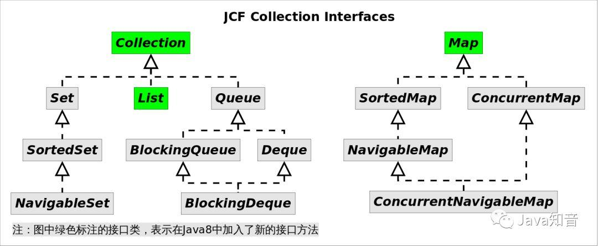
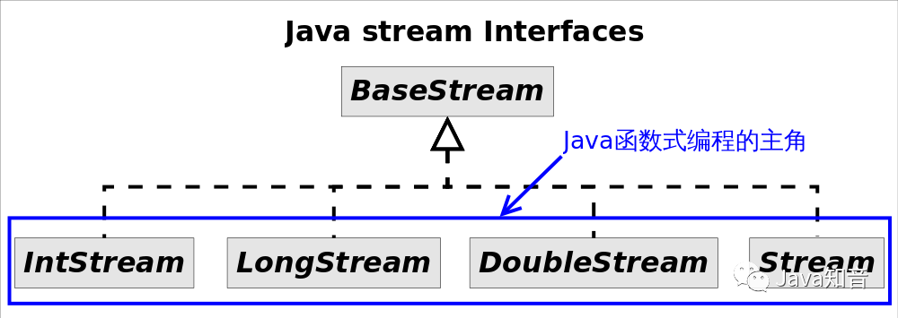

<center>Lambda表达式</center>
##定义
Lambda表达式是Java SE 8中一个重要的新特性。lambda表达式允许你通过表达式来代替功能接口。lambda表达式就和方法一样,它提供了一个正常的参数列表和一个使用这些参数的主体(body,可以是一个表达式或一个代码块)。Lambda表达式还增强了集合库。
Java Lambda表达式的一个重要用法是简化某些匿名内部类（Anonymous Classes）的写法。实际上Lambda表达式并不仅仅是匿名内部类的语法糖，JVM内部是通过invokedynamic指令来实现Lambda表达式的。
##Lambda表达式语法
Lambda 表达式在 Java 语言中引入了一个新的语法元素和操作符。这个操作符为 “->”，该操作符被称 为 Lambda 操作符或箭头操作符。
Lambda 分为两个部分：
左侧：指定了 Lambda 表达式需要的所有参数。
右侧：指定了 Lambda 体，即 Lambda 表达式要执行的功能。
####1.语法格式一：无参，无返回值，Lambda 体只需一条语句。
```
Runnable r1 = () -> System.out.println("Hello Lambda!");
```
####2.语法格式二：Lambda 需要一个参数。
```
Consumer<String> con = （x） -> System.out.println(x);
```
####3.语法格式三：Lambda 只需要一个参数时，参数的小括号可以省略。
```
Consumer<String> con = x -> System.out.println(x);
```
####4.语法格式四：Lambda 需要两个参数，并且有返回值。
```
Comparator<Integer> com = (x, y) -> {
   System.out.println("函数式接口");
   return Integer.compare(x, y);
};
```
####5.语法格式五：当 Lambda 体只有一条语句时，return 与大括号可以省略。
```
Comparator<Integer> com = (x, y) -> Integer.compare(x, y);
```
####6.Lambda 表达式的参数列表的数据类型可以省略不写，因为JVM编译器通过上下文推断出，数据类型，即“类型推断”。
```
Comparator<Integer> com = (Integer x,Integer y) -> {  //Integer 类型可以省略
  System.out.println("函数式接口");
  return Integer.compare(x, y);
};

BinaryOperator<Long> add = (Long x, Long y) -> x + y;// 4

BinaryOperator<Long> addImplicit = (x, y) -> x + y;// 5 类型推断
```
类型推断：Lambda 表达式中的参数类型都是由编译器推断得出的。Lambda 表达式中无需指定类型，程序依然可以编译，这是因为 javac 根据程序的上下文，在后台推断出了参数的类型。Lambda 表达式的类型依赖于上下文环境，是由编译器推断出来的。
##必要性
使用Lambda的依据是必须有相应的**函数接口**。
**函数接口，是指内部<font color=red>只有</font>一个抽象方法的接口**。这一点跟Java是强类型语言吻合，也就是说你并不能在代码的任何地方任性的写Lambda表达式。实际上**Lambda的类型就是对应函数接口的类型**。Lambda表达式另一个依据是类型推断机制，在上下文信息足够的情况下，编译器可以推断出参数表的类型，而不需要显式指名。
##自定义函数接口
自定义函数接口很容易，只需要编写一个只有一个抽象方法的接口即可。
```
    // 自定义函数接口
    @FunctionalInterface
    public interface ConsumerInterface<T>{
        void accept(T t);
    }
```
上面代码中的@FunctionalInterface是可选的，但加上该标注编译器会帮你检查接口是否符合函数接口规范。
有了上述接口定义，就可以写出类似如下的代码：
```
ConsumerInterface<String> consumer = str -> System.out.println(str);
consumer.accept("我是自定义函数式接口");
```
详细例子参考：
```
import java.util.Arrays;
import java.util.List;

public class Test {
    public static void main(String[] args) {
        TestStream<String> stream = new TestStream<String>();
        List list = Arrays.asList("11", "22", "33");
        stream.setList(list);
        stream.myForEach(str -> System.out.println(str));// 使用自定义函数接口书写Lambda表达式
    }
}

@FunctionalInterface
interface ConsumerInterface<T>{
    void accept(T t);
}

class TestStream<T>{
    private List<T> list;
    public void myForEach(ConsumerInterface<T> consumer){// 1
        for(T t : list){
            consumer.accept(t);
        }
    }

    public void setList(List<T> list) {
        this.list = list;
    }
}
```
##Java 内置四大核心函数式接口
| 函数式接口 | 参数类型 | 返回类型 | 用途 |
| :------------- | :------------- | :------------- | :------------- |
| Consumer<T\>消费型接口 | T | void | 对类型为T的对象应用操作，包含方法：void accpet(T t); |
| Supplier<T\>供给型接口 | 无 | T | 返回类型为T的对象，包含方法：T get(); |
| Function<T, R\>函数型接口 | T | R | 对类型为T的对象应用操作，并返回结果。结果是R类型的对象。包含方法：R apply(T t); |
| Predicate<T\>断定型接口 | T | boolean | 确定类型为T的对象是否满足某约束，并返回boolean值。包含方法：boolean test(T t); |
####Consumer<T> 消费型接口
void accept(T t);
```
@Test
public void test1(){
    hello("张三", (m) -> System.out.println("你好：" + m));
}
public void hello(String st, Consumer<String> con){
    con.accept(st);
}
```
####Supplier<T> 供给型接口
T get();
```
//Supplier<T> 供给型接口 :
@Test
public void test2(){
    List list = Arrays.asList(121, 1231, 455, 56, 67,78);
    List<Integer> numList = getNumList(1, () -> (int)(Math.random() * 100));
    for (Integer num : numList) {
        System.out.println(num);
    }
}
//需求：产生指定个数的整数，并放入集合中
public List<Integer> getNumList(int num, Supplier<Integer> sup){
    List<Integer> list = new ArrayList<>();
    for (int i = 0; i < num; i++) {
        Integer n = sup.get();
        list.add(n);
    }
    return list;
}
```
####Function<T, R> 函数型接口
R apply(T t);
```
//Function<T, R> 函数型接口：
@Test
public void test3(){
    String newStr = strHandler("ttt 这是一个函数型接口 ", (str) -> str.trim());
    System.out.println(newStr);
    String subStr = strHandler("这是一个函数型接口", (str) -> str.substring(4, 7));
    System.out.println(subStr);
}
//需求：用于处理字符串
public String strHandler(String str, Function<String, String> fun){
    return fun.apply(str);
}
```
####Predicate<T> 断定型接口
boolean test(T t);
```
// Predicate<T> 断言型接口：
@Test
public void test4(){
    List<String> list = Arrays.asList("Hello", "Java8", "Lambda", "www", "ok");
    List<String> strList = filterStr(list, (s) -> s.length() > 3);
    for (String str : strList) {
        System.out.println(str);
    }
}
//需求：将满足条件的字符串，放入集合中
public List<String> filterStr(List<String> list, Predicate<String> pre){
    List<String> strList = new ArrayList<>();
    for (String str : list) {
        if(pre.test(str)){
            strList.add(str);
        }
    }
    return strList;
}
```
####其他接口
| 函数式接口 | 参数类型 | 返回类型 | 用途 |
| :------------- | :------------- | :------------- | :------------- |
| BiFunction<T, U, R\> | T,U | R | 对类型为T,U参数应用操作，返回R类型的结果，包含方法：R apply(T t, U u); |
| UnaryOperator<T\>(Function子接口) | T | T | 对类型为T的对象进行一元运算，并返回T类型的结果，包含方法：T apply(T t); |
| BinaryOperator<T\>(BiFunction子接口) | T,T | T | 对类型为T的对象进行二元运算，并返回T类型的结果。包含方法：T apply(T t1, T t2); |
| BiConsumer<T, U\> | T,U | void | 对类型为T,U参数应用操作。包含方法：void accept(T t, U u); |
| ToIntFunction<T\> ToLongFunction<T\> ToDoubleFunction<T\> | T | int long double | 分别计算int、long、double值的函数 |
| IntFunction<R\> LongFunction<R\> DoubleFunction<R\> | int long double | R | 参数分别为int、long、double类型的函数 |
##方法引用和构造器引用
####方法引用
当要传递给Lambda体内的操作，已经有实现的方法了，就可以使用方法引用了！
**前提条件：**
方法引用所引用的方法的参数列表必须要和函数式接口中抽象方法的参数列表相同（完全一致）。
方法引用所引用的方法的的返回值必须要和函数式接口中抽象方法的返回值相同（完全一致）。
**方法引用一般有三种格式：**
实例对象名::实例方法名
类名::静态方法名
类名::实例方法名
**注意：**
2和3的区别：若Lambda 的参数列表的第一个参数，是实例方法的调用者，第二个参数(或无参)是实例方法的参数时，格式：类名::实例方法名。
方法引用：使用操作符 “::” 将方法名和对象或类的名字分隔开来。
####1、对象::实例方法
```
@Test
public void test1(){
    PrintStream ps = System.out;
    Consumer<String> con = (str) -> ps.println(str);
    con.accept("Hello World！");

    System.out.println("--------------------------------");

    Consumer<String> con2 = ps::println;
    con2.accept("Hello Java8！");

    Consumer<String> con3 = System.out::println;
}
@Test
public void test2(){
    Employee emp = new Employee(1, "张三", 18, 5112.99);

    Supplier<String> sup = () -> emp.getName();
    System.out.println(sup.get());

    System.out.println("----------------------------------");

    Employee emp1 = new Employee(2, "李四", 18, 5112.99);
    Supplier<String> sup2 = emp1::getName;
    System.out.println(sup2.get());
}
```
####2、类::静态方法
```
@Test
public void test3(){
    BiFunction<Double, Double, Double> fun = (x, y) -> Math.max(x, y);
    System.out.println(fun.apply(1.5, 22.2));

    System.out.println("--------------------------------------------------");
    BiFunction<Double, Double, Double> fun2 = Math::max;
    System.out.println(fun2.apply(1.2, 1.5));
}

@Test
public void test4(){
    Comparator<Integer> com = (x, y) -> Integer.compare(x, y);
    System.out.println(com.compare(3,9));

    System.out.println("-------------------------------------");
    Comparator<Integer> com2 = Integer::compare;
    System.out.println(com2.compare(3,9));
}
```
####3、类::实例方法
```
@Test
public void test5(){
    BiPredicate<String, String> bp = (x, y) -> x.equals(y);
    System.out.println(bp.test("abcde", "abcde"));

    System.out.println("-----------------------------------------");
    BiPredicate<String, String> bp2 = String::equals;
    System.out.println(bp2.test("abc", "abc"));

    System.out.println("-----------------------------------------");
    Function<Employee, String> fun = (e) -> e.show();
    System.out.println(fun.apply(new Employee()));

    System.out.println("-----------------------------------------");
    Function<Employee, String> fun2 = Employee::show;
    System.out.println(fun2.apply(new Employee()));
}
```
####构造器引用
**前提:**
构造器参数列表要与接口中抽象方法的参数列表一致！
**语法格式：**
类名 :: new
```
// Employee类中必须有一个 Employee(String name, int age) 的构造器
BiConsumer<String, Integer> biConsumer = Employee :: new;
biConsumer.accept("王五", 19);
```
####数组引用
数组引用和构造引用基本相同
```
@Test
public void test10(){
    //传统Lambda实现
    Function<Integer,int[]> function = (i) -> new int[i];
    int[] apply = function.apply(10);
    System.out.println(apply.length); // 10

    //数组类型引用实现
    function = int[] ::new;
    apply = function.apply(100);
    System.out.println(apply.length); // 100
}
```
##Collections中的常用函数接口
Java8新增了java.util.funcion包，里面包含常用的函数接口，这是Lambda表达式的基础，Java集合框架也新增部分接口，以便与Lambda表达式对接。
Java8集合框架的接口继承结构:

上图中绿色标注的接口类，表示在Java8中加入了新的接口方法，当然由于继承关系，他们相应的子类也都会继承这些新方法。
下表详细列举了这些方法：
| 接口名 | Java8新加入的方法 |
| :------------- | :------------- |
| Collection | removelf() spliterator() stream() parallelStream() forEach() |
| List | replaceAll() sort() |
| Map | getOrDefault() forEach() replaceAll() putlfAbsent() remove() replace() computelfAbsent() computelfPresent() compute() merge() |
这些新加入的方法大部分要用到java.util.function包下的接口，这意味着这些方法大部分都跟Lambda表达式相关。
####Collection中的新方法
######forEach()
该方法的签名为void forEach(Consumer action)，作用是对容器中的每个元素执行action指定的动作，其中Consumer是个函数接口，里面只有一个待实现方法void accept(T t)。
匿名内部类实现：
```
ArrayList<Integer> list = new ArrayList<>(Arrays.asList(3, 6, 9, 10));
list.forEach(new Consumer<Integer>(){
    @Override
    public void accept(Integer integer){
        if(integer % 3 == 0){
            System.out.println(integer);
        }
    }
});
```
lambda表达式实现：
```
ArrayList<Integer> list = new ArrayList<>(Arrays.asList(3, 6, 9, 10));
list.forEach((s) -> {
    if (s % 3 == 0){
        System.out.println(s);
    }
});
```
######removeIf()
该方法签名为boolean removeIf(Predicate filter)，作用是删除容器中所有满足filter指定条件的元素，其中Predicate是一个函数接口，里面只有一个待实现方法boolean test(T t)。
匿名内部类实现：
```
ArrayList<Integer> list = new ArrayList<>(Arrays.asList(3, 6, 9, 10));
list.removeIf(new Predicate<Integer>(){ // 删除长度大于3的元素
    @Override
    public boolean test(Integer sum){
        return sum % 3 == 0;
    }
});
System.out.println(list);
```
lambda表达式实现：
```
ArrayList<Integer> list = new ArrayList<>(Arrays.asList(3, 6, 9, 10));
list.removeIf(s -> s % 3 == 0);
System.out.println(list);
```
######replaceAll()
该方法签名为void replaceAll(UnaryOperator<E> operator)，作用是对每个元素执行operator指定的操作，并用操作结果来替换原来的元素。其中UnaryOperator是一个函数接口，里面只有一个待实现函数T apply(T t)。
匿名内部类实现：
```
ArrayList<Integer> list = new ArrayList<>(Arrays.asList(3, 6, 9, 10));
list.replaceAll(new UnaryOperator<Integer>(){
    @Override
    public Integer apply(Integer sum){
        if(sum % 3 == 0){
            return ++sum;
        }
        return --sum;
    }
});
System.out.println(list);
```
lambda表达式实现：
```
ArrayList<Integer> list = new ArrayList<>(Arrays.asList(3, 6, 9, 10));
list.replaceAll(sum -> {
    if (sum % 3 == 0){
        return ++sum;
    }else {
        return --sum;
    }
});
System.out.println(list);
```
######sort()
该方法定义在List接口中，方法签名为void sort(Comparator c)，该方法根据c指定的比较规则对容器元素进行排序。Comparator接口我们并不陌生，其中有一个方法int compare(T o1, T o2)需要实现，显然该接口是个函数接口。
匿名内部类实现：
```
ArrayList<Integer> list = new ArrayList<>(Arrays.asList(6, 10, 9, 3));
Collections.sort(list, new Comparator<Integer>(){
    @Override
    public int compare(Integer sum1, Integer sum2){
        return sum1 - sum2;
    }
});
System.out.println(list);
```
lambda表达式实现：
```
ArrayList<Integer> list = new ArrayList<>(Arrays.asList(6, 10, 9, 3));
System.out.println(list);
list.sort((sum1, sum2) -> sum1 - sum2);
System.out.println(list);
```
######spliterator()
方法签名为Spliterator<E> spliterator()，该方法返回容器的可拆分迭代器。
从名字来看该方法跟iterator()方法有点像，我们知道Iterator是用来迭代容器的，Spliterator也有类似作用，但**二者有如下不同**：Spliterator既可以像Iterator那样逐个迭代，也可以批量迭代。批量迭代可以降低迭代的开销。
Spliterator是可拆分的，一个Spliterator可以通过调用Spliterator trySplit()方法来尝试分成两个。一个是this，另一个是新返回的那个，这两个迭代器代表的元素没有重叠。
可通过（多次）调用Spliterator.trySplit()方法来分解负载，以便多线程处理。
######stream()和parallelStream()
stream()和parallelStream()分别返回该容器的Stream视图表示，不同之处在于parallelStream()返回并行的Stream。Stream是Java函数式编程的核心类，具体内容后面单独介绍。
####Map中的新方法
######forEach()
该方法签名为void forEach(BiConsumer action)，作用是对Map中的每个映射执行action指定的操作，其中BiConsumer是一个函数接口，里面有一个待实现方法void accept(T t, U u)。
匿名内部类实现：
```
HashMap<Integer, String> map = new HashMap<>();
map.put(1, "我");
map.put(2, "拒绝");
map.put(3, "996");
map.forEach(new BiConsumer<Integer, String>(){
    @Override
    public void accept(Integer key, String value){
        System.out.println(key + "=" + value);
    }
});
```
lambda表达式实现：
```
HashMap<Integer, String> map = new HashMap<>();
map.put(1, "我");
map.put(2, "拒绝");
map.put(3, "996");
map.forEach((key, value) -> System.out.println(key + "=" + value));
```
######getOrDefault()
该方法跟Lambda表达式没关系，但是很有用。方法签名为V getOrDefault(Object key, V defaultValue)，作用是按照给定的key查询Map中对应的value，如果没有找到则返回defaultValue。使用该方法可以省去查询指定键值是否存在的麻烦。
实现：
```
HashMap<Integer, String> map = new HashMap<>();
map.put(1, "我");
map.put(2, "拒绝");
map.put(3, "996");
// Java7以及之前做法
if(map.containsKey(4)){
    System.out.println(map.get(4));
}else{
    System.out.println("NoValue");
}

// Java8使用Map.getOrDefault()
System.out.println(map.getOrDefault(4, "NoValue"));
```
######putIfAbsent()
该方法跟Lambda表达式没关系，但是很有用。方法签名为V putIfAbsent(K key, V value)，作用是只有在不存在key值的映射或映射值为null时，才将value指定的值放入到Map中，否则不对Map做更改．该方法将条件判断和赋值合二为一，使用起来更加方便。
######remove()
我们都知道Map中有一个remove(Object key)方法，来根据指定key值删除Map中的映射关系；Java8新增了remove(Object key, Object value)方法，只有在当前Map中key正好映射到value时才删除该映射，否则什么也不做。
######replace()
在Java7及以前，要想替换Map中的映射关系可通过put(K key, V value)方法实现，该方法总是会用新值替换原来的值．为了更精确的控制替换行为，Java8在Map中加入了两个replace()方法，分别如下：
replace(K key, V value)，只有在当前Map中key的映射存在时才用value去替换原来的值，否则什么也不做。
replace(K key, V oldValue, V newValue)，只有在当前Map中key的映射存在且等于oldValue时才用newValue去替换原来的值，否则什么也不做。
######replaceAll()
该方法签名为replaceAll(BiFunction function)，作用是对Map中的每个映射执行function指定的操作，并用function的执行结果替换原来的value，其中BiFunction是一个函数接口，里面有一个待实现方法R apply(T t, U u)。
匿名内部类实现：
```
HashMap<Integer, String> map = new HashMap<>();
map.put(1, "我");
map.put(2, "拒绝");
map.put(3, "996");
map.replaceAll(new BiFunction<Integer, String, String>(){
    @Override
    public String apply(Integer k, String v){
        if (v.equals("我")){
            v = "你";
        }
        return v.toUpperCase();
    }
});
map.forEach((key, value) -> System.out.println(key + "=" + value));
```
lambda表达式实现：
```
HashMap<Integer, String> map = new HashMap<>();
map.put(1, "我");
map.put(2, "拒绝");
map.put(3, "996");
map.replaceAll((k, v) -> {
    if (v.equals("我")){
        v = "你";
    }
    return v.toUpperCase();
});
map.forEach((key, value) -> System.out.println(key + "=" + value));
```
######merge()
该方法签名为merge(K key, V value, BiFunction remappingFunction)。
作用是：
如果Map中key对应的映射不存在或者为null，则将value（不能是null）关联到key上；
否则执行remappingFunction，如果执行结果非null则用该结果跟key关联，否则在Map中删除key的映射。
参数中BiFunction函数接口前面已经介绍过，里面有一个待实现方法R apply(T t, U u)。
merge()方法虽然语义有些复杂，但该方法的用方式很明确，一个比较常见的场景是将新的错误信息拼接到原来的信息上，比如：
```
HashMap<Integer, String> map = new HashMap<>();
map.put(1, "我");
map.put(2, "拒绝");
map.put(3, "996");

map.forEach((key, value) -> System.out.println(key + "=" + value));
map.merge(1, "和你", (v1, v2) -> v1+v2);
map.forEach((key, value) -> System.out.println(key + "=" + value));
```
######compute()
该方法签名为compute(K key, BiFunction remappingFunction)，作用是把remappingFunction的计算结果关联到key上，如果计算结果为null，则在Map中删除key的映射。
```
HashMap<Integer, String> map = new HashMap<>();
map.put(1, "我");
map.put(2, "拒绝");
map.put(3, "996");

map.forEach((key, value) -> System.out.println(key + "=" + value));
map.compute(1, (k,v) -> v == null ? "值为空" : v.concat("和你"));
map.forEach((key, value) -> System.out.println(key + "=" + value));
```
######computeIfAbsent()
该方法签名为V computeIfAbsent(K key, Function mappingFunction)，作用是：只有在当前Map中不存在key值的映射或映射值为null时，才调用mappingFunction，并在mappingFunction执行结果非null时，将结果跟key关联。
Function是一个函数接口，里面有一个待实现方法R apply(T t)。
computeIfAbsent()常用来对Map的某个key值建立初始化映射．比如我们要实现一个多值映射，Map的定义可能是Map<K,Set<V>>，要向Map中放入新值，可通过如下代码实现：
实现：
```
Map<Integer, Set<String>> map = new HashMap<>();
// Java7及以前的实现方式
if(map.containsKey(1)){
    map.get(1).add("123");
}else{
    Set<String> valueSet = new HashSet<String>();
    valueSet.add("123");
    map.put(1, valueSet);
}
// Java8的实现方式
map.computeIfAbsent(1, v -> new HashSet<String>()).add("345");
map.forEach((key, value) -> System.out.println(key + "=" + value));
```
使用computeIfAbsent()将条件判断和添加操作合二为一，使代码更加简洁。
######computeIfPresent()
该方法签名为V computeIfPresent(K key, BiFunction remappingFunction)，作用跟computeIfAbsent()相反。即只有在当前Map中存在key值的映射且非null时，才调用remappingFunction，如果remappingFunction执行结果为null，则删除key的映射，否则使用该结果替换key原来的映射。
##Stream
对于Java 7来说stream完全是个陌生东西，stream并不是某种数据结构，它只是数据源的一种视图。这里的数据源可以是一个数组，Java容器或I/O channel等。
常见的stream接口继承关系如图：

图中4种stream接口继承自BaseStream，其中IntStream, LongStream, DoubleStream对应三种基本类型（int, long, double，注意不是包装类型），Stream对应所有剩余类型的stream视图。
为不同数据类型设置不同stream接口，可以:1、提高性能；2、增加特定接口函数。
**为什么不把IntStream等设计成Stream的子接口？**
答案是这些方法的名字虽然相同，但是返回类型不同，如果设计成父子接口关系，这些方法将不能共存，因为Java不允许只有返回类型不同的方法重载。
虽然大部分情况下stream是容器调用Collection.stream()方法得到的，但stream和collections有以下不同：
无存储。stream不是一种数据结构，它只是某种数据源的一个视图，数据源可以是一个数组，Java容器或I/O channel等。
————————————————————————————
为函数式编程而生。对stream的任何修改都不会修改背后的数据源，比如对stream执行过滤操作并不会删除被过滤的元素，而是会产生一个不包含被过滤元素的新stream。
————————————————————————————
惰式执行。stream上的操作并不会立即执行，只有等到用户真正需要结果的时候才会执行。
————————————————————————————
可消费性。stream只能被“消费”一次，一旦遍历过就会失效，就像容器的迭代器那样，想要再次遍历必须重新生成。
对stream的操作分为为两类，中间操作(intermediate operations)和结束操作(terminal operations)，二者特点是：
中间操作总是会惰式执行，调用中间操作只会生成一个标记了该操作的新stream，仅此而已。
————————————————————————————
结束操作会触发实际计算，计算发生时会把所有中间操作积攒的操作以pipeline的方式执行，这样可以减少迭代次数。计算完成之后stream就会失效。
下表汇总了Stream接口的部分常见方法：
| 操作类型 | 接口方法 |
| :------------- | :------------- |
| 中间操作 | contact() distinct() filter() flatMap() limit() map() peek() skip() sorted() parallel() sequential() unordered() |
| 结束操作 | allMatch() anyMatch() collect() count() findAny() findFirst() forEach() forEachOrdered() max() min() noneMatch() reduce() toArray() |
区分中间操作和结束操作最简单的方法，就是看方法的返回值，返回值为stream的大都是中间操作，否则是结束操作。
####stream方法使用
stream跟函数接口关系非常紧密，没有函数接口stream就无法工作。
函数接口是指内部只有一个抽象方法的接口。通常函数接口出现的地方都可以使用Lambda表达式，所以不必记忆函数接口的名字。
####forEach()
方法签名为void forEach(Consumer action)，作用是对容器中的每个元素执行action指定的动作，也就是对元素进行遍历。
```
// 使用Stream.forEach()迭代
Stream<String> stream = Stream.of("I", "love", "Java");
stream.forEach(str -> System.out.println(str));
```
由于forEach()是结束方法，上述代码会立即执行，输出所有字符串。
####filter()
函数原型为Stream<T> filter(Predicate predicate)，作用是返回一个只包含满足predicate条件元素的Stream。
```
// 保留长度大于等于3的字符串
Stream<String> stream = Stream.of("I", "love", "Java");
stream.filter(str -> str.length() >= 3).forEach(str -> System.out.println(str));
```
上述代码将输出为长度大于等于3的字符串love和Java。注意，由于filter()是个中间操作，如果只调用filter()不会有实际计算，因此也不会输出任何信息。
####distinct()
函数原型为Stream<T> distinct()，作用是返回一个去除重复元素之后的Stream。
```
// 元素去重
Stream<String> stream = Stream.of("I", "love", "you", "Java", "you");
stream.distinct().forEach(str -> System.out.println(str));
```
上述代码会输出去掉一个you之后的其余字符串。
####sorted()
排序函数有两个，一个是用自然顺序排序，一个是使用自定义比较器排序，函数原型分别为Stream<T>　sorted()和Stream<T>　sorted(Comparator comparator)。
```
// 排序
Stream<String> stream = Stream.of("I", "love", "you", "too", "Java");
stream.sorted((str1, str2) -> str1.length() - str2.length()).forEach(str -> System.out.println(str));
```
####map()
函数原型为<R> Stream<R> map(Function mapper)，作用是返回一个对当前所有元素执行执行mapper之后的结果组成的Stream。直观的说，就是对每个元素按照某种操作进行转换，转换前后Stream中元素的个数不会改变，但元素的类型取决于转换之后的类型。
```
// 将字符串转换成大写
Stream<String> stream = Stream.of("i", "love", "java", "too");
stream.map(str -> str.toUpperCase()).forEach(str -> System.out.println(str));
```
####flatMap()
函数原型为<R> Stream<R> flatMap(Function> mapper)，作用是对每个元素执行mapper指定的操作，并用所有mapper返回的Stream中的元素组成一个新的Stream作为最终返回结果。说起来太拗口，通俗的讲flatMap()的作用就相当于把原stream中的所有元素都”摊平”之后组成的Stream，转换前后元素的个数和类型都可能会改变。
```
// 将两个集合中大于等于2的数重新组成Stream，然后输出
Stream<List<Integer>> stream = Stream.of(Arrays.asList(1,2), Arrays.asList(3, 4, 5));
stream.flatMap(list -> list.stream().filter(integer -> integer >= 2)).forEach(i -> System.out.println(i));
```
####流的规约操作
规约操作（reduction operation）又被称作折叠操作（fold），是通过某个连接动作将所有元素汇总成一个汇总结果的过程。元素求和、求最大值或最小值、求出元素总个数、将所有元素转换成一个列表或集合，都属于规约操作。Stream类库有两个通用的规约操作reduce()和collect()，也有一些为简化书写而设计的专用规约操作，比如sum()、max()、min()、count()等。
最大或最小值这类规约操作很好理解（至少方法语义上是这样），我们着重介绍reduce()和collect()，这是比较有魔法的地方。
####reduce()
reduce操作可以实现从一组元素中生成一个值，sum()、max()、min()、count()等都是reduce操作，将他们单独设为函数只是因为常用。reduce()的方法定义有三种重写形式：
Optional<T> reduce(BinaryOperator<T> accumulator)
T reduce(T identity, BinaryOperator<T> accumulator)
\<U> U reduce(U identity, BiFunction<U,? super T,U> accumulator, BinaryOperator\<U> combiner)
虽然函数定义越来越长，但语义不曾改变，多的参数只是为了指明初始值（参数identity），或者是指定并行执行时多个部分结果的合并方式（参数combiner）。reduce()最常用的场景就是从一堆值中生成一个值。
具体实践：
```
// 找出最长的单词
Stream<String> stream1 = Stream.of("I", "love", "you", "too");
Optional<String> longest = stream1.reduce((s1, s2) -> s1.length() >= s2.length() ? s1 : s2);
// Optional<String> longest = stream.max((s1, s2) -> s1.length() - s2.length());
System.out.println(longest.get());
```
上述代码会选出最长的单词love，其中Optional是（一个）值的容器，使用它可以避免null值的麻烦。当然可以使用Stream.max(Comparator comparator)方法来达到同等效果，但reduce()自有其存在的理由。
```
// 求单词长度之和
// (参数1)初始值
// (参数2)累加器
// (参数3)部分和拼接器，并行执行时才会用到
Stream<String> stream2 = Stream.of("I", "love", "you", "too");
Integer lengthSum = stream2.reduce(0, (sum, str) -> sum + str.length(), (a, b) -> a + b);
// int lengthSum = stream.mapToInt(str -> str.length()).sum();
System.out.println(lengthSum);
```
参数2处：1、字符串映射成长度。2、并和当前累加和相加。
这显然是两步操作，使用reduce()函数将这两步合二为一，更有助于提升性能。如果想要使用map()和sum()组合来达到上述目的，也是可以的。
reduce()擅长的是生成一个值，如果想要从Stream生成一个集合或者Map等复杂的对象该怎么办呢？
####collect()
如果你发现某个功能在Stream接口中没找到，十有八九可以通过collect()方法实现。collect()是Stream接口方法中最灵活的一个，学会它才算真正入门Java函数式编程。
例子：
```
Stream<String> stream = Stream.of("I", "love", "you", "too");
// 转换成list集合
List<String> list = stream.collect(Collectors.toList());
// 转换成set集合
// Set<String> set = stream.collect(Collectors.toSet());
// 转换成map集合
// Map<String, Integer> map = stream.collect(Collectors.toMap(Function.identity(), String::length));
```
上述代码分别列举了如何将Stream转换成List、Set和Map。虽然代码语义很明确，可是我们仍然会有几个疑问：
**Function.identity()是干什么的？**
**String::length是什么意思？**
**Collectors是个什么东西？**
####接口的静态方法和默认方法
Function是一个接口，那么Function.identity()是什么意思呢？这要从两方面解释：
Java 8允许在接口中加入具体方法。接口中的具体方法有两种，default方法和static方法，identity()就是Function接口的一个静态方法。
Function.identity()返回一个输出跟输入一样的Lambda表达式对象，等价于形如t -> t形式的Lambda表达式。
上面的解释是不是让你疑问更多？不要问我为什么接口中可以有具体方法，也不要告诉我你觉得t -> t比identity()方法更直观。我会告诉你接口中的default方法是一个无奈之举，在Java 7及之前要想在定义好的接口中加入新的抽象方法是很困难甚至不可能的，因为所有实现了该接口的类都要重新实现。试想在Collection接口中加入一个stream()抽象方法会怎样？default方法就是用来解决这个尴尬问题的，直接在接口中实现新加入的方法。既然已经引入了default方法，为何不再加入static方法来避免专门的工具类呢！
####方法引用
诸如String::length的语法形式叫做方法引用（method references），这种语法用来替代某些特定形式Lambda表达式。如果Lambda表达式的全部内容就是调用一个已有的方法，那么可以用方法引用来替代Lambda表达式。方法引用可以细分为四类：
| 方法引用类别 | 举例 |
| :------------- | :------------- |
| 引用静态方法 | Integer::sum |
| 引用某个对象的方法 | list::add |
| 引用某个类的方法 | String::length |
| 引用构造方法 | HashMap::new |
####收集器
收集器（Collector）是为Stream.collect()方法量身打造的工具接口（类）。考虑一下将一个Stream转换成一个容器（或者Map）需要做哪些工作？我们至少需要两样东西：
目标容器是什么？是ArrayList还是HashSet，或者是个TreeMap。
新元素如何添加到容器中？是List.add()还是Map.put()。
如果并行的进行规约，还需要告诉collect()，多个部分结果如何合并成一个。
结合以上分析，collect()方法定义为 <R> R collect(Supplier<R> supplier, BiConsumer<R,? super T> accumulator, BiConsumer<R,R> combiner)，三个参数依次对应上述三条分析。
不过每次调用collect()都要传入这三个参数太麻烦，收集器Collector就是对这三个参数的简单封装,所以collect()的另一定义为 <R,A> R collect(Collector collector)。
Collectors工具类可通过静态方法生成各种常用的Collector。举例来说，如果要将Stream规约成List可以通过如下两种方式实现：
```
//　将Stream规约成List
Stream<String> stream = Stream.of("I", "love", "Collector");
List<String> list = stream.collect(ArrayList::new, ArrayList::add, ArrayList::addAll);// 方式1
// List<String> list = stream.collect(Collectors.toList());// 方式2
System.out.println(list);
```
通常情况下我们不需要手动指定collect()的三个参数，而是调用collect(Collector collector)方法，并且参数中的Collector对象大都是直接通过Collectors工具类获得。实际上传入的收集器的行为决定了collect()的行为。
####使用collect()生成Collection
有时候我们可能会想要人为指定容器的实际类型，这个需求可通过Collectors.toCollection(Supplier<C> collectionFactory)方法完成。
```
// 使用toCollection()指定规约容器的类型
Stream<String> stream = Stream.of("I", "love", "Collector");
ArrayList<String> arrayList = stream.collect(Collectors.toCollection(ArrayList::new));
System.out.println(arrayList);
// HashSet<String> hashSet = stream.collect(Collectors.toCollection(HashSet::new));
// System.out.println(hashSet);
```
####使用collect()生成Map
通常在三种情况下collect()的结果会是Map：
使用Collectors.toMap()生成的收集器，用户需要指定如何生成Map的key和value。
使用Collectors.partitioningBy()生成的收集器，对元素进行二分区操作时用到。
使用Collectors.groupingBy()生成的收集器，对元素做group操作时用到。
情况1：使用toMap()生成的收集器，这种情况是最直接的，前面例子中已提到，这是和Collectors.toCollection()并列的方法。如下代码将字符列表转换成由<String，字符串长度>组成的Map。
```
// 使用toMap()统计字符长度
Stream<String> stream = Stream.of("I", "love", "Collector");
List<String> list = stream.collect(Collectors.toList());// 方式2
Map<String, Integer> strLength = list.stream().collect(Collectors.toMap(Function.identity(), str -> str.length()));
System.out.println(strLength);
```
情况2：使用partitioningBy()生成的收集器，这种情况适用于将Stream中的元素依据某个二值逻辑（满足条件，或不满足）分成互补相交的两部分，比如男女性别、成绩及格与否等。下列代码展示将字符列表分成长度大于2或不大于2的两部分。
```
// 对字符串列表进行分组
Stream<String> stream = Stream.of("I", "love", "Collector");
List<String> list = stream.collect(Collectors.toList());// 方式2
Map<Boolean, List<String>> listMap = list.stream().collect(Collectors.partitioningBy(str -> str.length() > 2));
System.out.println(listMap);
```
情况3：使用groupingBy()生成的收集器，这是比较灵活的一种情况。跟SQL中的group by语句类似，这里的groupingBy()也是按照某个属性对数据进行分组，属性相同的元素会被对应到Map的同一个key上。下列代码展示将字符列表按照字符长度进行分组。
```
// 按照长度对字符串列表进行分组
Stream<String> stream = Stream.of("I", "love", "Collector", "you", "Java");
List<String> list = stream.collect(Collectors.toList());// 方式2
Map<Integer, List<String>> listMap = list.stream().collect(Collectors.groupingBy(String::length));
System.out.println(listMap);
```
以上只是分组的最基本用法，有些时候仅仅分组是不够的。在SQL中使用group by是为了协助其他查询，比如：
先将员工按照部门分组。
然后统计每个部门员工的人数。
Java类库设计者也考虑到了这种情况，增强版的groupingBy()能够满足这种需求。增强版的groupingBy()允许我们对元素分组之后再执行某种运算，比如求和、计数、平均值、类型转换等。
这种先将元素分组的收集器叫做上游收集器，之后执行其他运算的收集器叫做下游收集器(downstream Collector)。
```
// 对字符串列表进行分组，并统计每组元素的个数
Stream<String> stream = Stream.of("I", "love", "Collector", "you", "Java");
List<String> list = stream.collect(toList());// 方式2
Map<Integer, Long> listMap = list.stream().collect(groupingBy(String::length, Collectors.counting()));
System.out.println(listMap);
```
上面代码的逻辑是不是越看越像SQL？高度非结构化。还有更狠的，下游收集器还可以包含更下游的收集器，这绝不是为了炫技而增加的把戏，而是实际场景需要。考虑将员工按照部门分组的场景，如果我们想得到每个员工的名字（字符串），而不是一个个Employee对象，可通过如下方式做到：
```
// 按照部门对员工分布组，并只保留员工的名字
Map<Department, List<String>> byDept = employees.stream()
                .collect(Collectors.groupingBy(Employee::getDepartment,
                        Collectors.mapping(Employee::getName,// 下游收集器
                                Collectors.toList())));// 更下游的收集器
```
####使用collect()做字符串join
字符串拼接时使用Collectors.joining()生成的收集器，从此告别for循环。Collectors.joining()方法有三种重写形式，分别对应三种不同的拼接方式。
```
// 使用Collectors.joining()拼接字符串
Stream<String> stream = Stream.of("I", "love", "Collector");
// String joined = stream.collect(Collectors.joining());// "IloveCollector"
// String joined = stream.collect(Collectors.joining(","));// "I,love,Collector"
String joined = stream.collect(Collectors.joining(",", "{", "}"));// "{I,love,Collector}
System.out.println(joined);
```
##关于lambda并不是语法糖的问题
关于这个问题，有很多种说法，这里说明一下：
Labmda表达式不是匿名内部类的语法糖，但是它也是一个语法糖。实现方式其实是依赖了几个JVM底层提供的lambda相关api。为什么说它不是内部类的语法糖呢？
如果是匿名内部类的语法糖，那么编译之后会有两个class文件，但是，包含lambda表达式的类编译后只有一个文件。这里大家可以实际去操作一下，就可以论证这个问题了。
