<center>Synchronized</center>
##零、讲解重点
1、Synchronized关键字的简介，主要是为什么要使用Synchronized关键字，极其作用地位。
2、Synchronized关键字的使用，主要是从对象锁和类锁两个角度。
3、Synchronized关键字的使用注意事项。分析了6种常见的使用情况。
4、Synchronized关键字的两个性质，主要是可重入性和不可中断性。
5、Synchronized关键字的底层原理。
6、Synchronized关键字的常见缺陷。

##一、简介
**Synchronized一句话来解释其作用就是：能够保证同一时刻最多只有一个线程执行该段代码，以达到并发安全的效果**。也就是说Synchronized就好比是一把锁，某个线程把资源锁住了之后，别人就不能使用了，只有当这个线程用完了别人才能用。
对于Synchronized关键字来说，它是并发编程中一个元老级角色，也就是说你只要学习并发编程，就必须要学习Synchronized关键字。由此可见其地位。
直接举例分析：
```java
public class SynTest01 implements Runnable{
    static int a=0;
    public static void main(String[] args)
                throws InterruptedException {
        SynTest01 syn= new SynTest01();
        Thread thread1 = new Thread(syn);
        Thread thread2 = new Thread(syn);
        thread1.start();thread1.join();
        thread2.start();thread2.join();
        System.out.println(a);
    }
    @Override
    public void run() {
        for(int i=0;i<1000;i++) {
            a++;
        }
    }
}
```
上面代码要完成的功能就是，thread1对a进行增加，一直到1000，thread2再对a进行增加，一直到2000。不过如果运行过之后就会发现，最后的输出值总是小于2000，这是为什么呢？
这是因为在执行a++的时候其实包含了以下三个操作：
（1）线程1读取a
（2）线程1将a加1
（3）将a的值写入内存
出错原因的关键就在于第二操作和第三个操作之间，此时线程1还没来得及把a的值写入内存，线程2就把旧值读走了，这也就造成了a加了两次，但是内存中的a的值只增加了1。这也就是不同步现象。

使用Synchronized：
```java
public class SynTest01 implements Runnable{
    static int a=0;
    Object object = new Object();
    public static void main(String[] args) throws InterruptedException {
        SynTest01 syn= new SynTest01();
        Thread thread1 = new Thread(syn);
        Thread thread2 = new Thread(syn);
        thread1.start();thread1.join();
        thread2.start();thread2.join();
        System.out.println(a);
    }
    @Override
    public void run() {
        synchronized (object) {
            for(int i=0;i<1000;i++) {
                a++;
            }
        }//结束
    }
}
```
现在使用synchronized关键字把这一块代码锁住，不管你怎么输出都是2000了，锁住之后，同一时刻只有一个线程进入。也就不会发生上面a写操作不同步的现象了。

##二、使用
对于synchronized关键字来说，一共可以分为两类：对象锁和类锁。
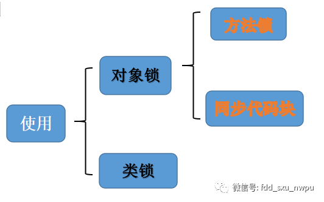

####1、对象锁
对于对象锁来说，又可以分为两个，一个是方法锁，一个是同步代码块锁。

######（1）同步代码块锁
同步代码块锁主要是对代码块进行加锁，其实已经演示过了，就是上面的那个案例。不过为了保持一致，再举一个例子。
```java
public class SynTest01 implements Runnable {
    Object object = new Object();
    public static void main(String[] args) throws InterruptedException {
        SynTest01 syn = new SynTest01();
        Thread thread1 = new Thread(syn);
        Thread thread2 = new Thread(syn);
        thread1.start();
        thread2.start();
        //线程1和线程2只要有一个还存活就一直执行
        while (thread1.isAlive() || thread2.isAlive()) {}
        System.out.println("main程序运行结束");
    }
    @Override
    public void run() {
        synchronized (object) {
            try {
                System.out.println(Thread.currentThread().getName()
                        + "线程执行了run方法");
                Thread.sleep(2000);
                System.out.println(Thread.currentThread().getName()
                        + "执行2秒钟之后完毕");
            } catch (InterruptedException e) {
                e.printStackTrace();
            }
        }
    }
}
```
在这个例子中，使用了synchronized锁住了run方法中的代码块。表示同一时刻只有一个线程能够进入代码块。
在这里面看到，线程1和线程2使用的是同一个锁，也就是new的Object。如果让线程1和线程2每一个人拥有一个锁对象呢？

现在线程1和线程2每个人拥有一把锁，去访问不同的方法资源。这时候会出现什么情况呢？

同样用一张图看一下其原理。


**同步代码块锁总结：**
<blockquote style="line-height: inherit;padding: 15px 15px 15px 1rem;font-size: 0.9em;color: rgb(129, 145, 152);border-left-width: 6px;border-left-color: rgb(220, 230, 240);background: rgb(242, 247, 251);overflow: auto;word-wrap: normal;word-break: normal;">
<p style="font-size: inherit;color: inherit;line-height: inherit;"><strong style="font-size: inherit;color: inherit;line-height: inherit;">同步代码块锁主要是对代码块进行加锁，此时同一时刻只能有一个线程获取到该资源，要注意每一把锁只负责当前的代码块，其他的代码块不管。</strong></p>
</blockquote>

######（2）方法锁
方法锁相比较同步代码块锁就简单很多了，就是在普通方法上添加synchronized关键字修饰即可。
```java
public class SynTest2 implements Runnable {
    public static void main(String[] args) throws InterruptedException {
        SynTest2 syn = new SynTest2();
        Thread thread1 = new Thread(syn);
        Thread thread2 = new Thread(syn);
        thread1.start();
        thread2.start();
        // 线程1和线程2只要有一个还存活就一直执行
        while (thread1.isAlive() || thread2.isAlive()) {
        }
        System.out.println("main程序运行结束");
    }
    @Override
    public void run() {
        method();
    }
    public synchronized void method() {
        try {
            System.out.println(Thread.currentThread().getName() + "进入到了方法");
            Thread.sleep(2000);
            System.out.println(Thread.currentThread().getName() + "执行完毕");
        } catch (InterruptedException e) {
            e.printStackTrace();
        }
    }
}
```
在这个例子中使用两个线程对同一个普通方法进行访问，结果可想而知，也就是同一时刻只能有一个线程进入到此方法。运行一下，看一下结果。


一个问题：此时synchronized关键字加了一把锁，这个锁指代是谁呢？像同步代码块锁synchronized (object)，这里面都有object，但是方法锁是谁呢？
答案就是this对象，也就是说在方法锁里面synchronized其实锁的就是当前this对象。
举例验证：
```java
public class SynTest3 implements Runnable {
    public static void main(String[] args) throws InterruptedException {
        SynTest3 syn = new SynTest3();
        Thread thread1 = new Thread(syn);
        Thread thread2 = new Thread(syn);
        thread1.start();
        thread2.start();
        // 线程1和线程2只要有一个还存活就一直执行
        while (thread1.isAlive() || thread2.isAlive()) {}
        System.out.println("main程序运行结束");
    }
    @Override
    public void run() {
        method1();
        method2();
    }
    public synchronized void method1() {
        try {
            System.out.println(Thread.currentThread().getName() + "进入到了方法1");   
            Thread.sleep(2000);
            System.out.println(Thread.currentThread().getName() + "离开方法1，并释放锁");
        } catch (InterruptedException e) {
            e.printStackTrace();
        }
    }
    public synchronized void method2() {
        try {
            System.out.println(Thread.currentThread().getName() + "进入到了方法2");
            Thread.sleep(2000);
            System.out.println(Thread.currentThread().getName() + "离开方法2，并释放锁");
        } catch (InterruptedException e) {
            e.printStackTrace();
        }
    }
}
```
上面这个例子中，定义了两个synchronized关键字修饰的方法method1和method2，然后让两个线程同时运行，测试一下看看会出现什么结果：

从结果来看，会发现不管是method1还是method2，同一个时刻两个方法只能有一个线程在运行。这也就是this锁导致的。再给一张图描述一下其原理。


####2、类锁
上面的锁都是对象锁，下面看看类锁。类锁其实也有两种形式，一种是static方法锁，一种是class锁。
######（1）static方法锁
在java中，java的类对象可能有无数个，但是类却只有一个。首先看第一种形式。
```java
public class SynTest4 implements Runnable {
    public static void main(String[] args) throws InterruptedException {
        SynTest4 instance1 = new SynTest4();
        SynTest4 instance2 = new SynTest4();
        Thread thread1 = new Thread(instance1);
        Thread thread2 = new Thread(instance2);
        thread1.start();
        thread2.start();
        System.out.println("main程序运行结束");
    }
    @Override
    public void run() {
        method1();
    }
    public static synchronized void method1() {
        try {
            System.out.println(Thread.currentThread().getName() + "进入到了静态方法");

            Thread.sleep(2000);
            System.out.println(Thread.currentThread().getName() + "离开静态方法，并释放锁");
        } catch (InterruptedException e) {
            e.printStackTrace();
        }
    }
}
```
在这个例子中定义了两个不同的对象instance1和instance2。分别去执行了method1。会出现什么结果呢？

如果把static关键字去掉，很明显现在就是普通方法了，如果再去运行，由于instance1和instance2是两个不同的对象，那么也就是两个不同的this锁，这时候就能随便进入了。去掉static关键字之后运行一下：


######（2）class锁
这种用法直接看例子，再来分析一下：
```java
public class SynTest5 implements Runnable {
    public static void main(String[] args) throws InterruptedException {
        SynTest5 instance1 = new SynTest5();
        SynTest5 instance2 = new SynTest5();
        Thread thread1 = new Thread(instance1);
        Thread thread2 = new Thread(instance2);
        thread1.start();
        thread2.start();
        // 线程1和线程2只要有一个还存活就一直执行
        while (thread1.isAlive() || thread2.isAlive()) {}
        System.out.println("main程序运行结束");
    }
    @Override
    public void run() {
        method1();
    }
    public void method1() {
        synchronized (SynTest5.class) {
            try {
                System.out.println(Thread.currentThread().getName() + "进入到了方法");
                Thread.sleep(2000);
                System.out.println(Thread.currentThread().getName() + "离开方法");
            } catch (InterruptedException e) {
                e.printStackTrace();
            }
        }
    }
}
```
在这个例子中使用了同步代码块，不过synchronized关键字包装的可不是object了，而是SynTest5.class。还定义了两个不同的对象实例instance1和instance2。运行一下会发现，线程1和线程2依然会依次执行。

以上就是synchronized关键字的几种常见的用法，到这里来做一个总结：
<blockquote style="line-height: inherit;padding: 15px 15px 15px 1rem;font-size: 0.9em;color: rgb(129, 145, 152);border-left-width: 6px;border-left-color: rgb(220, 230, 240);background: rgb(242, 247, 251);overflow: auto;word-wrap: normal;word-break: normal;">
<p style="font-size: inherit;color: inherit;line-height: inherit;"><strong style="font-size: inherit;color: inherit;line-height: inherit;">对于同步不同步，关键点在于锁，两个线程执行的是同一把锁，那么就依次排队等候，两个线程执行的不是同一把锁，那就各干各的事。</strong></p>
</blockquote>

##三、6个常见的使用情况
先给出这6种常见的情况，然后一个一个分析。
1. 两个线程同时访问一个对象的同步方法。
2. 两个线程访问的是两个对象的同步方法。
3. 两个线程访问的是synchronized的静态方法。
4. 两个线程同时访问同步方法与非同步方法。
5. 一个线程访问一个类的两个普通同步方法。
6. 同时访问静态同步方法和非静态同步方法。

框架图
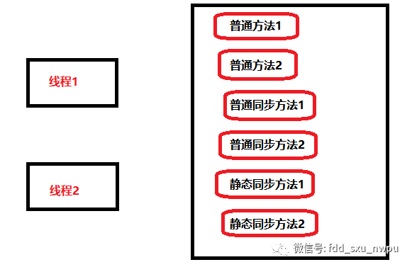

####1、两个线程同时访问一个对象的同步方法
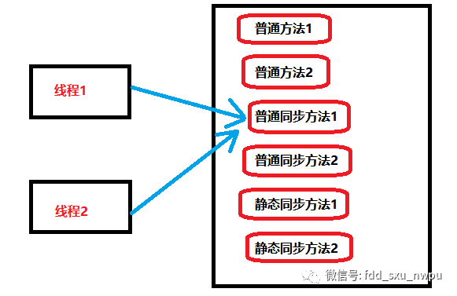
这种情况很简单，在上面也演示过，结果就是同一个时刻只能有一个方法进入。

####2、两个线程访问的是两个对象的同步方法
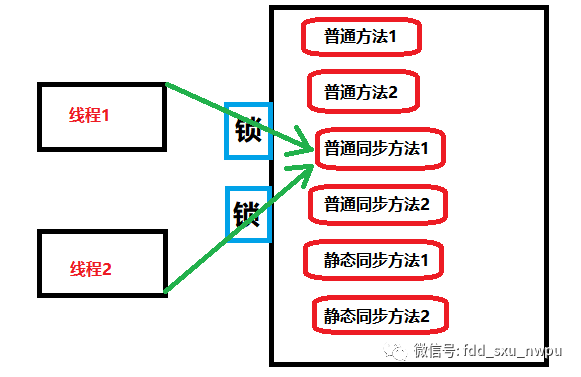
也就是一个方法有两把锁，线程1和线程2互不干扰的访问。锁是不起作用的。

####3、两个线程访问的是synchronized的静态方法
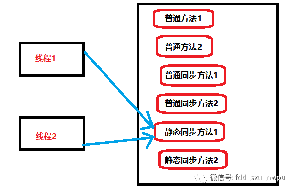
```java
public class SynTest6 implements Runnable {
    public static void main(String[] args) throws InterruptedException {
        SynTest6 instance1 = new SynTest6();
        SynTest6 instance2 = new SynTest6();
        Thread thread1 = new Thread(instance1);
        Thread thread2 = new Thread(instance2);
        thread1.start();
        thread2.start();
    }
    @Override
    public void run() {
        method1();
    }
    public synchronized static void method1() {
        try {
            System.out.println(Thread.currentThread().getName() + "进入到了静态方法");
            Thread.sleep(2000);
            System.out.println(Thread.currentThread().getName() + "离开静态方法，并释放锁");
        } catch (InterruptedException e) {
            e.printStackTrace();
        }
    }
}
```
在这个例子中实例化了两个对象instance1和instance2，并且存放在了两个不同的线程中，测试一下访问同一个static同步方法你会发现。即使是实例不同，锁也会生效，也就是同一时刻只能有一个线程进去。

####4、两个线程同时访问同步方法与非同步方法
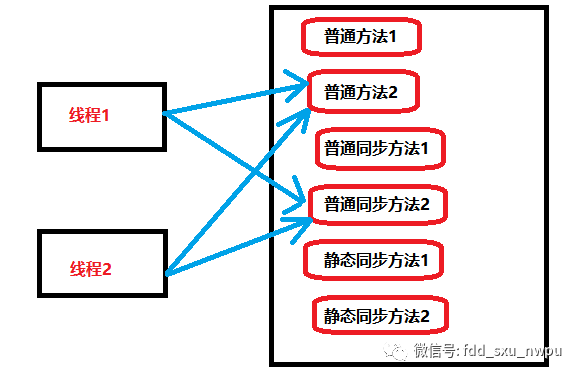
```java
public class SynTest7 implements Runnable {
    public static void main(String[] args) throws InterruptedException {
        SynTest7 instance1 = new SynTest7();
        Thread thread1 = new Thread(instance1);
        Thread thread2 = new Thread(instance1);
        thread1.start();
        thread2.start();
    }
    @Override
    public void run() {

        method1();
        method2();
    }
    public synchronized  void method1() {
        try {
            System.out.println(Thread.currentThread().getName() + "进入到了同步方法");
            Thread.sleep(2000);
            System.out.println(Thread.currentThread().getName() + "离开同步方法");
        } catch (InterruptedException e) {
            e.printStackTrace();
        }
    }
    public  void method2() {
        System.out.println(Thread.currentThread().getName() + "进入了普通方法");
        System.out.println(Thread.currentThread().getName() + "离开了普通方法");
    }
}
```
在上面的代码中，定义一个对象，但是使用了两个线程去分别同时访问同步和非同步方法。下面看结果：

也就是说，同步方法依然会同步执行，非同步方法不会受到任何影响。

####5、一个线程访问一个类的两个普通同步方法
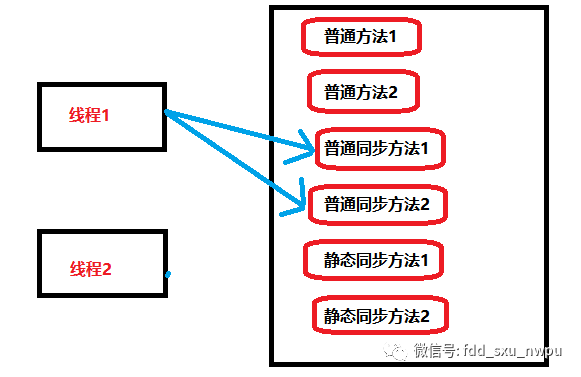
```java
public class SynTest8 implements Runnable {
    public static void main(String[] args) throws InterruptedException {
        SynTest8 instance1 = new SynTest8();
        Thread thread1 = new Thread(instance1);
        thread1.start();
    }
    @Override
    public void run() {
        if(Thread.currentThread().getName().equals("Thread-0")) {
            method1();
        }else {
            method2();
        }
    }
    public synchronized  void method1() {
        try {
            System.out.println(Thread.currentThread().getName() + "进入到了同步方法1");
            Thread.sleep(2000);
            System.out.println(Thread.currentThread().getName() + "离开同步方法1");
        } catch (InterruptedException e) {
            e.printStackTrace();
        }
    }
    public synchronized  void method2() {
        try {
            System.out.println(Thread.currentThread().getName() + "进入到了同步方法2");
            Thread.sleep(2000);
            System.out.println(Thread.currentThread().getName() + "离开同步方法2");
        } catch (InterruptedException e) {
            e.printStackTrace();
        }
    }
}
```
上面这个例子，创建了一个对象instance1，然后使用一个线程分别去访问同步方法1和同步方法2。结果呢可想而知，所一定会失效。在一开始已经验证了，此时同步方法1和同步方法2中synchronized锁的就是this对象，所以是同一把锁。当然会生效。

####6、同时访问静态同步方法和非静态同步方法
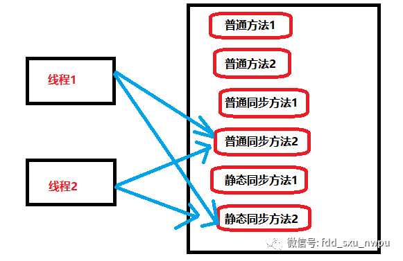
```java
public class SynTest9 implements Runnable {
    public static void main(String[] args) throws InterruptedException {
        SynTest9 instance1 = new SynTest9();
        Thread thread1 = new Thread(instance1);
        Thread thread2 = new Thread(instance1);
        thread1.start();thread2.start();
    }
    @Override
    public void run() {
            method1();
            method2();
    }
    public synchronized  void method1() {
        try {
            System.out.println(Thread.currentThread().getName() + "进入到了同步方法1");
            Thread.sleep(2000);
            System.out.println(Thread.currentThread().getName() + "离开同步方法1");
        } catch (InterruptedException e) {
            e.printStackTrace();
        }
    }
    public synchronized static void method2() {
        try {
            System.out.println(Thread.currentThread().getName() + "进入到了静态同步方法2");
            Thread.sleep(2000);
            System.out.println(Thread.currentThread().getName() + "离开静态同步方法2");
        } catch (InterruptedException e) {
            e.printStackTrace();
        }
    }
}
```
在上面的代码中，创建了一个instance实例，使用两个线程同时访问普通同步方法和静态同步方法。下面运行一下，看看输出结果：

上面输出结果表明普通同步方法和静态同步方法是没有关联的，这是为什么呢？这是因为普通同步方法的锁是对象，但是静态同步方法的锁是类，所以这是两把锁。锁自然也就是失效了。

##四、性质
对于synchronized关键字主要有两个性质：**可重入性质和不可中断性质**。

####1、可重入性质
什么是可重入呢？指的是同一线程的外层函数获得锁之后，内层函数可以直接再次获取该锁。举一个例子来说明，一句话吃着碗里的看着锅里的。嘴里面还没吃完就继续再去拿吃的。这就是可重入。不可重入的意思正好相反，你吃完了这碗饭才能盛下一碗。
可重入的程度可以细分为三种情况，分别测试一下：
（1）同一个方法中是不是可重入的。就好比是递归调用同步方法。
（2）不同的方法是不是可重入的。就好比是一个同步方法调用另外一个同步方法。
（3）不同的类方法是不是可重入的。

######（1）同一个方法是不是可重入的
```java
public class SynTest10 {
    private int a=1;
    public static void main(String[] args) throws InterruptedException {
        SynTest10 instance1 = new SynTest10();
        instance1.method1();
    }   
    public synchronized  void method1() {
        System.out.println("method1: a= " + a);
        if(a == 3) {
            return ;
        }else {
            a++;
            method1();
        }
    }
}
```
代码很简单，也就是定义了一个变量a，只要a不等于3，就一直递归调用方法method1。可以看一下运行结果。

也就是说在同一个方法中是可重入的。

######（2）不同的方法是不是可重入的
```java
public class SynTest10 {
    public static void main(String[] args) throws InterruptedException {
        SynTest10 instance1 = new SynTest10();
        instance1.method1();
    }   
    public synchronized  void method1() {
        System.out.println("method1");
        method2();
    }
    public synchronized  void method2() {
        System.out.println("method2" );
    }
}
```
在同步方法1中调用了同步方法2。同样测试一下。

method1和method2可以依次输出，说明了在不同的方法中也是可重入的。

######（3）、不同的类方法是不是可重入的
既然是不同的类，那么就在这里定义两个类，一个是Father，一个是Son。让son调用father中的方法。
```java
public class Father{
    public synchronized void father() {
        System.out.println("父亲");
    }
}
class Son extends Father{
    public static void main(String[] args) {
        Son instance1 = new Son();
        instance1.son();
    }   
    public synchronized  void son() {
        System.out.println("儿子");
        super.father();
    }
}
```
在这里son类中使用super.father()调用了父类中的synchronized方法，测试一下看看输出结果：
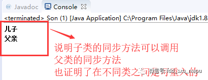

####2、不可中断性质
不可中断的意思你可以这样理解，别人正在打游戏，你也想玩，你必须要等别人不想玩了你才能去。在java中表示一旦这个锁被别人抢走了，你必须等待。等别的线程释放了锁，你才可以拿到。否则就一直等下去。

##五、底层原理
对于原理，最好的方式就是深入到JVM中去。可以编译看看其字节码文件，再来分析，因此在这里举一个最简单的例子。
####1、定义一个简单例子
```java
public class SynTest11 {
    private Object object = new Object();
    public void test() {
        synchronized(object){
            System.out.println("java的架构师技术栈");
        }
    }
}
```
####2、分析
分析的步骤很简单，通过反编译字节码文件。记住的类名是SynTest11。
先编译生成字节码文件。
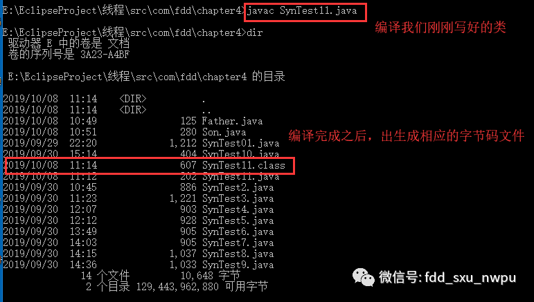
然后，再反编译字节码文件。
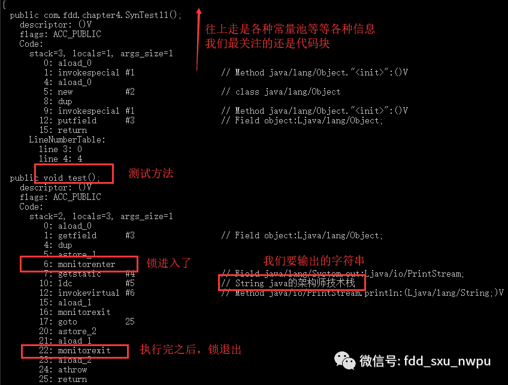
以上知道其是就是设置了一个监控器monitor。线程进来那就是monitorenter，线程离开是monitorexit。这就是synchronized关键字最基本的原理。

####3、可重入原理
在上面曾提到可重入的性质，那么synchronized关键字是如何保证的呢？其是工作是由jvm来完成的，线程第一次给对象加锁的时候，计数为1，以后这个线程再次获取锁的时候，计数会依次增加。同理，任务离开的时候，相应的计数器也会减少。

####4、从java内存模型分析
java内存模型不是真正存在的，但是可以给出一个内存模型。synchronized关键字，会对同步的代码会先写到工作内存，等synchronized修饰的代码块一结束，就会写入到主内存，这样保证了同步。
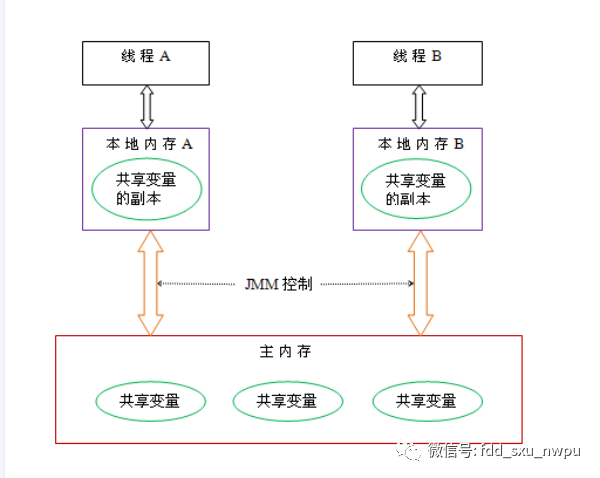

##六、缺陷
####1、效率低
之前曾经分析过synchronized关键字是不可中断的，这也就意味着一个等待的线程如果不能获取到锁将会一直等待，而不能再去做其他的事了。
<blockquote style="line-height: inherit;padding: 15px 15px 15px 1rem;font-size: 0.9em;color: rgb(129, 145, 152);border-left-width: 6px;border-left-color: rgb(220, 230, 240);background: rgb(242, 247, 251);overflow: auto;word-wrap: normal;word-break: normal;">
<p style="font-size: inherit;color: inherit;line-height: inherit;">这里也说明了对synchronized关键字的一个改进措施，那就是设置超时时间，如果一个线程长时间拿不到锁，就可以去做其他事情了。</p>
</blockquote>

####2、不够灵活
加锁和解锁的时候，每个锁只能有一个对象处理，这对于目前分布式等思想格格不入。

####3、无法知道是否成功获取到锁
也就是锁如果获取到了，我们无法得知。既然无法得知，也就很不容易进行改进。
