<center>Docker统一文件系统（the union file system）</center>
##容器和镜像
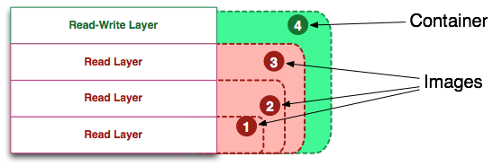
##镜像定义（Image Definition）
镜像（Image）就是一堆只读层（read-only layer）的统一视角。
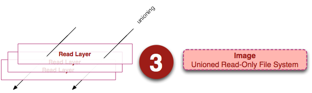
<strong>解释</strong>从左边我们看到了多个只读层，它们重叠在一起。除了最下面一层，其它层都会有一个指针指向下一层。这些层是Docker内部的实现细节，并且能够在主机（译者注：运行Docker的机器）的文件系统上访问到。
统一文件系统（union file system）技术能够将不同的层整合成一个文件系统，为这些层提供了一个统一的视角，这样就隐藏了多层的存在，在用户的角度看来，只存在一个文件系统。我们可以在图片的右边看到这个视角的形式。
可以在你的主机文件系统上找到有关这些层的文件。需要注意的是，在一个运行中的容器内部，这些层是不可见的。【在我的主机上，我发现它们存于/var/lib/docker/aufs目录下。】
```
sudo tree -L 1 /var/lib/docker/
```
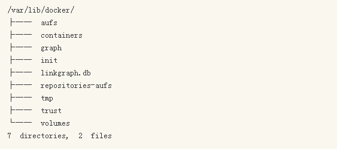
##容器定义（Container Definition）
容器（container）的定义和镜像（image）几乎一模一样，也是一堆层的统一视角，唯一区别在于容器的最上面那一层是可读可写的。
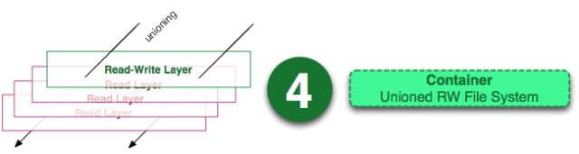
**容器的定义并没有提及容器是否在运行**
<table><tr><td bgcolor=yellow>容器 = 镜像 + 可读层</td></tr></table>
##运行容器定义（Running Container Definition）
一个运行态容器（running container）被定义为一个可读写的统一文件系统加上隔离的进程空间和包含其中的进程。
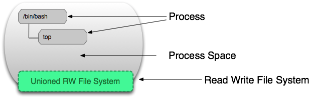
正是文件系统隔离技术使得Docker成为了一个前途无量的技术。一个容器中的进程可能会对文件进行修改、删除、创建，这些改变都将作用于可读写层（read-write layer）。
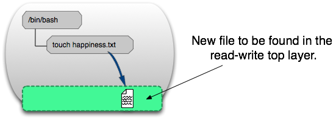
可以通过运行以下命令来验证我们上面所说的：
```
docker run ubuntu touch happiness.txt
```
即便是这个ubuntu容器不再运行，我们依旧能够在主机的文件系统上找到这个新文件。
```
/var/lib/docker/aufs/diff/860a7b...889/happiness.txt
```
##镜像层定义（Image Layer Definition）
为了将零星的数据整合起来，我们提出了镜像层（image layer）这个概念。下面的这张图描述了一个镜像层，通过图片我们能够发现一个层并不仅仅包含文件系统的改变，它还能包含了其他重要信息。

元数据（metadata）就是关于这个层的额外信息，它不仅能够让Docker获取运行和构建时的信息，还包括父层的层次信息。需要注意，只读层和读写层都包含元数据。
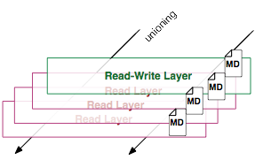
除此之外，每一层都包括了一个指向父层的指针。如果一个层没有这个指针，说明它处于最底层。
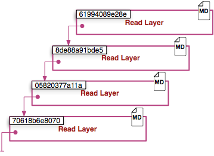
####Metadata Location:
发现在我自己的主机上，镜像层（image layer）的元数据被保存在名为”json”的文件中，比如说：
```
/var/lib/docker/graph/e809f156dc985.../json
```
e809f156dc985…就是这层的id。
一个容器的元数据好像是被分成了很多文件，但或多或少能够在/var/lib/docker/containers/<id>目录下找到，<id>就是一个可读层的id。这个目录下的文件大多是运行时的数据，比如说网络，日志等等。
##全局理解（Tying It All Together）
```
docker create <image-id>
```
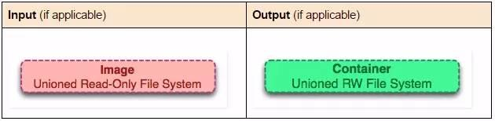
docker create 命令为指定的镜像（image）添加了一个可读层，构成了一个新的容器。注意，这个容器并没有运行。
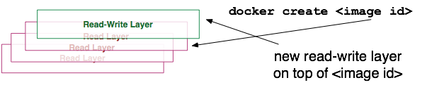
```
docker start <container-id>
```
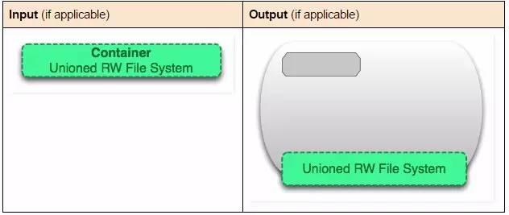
Docker start命令为容器文件系统创建了一个进程隔离空间。注意，每一个容器只能够有一个进程隔离空间。
```
docker run <image-id>
```
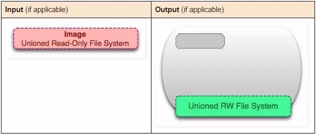
看到这个命令，读者通常会有一个疑问：docker start 和 docker run命令有什么区别。
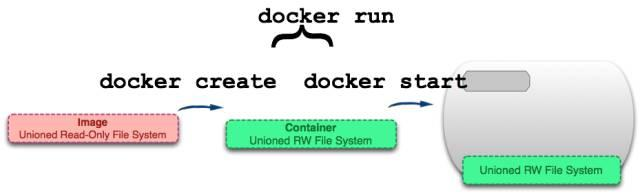
从图片可以看出，docker run 命令先是利用镜像创建了一个容器，然后运行这个容器。这个命令非常的方便，并且隐藏了两个命令的细节，但从另一方面来看，这容易让用户产生误解。
题外话：docker run命令类似于git pull命令。git pull命令就是git fetch 和 git merge两个命令的组合，同样的，docker run就是docker create和docker start两个命令的组合。
```
docker ps
```
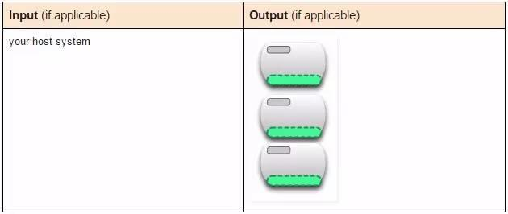
docker ps 命令会列出所有运行中的容器。这隐藏了非运行态容器的存在，如果想要找出这些容器，我们需要使用下面这个命令。
```
docker ps –a
```
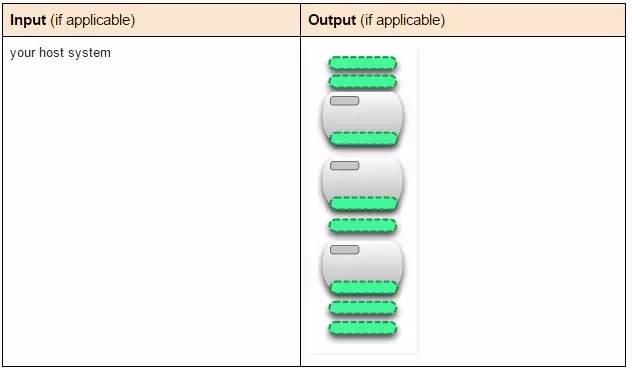
docker ps –a命令会列出所有的容器，不管是运行的，还是停止的。
```
docker images
```
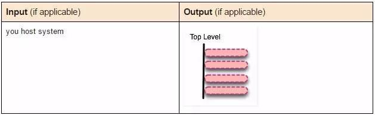
docker images命令会列出了所有顶层（top-level）镜像。实际上，在这里我们没有办法区分一个镜像和一个只读层，所以我们提出了top-level镜像。只有创建容器时使用的镜像或者是直接pull下来的镜像能被称为顶层（top-level）镜像，并且每一个顶层镜像下面都隐藏了多个镜像层。
```
docker images –a
```
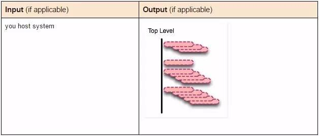
docker images –a命令列出了所有的镜像，也可以说是列出了所有的可读层。如果你想要查看某一个image-id下的所有层，可以使用docker history来查看。
```
docker stop <container-id>
```
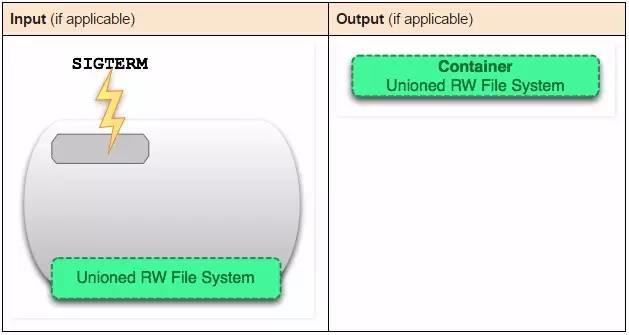
docker stop命令会向运行中的容器发送一个SIGTERM的信号，然后停止所有的进程。
```
docker kill <container-id>
```
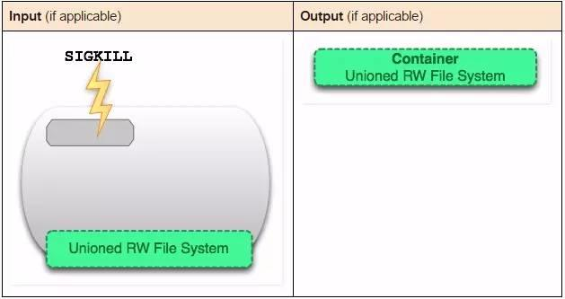
docker kill 命令向所有运行在容器中的进程发送了一个不友好的SIGKILL信号。
```
docker pause <container-id>
```
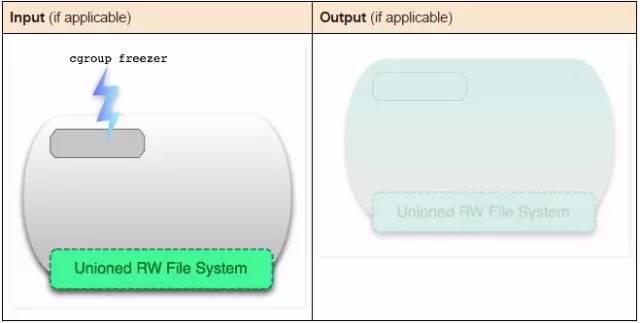
docker stop和docker kill命令会发送UNIX的信号给运行中的进程，docker pause命令则不一样，它利用了cgroups的特性将运行中的进程空间暂停。
```
docker rm <container-id>
```
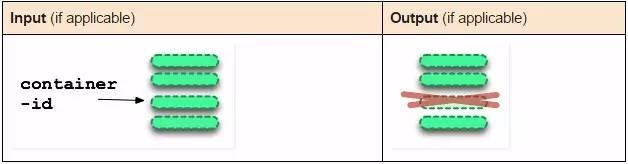
docker rm命令会移除构成容器的可读写层。注意，这个命令只能对非运行态容器执行。
```
docker rmi <image-id>
```
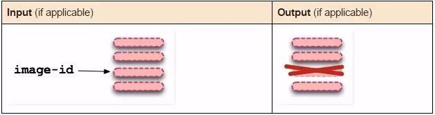
docker rmi 命令会移除构成镜像的一个只读层。你只能够使用docker rmi来移除最顶层（top level layer）（也可以说是镜像），你也可以使用-f参数来强制删除中间的只读层。
```
docker commit <container-id>
```
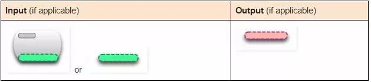
docker commit命令将容器的可读写层转换为一个只读层，这样就把一个容器转换成了不可变的镜像。
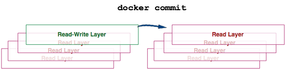
```
docker build
```
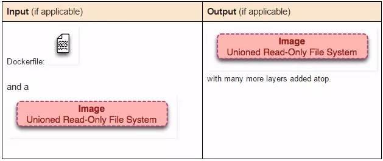
docker build命令非常有趣，它会反复的执行多个命令。
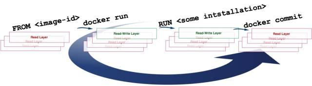
我们从上图可以看到，build命令根据Dockerfile文件中的FROM指令获取到镜像，然后重复地1）run（create和start）、2）修改、3）commit。在循环中的每一步都会生成一个新的层，因此许多新的层会被创建。
```
docker exec <running-container-id>
```
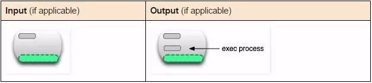
docker exec 命令会在运行中的容器执行一个新进程。
```
docker inspect <container-id> or <image-id>
```
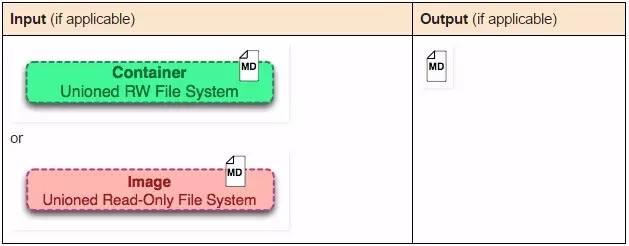
docker inspect命令会提取出容器或者镜像最顶层的元数据。
```
docker save <image-id>
```
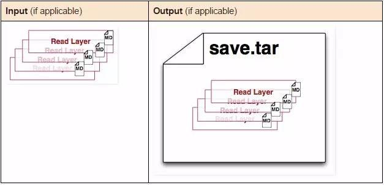
docker save命令会创建一个镜像的压缩文件，这个文件能够在另外一个主机的Docker上使用。和export命令不同，这个命令为每一个层都保存了它们的元数据。这个命令只能对镜像生效。
```
docker export <container-id>
```
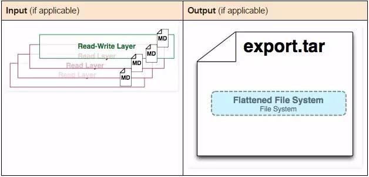
docker export命令创建一个tar文件，并且移除了元数据和不必要的层，将多个层整合成了一个层，只保存了当前统一视角看到的内容（译者注：expoxt后的容器再import到Docker中，通过docker images –tree命令只能看到一个镜像；而save后的镜像则不同，它能够看到这个镜像的历史镜像）。
```
docker history <image-id>
```
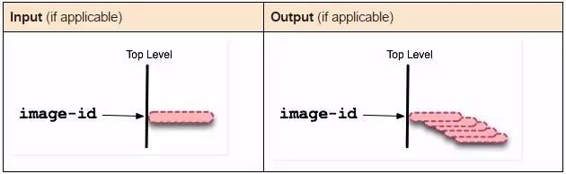
docker history命令递归地输出指定镜像的历史镜像
